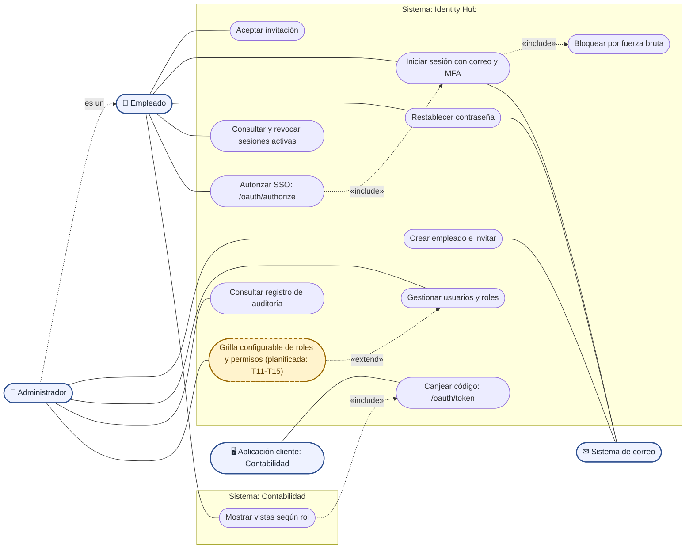

# Casos de uso de Identity Hub

Mermaid no incorpora un tipo nativo para casos de uso; por eso este diagrama usa un flujo con la notación habitual: actores fuera de los límites de cada sistema, casos de uso como óvalos dentro, relaciones «include» y «extend» punteadas, y la grilla planificada con borde discontinuo. El administrador es también un empleado: hereda sus casos de uso.

Fuente: `specs/03-api/openapi.yaml`, `backend/cmd/api/main.go`, `backend/internal/api/server.go`, `backend/internal/auth/login/login.go`, `backend/internal/auth/mfa/mfa.go`, `backend/internal/auth/session/session.go`, `backend/internal/auth/oauth/oauth.go`, `contabilidad/src/auth/flow.ts` y `odd/tasks/idp-semana-4.md`.
