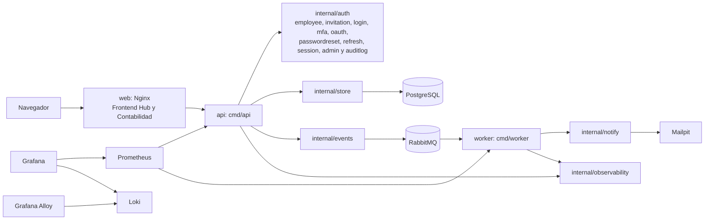

# Diagrama de componentes de Identity Hub

Este diagrama muestra los componentes desplegados localmente y los paquetes internos que componen la API y el procesamiento asíncrono de notificaciones.

Fuente: `specs/adr/0001-stack-y-contenerizacion.md`, `backend/cmd/api/main.go`, `backend/cmd/worker/main.go`, `backend/internal/`, `deploy/docker-compose.yml`, `deploy/observability/prometheus.yml`, `deploy/observability/alloy.river`, `frontend/Dockerfile` y `frontend/nginx/default.conf`.
