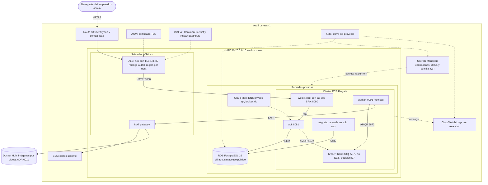
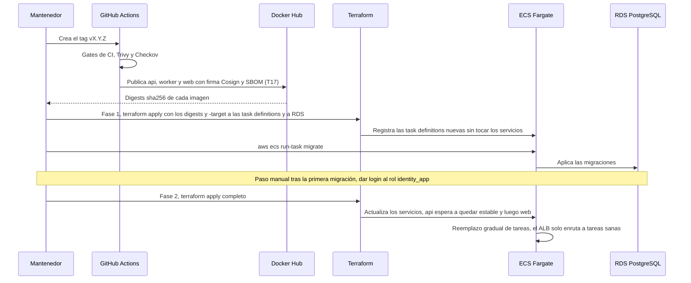

# Despliegue de referencia en AWS

Cómo se desplegaría Identity Hub en producción según la [ADR 0012](../../../specs/adr/0012-arquitectura-de-referencia-en-aws-con-localstack.md)
y el Terraform de [`infraestructura/terraform/`](../../../infraestructura/terraform/). Es una
arquitectura de referencia: el código pasa `terraform validate` y Checkov, pero no se aplica en una
nube real ni en LocalStack (decisión D8). El despliegue local que sí funciona está en
[`despliegue.md`](despliegue.md).

## Infraestructura

Una VPC `10.20.0.0/16` en dos zonas de disponibilidad. Solo el ALB vive en subredes públicas; las
tareas ECS y RDS van en subredes privadas, sin IP pública, y salen a Internet (descarga de imágenes
de Docker Hub, SES) por un NAT gateway. Las líneas punteadas marcan dependencias de configuración
(secretos, claves, logs), no tráfico de usuarios.

## Despliegue de una versión

Cómo llegaría una versión nueva a producción. La publicación de imágenes llega con T17; el resto
es lo que describe el Terraform. El orden migrar antes de actualizar `api` lo garantiza el
procedimiento de dos fases del [README](../../../infraestructura/terraform/README.md), no Terraform.

## Lo que este diagrama no promete

- **TLS, DNS público y WAF** se definen pero no se prueban (solo se crean en LocalStack, y no se
  aplica en ninguna nube).
- **El worker no toca la base de datos.** Solo consume la cola (AMQP) y envía SMTP: no recibe `DATABASE_URL` ni tiene regla de red hacia RDS.
- **El correo por SES** exige que el worker soporte autenticación SMTP y STARTTLS, y hoy no lo hace.
- **Detrás del ALB**, Nginx tiene que propagar la IP real del cliente; si no, el límite de fallos
  por IP trataría a todos los usuarios como uno solo.
- **Los hosts `*.localhost`** están fijos en el código y habría que volverlos configurables.

Detalle de estas brechas: [ADR 0012, Consecuencias](../../../specs/adr/0012-arquitectura-de-referencia-en-aws-con-localstack.md).

Fuente: `infraestructura/terraform/` (`network.tf`, `alb.tf`, `ecs.tf`, `rds.tf`, `secrets.tf`,
`kms.tf`, `logs.tf`, `service_discovery.tf`, `dns_tls_waf.tf`) y la ADR 0012.
