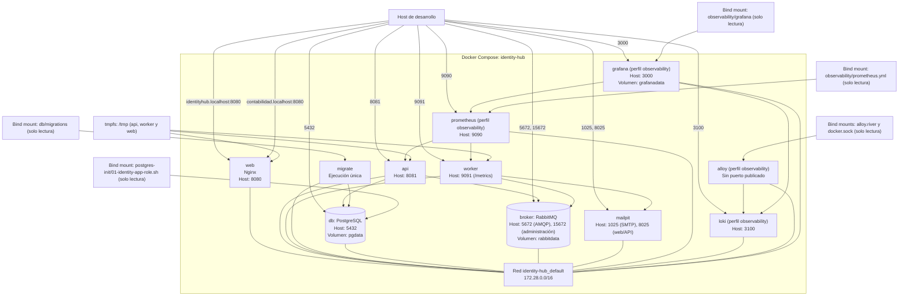

# Despliegue local con Docker Compose

La topología representa el archivo Compose actual: todos los servicios usan la red predeterminada `identity-hub_default` con subred `172.28.0.0/16`; los componentes de observabilidad se habilitan mediante el perfil `observability`.

La referencia de despliegue en nube para producción se incorpora en las tareas T7–T8; este diagrama no la representa como infraestructura actual.

Fuente: `deploy/docker-compose.yml`, `frontend/Dockerfile`, `frontend/nginx/default.conf` y `odd/tasks/idp-semana-4.md`.
