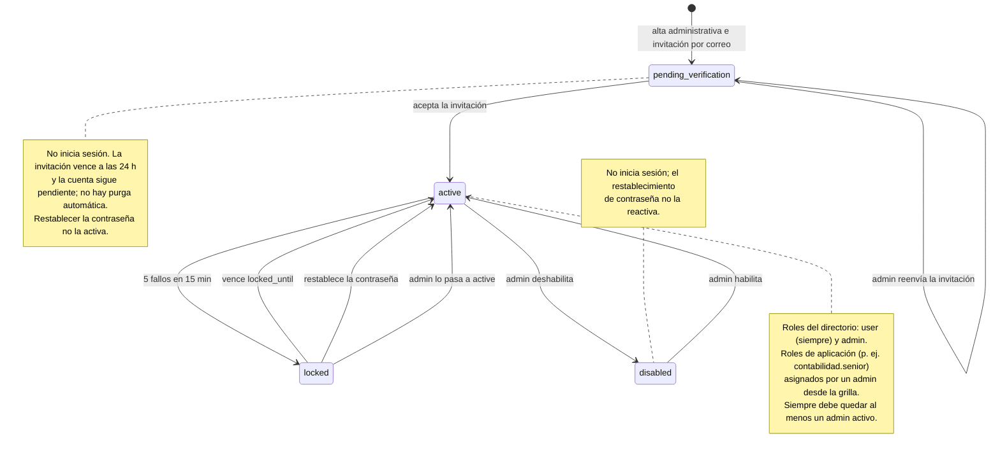

# Estados del ciclo de vida de una cuenta

Una cuenta nace por alta administrativa en `pending_verification` y pasa a `active` cuando la persona acepta la invitación recibida por correo y elige su contraseña. Cinco fallos de contraseña o de código MFA en 15 minutos la bloquean (`locked`); el bloqueo se levanta al vencer `locked_until`, al confirmar un restablecimiento de contraseña o por decisión de un administrador, que también puede deshabilitar (`disabled`) y habilitar la cuenta. Solo `active` obtiene sesión. Los roles del directorio (`user` y `admin`) y los de aplicación (grilla de roles, ADR 0013) son ortogonales al estado: no lo cambian.

Fuente: `backend/internal/auth/{employee,invitation,invitationresend,login,lockout,passwordreset,admin}`, `db/queries/users.sql`, `specs/02-domain-model.md` y `specs/03-api/openapi.yaml`. Vista visual equivalente: [`03-ciclo-de-vida-usuario.html`](../03-ciclo-de-vida-usuario.html).
