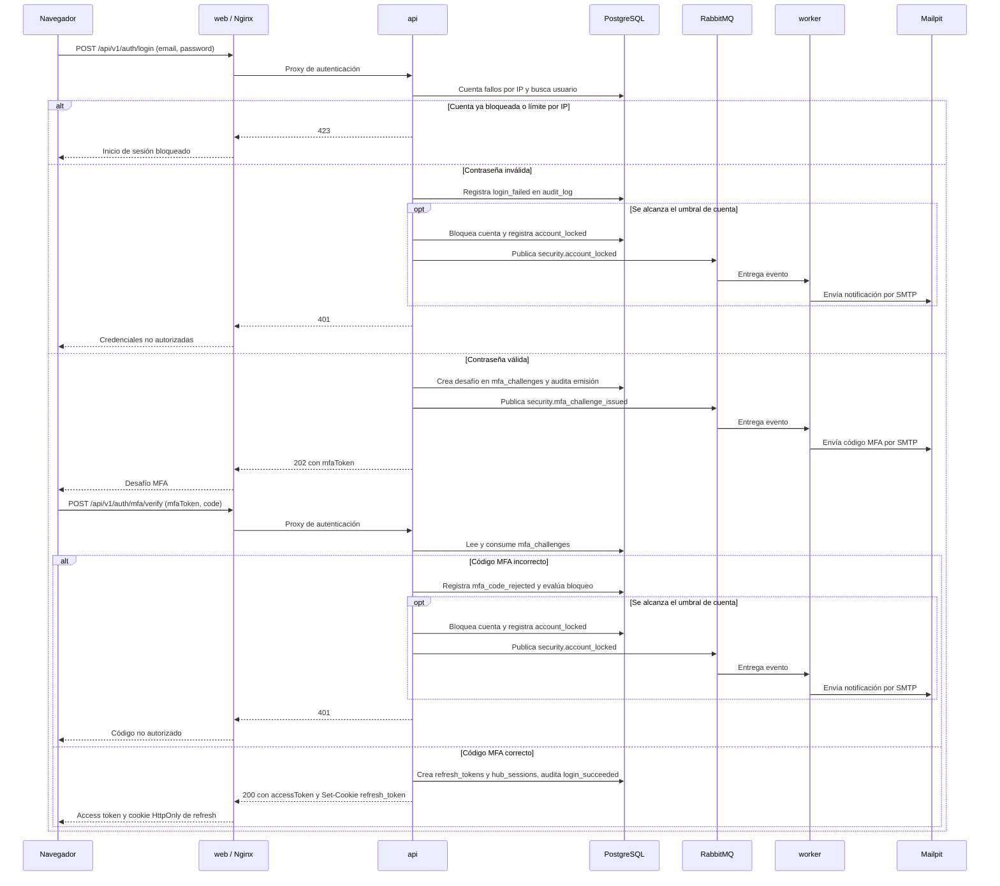

# Secuencia de inicio de sesión con MFA por correo

El flujo separa la validación de contraseña de la verificación MFA: la primera crea y envía el desafío, mientras que la segunda emite los tokens y establece la cookie de refresh.

Fuente: `backend/internal/api/login.go`, `backend/internal/api/mfa.go`, `backend/internal/auth/login/login.go`, `backend/internal/auth/mfa/mfa.go`, `backend/cmd/api/main.go`, `backend/cmd/worker/main.go`, `backend/internal/notify/notify.go`, `db/migrations/000001_initial_schema.up.sql`, `db/migrations/000006_mfa_challenges.up.sql`, `db/migrations/000007_oauth_authorization_code.up.sql`, `deploy/docker-compose.yml` y `frontend/nginx/default.conf`.
