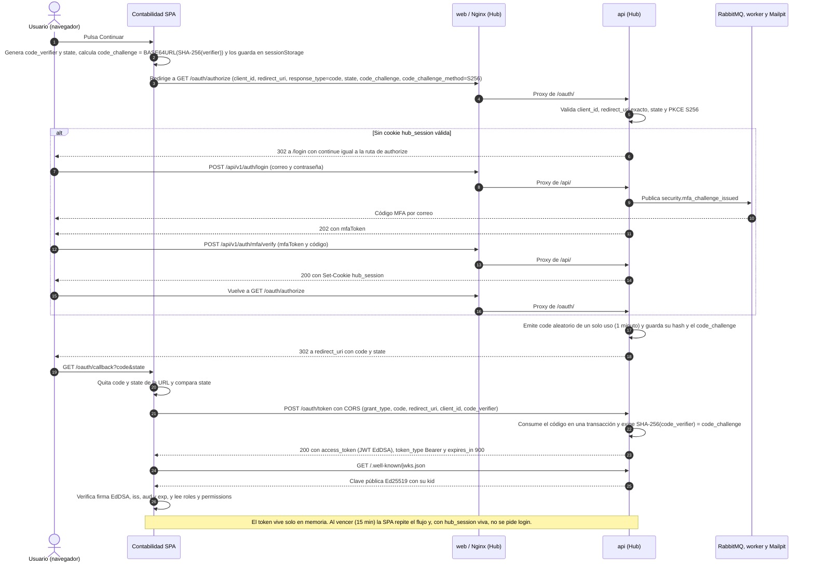

# Secuencia del SSO con Authorization Code y PKCE

Contabilidad delega su inicio de sesión en Identity Hub con OAuth 2.0 Authorization Code y PKCE S256 ([ADR 0009](../../../specs/adr/0009-sso-entre-dominios-con-authorization-code-y-pkce.md)). Contabilidad es un cliente público: no tiene secreto, genera un `code_verifier` y nunca ve la contraseña. Si no hay cookie `hub_session`, el Hub pide contraseña y código MFA por correo antes de emitir el código de autorización, de un solo uso y con vigencia de un minuto. El canje devuelve un JWT firmado con EdDSA (`aud`, `roles` y `permissions`) que la SPA verifica con el JWKS del Hub.

Fuente: `docs/manuales/integracion-terceros.md`, `backend/internal/auth/oauth/oauth.go`, `backend/internal/api/oauth.go`, `backend/internal/auth/token/token.go`, `contabilidad/src/auth/` y `frontend/nginx/default.conf`. Vista visual equivalente: [`02-flujo-sso.html`](../02-flujo-sso.html).
