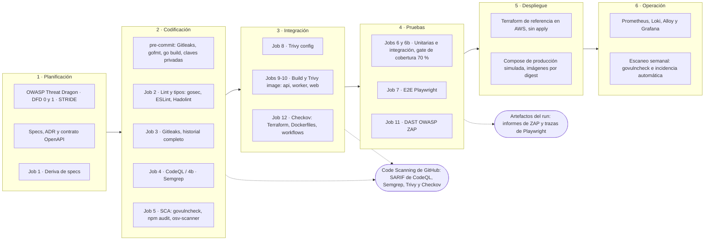
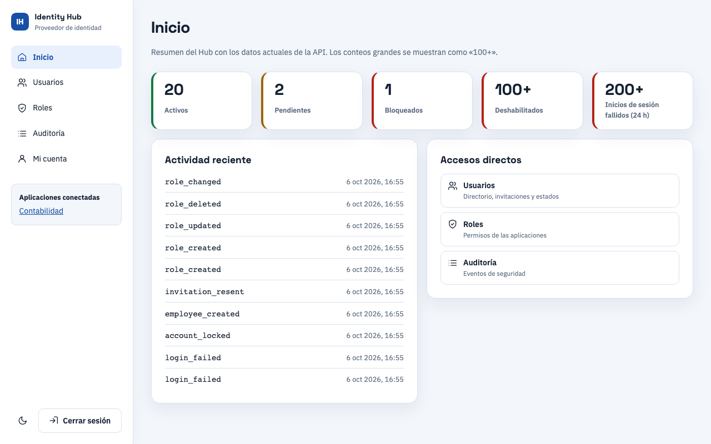
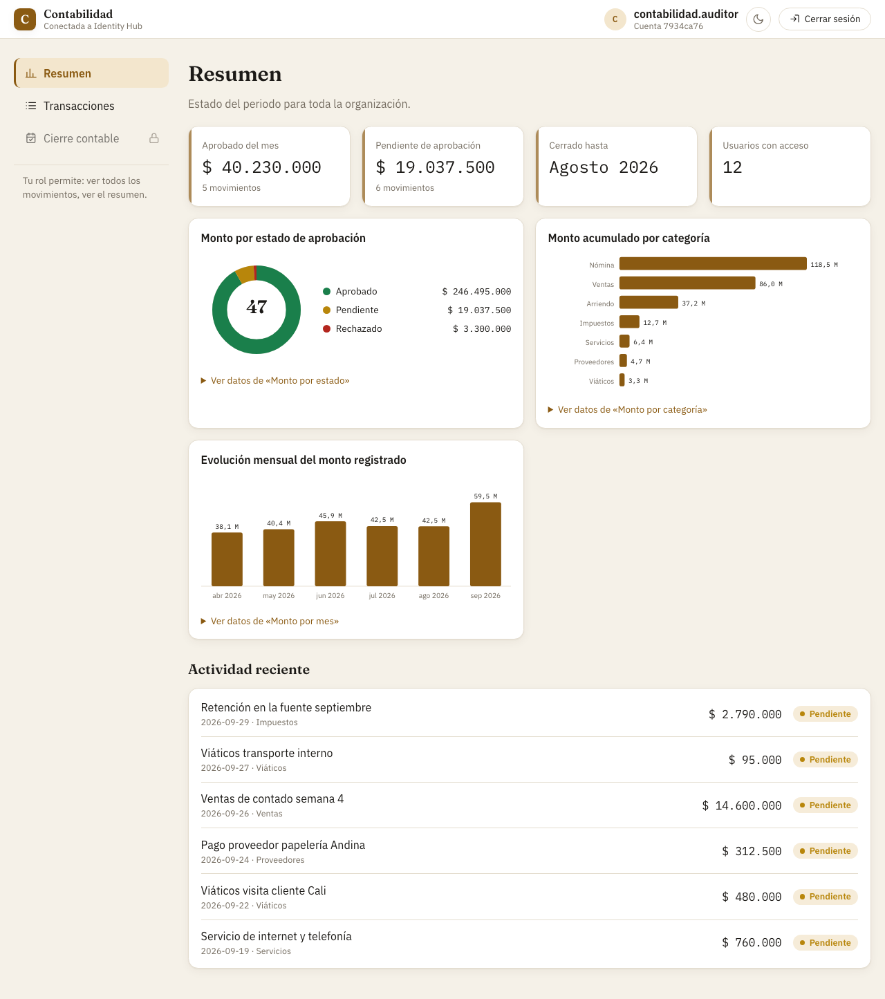
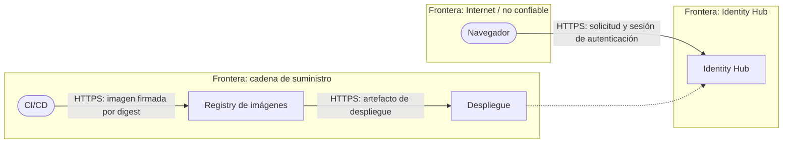
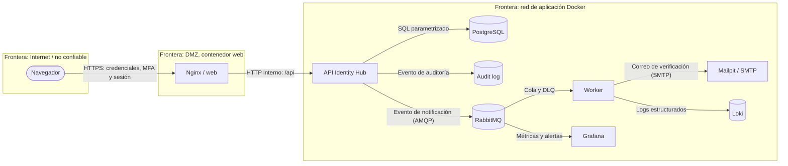
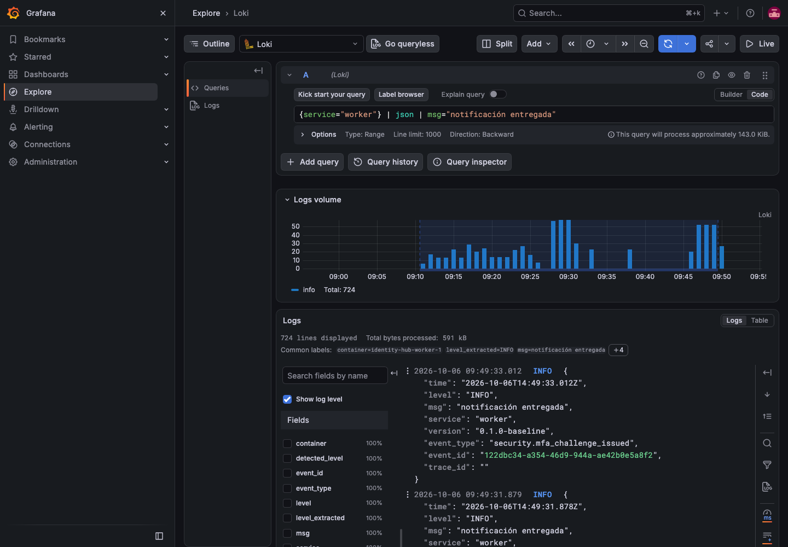
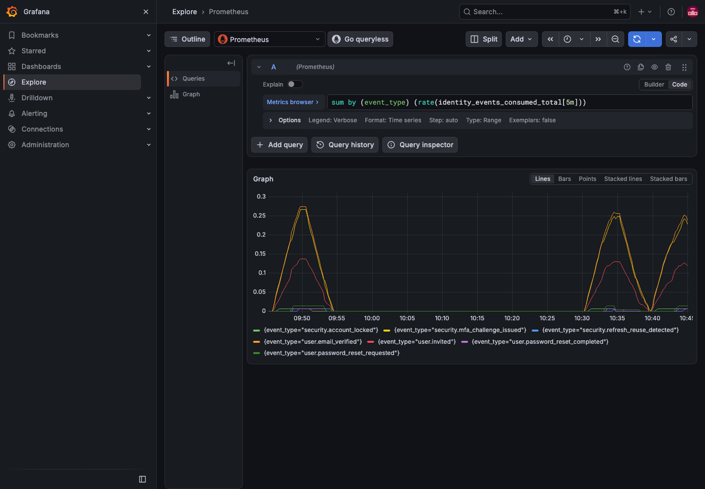
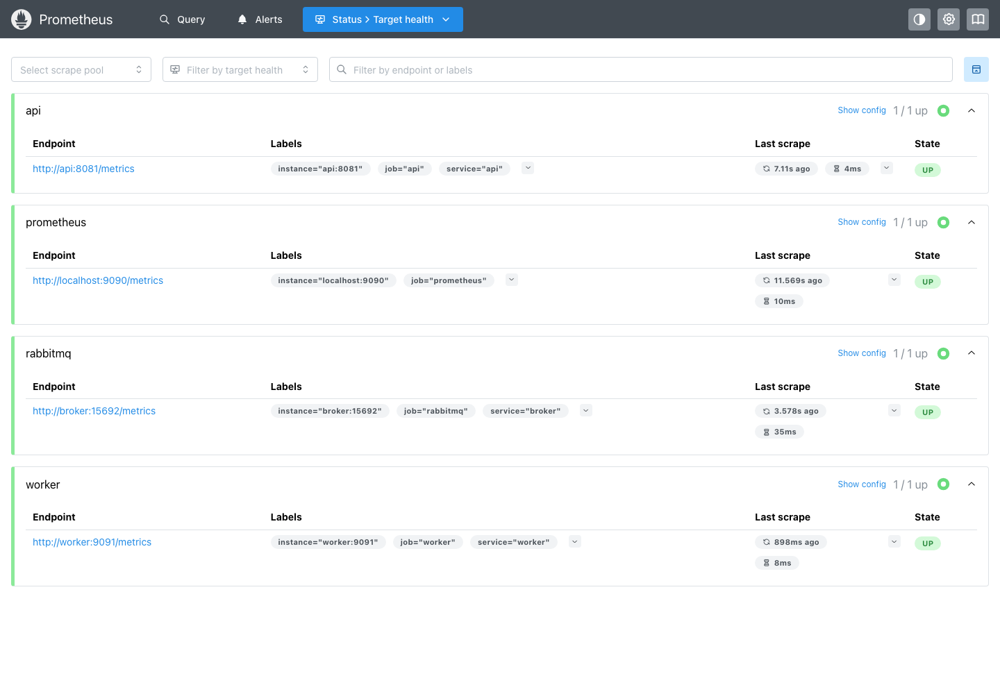

# Introducción

## Por qué esta aplicación

El enunciado del trabajo final deja claro que la aplicación es el vehículo y el pipeline DevSecOps es el producto evaluado. Para que el pipeline tenga algo que proteger de verdad, el equipo eligió construir **un proveedor de identidad (IdP)**: Identity Hub gestiona cuentas, autenticación, autorización y auditoría, y es comparable en alcance didáctico a un Entra ID pequeño. Un IdP concentra los riesgos que más importan a un curso de ciberseguridad: manejo de contraseñas, emisión y validación de tokens, control de acceso por roles, límites contra la fuerza bruta, auditoría inmutable y una cadena de suministro con dependencias criptográficas.

La aplicación se completa con una **segunda aplicación cliente, Contabilidad**, que delega su inicio de sesión en el Hub mediante SSO (OAuth 2.0 Authorization Code con PKCE). Esa pareja permite demostrar, de punta a punta, un caso real: un administrador define un rol y sus permisos en el Hub, se lo asigna a un empleado, y Contabilidad lo respeta sin cambiar código ni redesplegar.

La elección del lenguaje merece una nota. El backend está escrito en **Go** (API y worker) y no en Python o Node.js como sugería el enunciado. La decisión se documentó en el ADR 0001: Go reduce la superficie de las imágenes (binarios estáticos sobre bases mínimas), aporta criptografía en su biblioteca estándar y `govulncheck` con análisis de alcanzabilidad. El README del proyecto recoge que las alternativas del material del curso eran sugerencias. El repositorio no contiene, sin embargo, una validación escrita del docente; esa pregunta (Q4 de la semana 4) permanece abierta y se señala como limitación en las conclusiones.

## Objetivos

1. **Diseñar, implementar, asegurar y automatizar el ciclo de vida completo** de una aplicación contenerizada, integrando seguridad desde el primer commit (enfoque *shift-left*) hasta la operación observable.
2. Entregar una aplicación de microservicios funcional: SPA en React, API y worker asíncrono en Go, PostgreSQL, RabbitMQ y autenticación con JWT y control de roles.
3. Construir un **pipeline de CI en GitHub Actions** con gates que rompen la build: secretos, análisis estático, dependencias, imágenes, configuración, pruebas de integración y de extremo a extremo, y DAST.
4. Demostrar que cada gate detecta lo que dice detectar mediante una **línea base deliberadamente vulnerable** (ADR 0007) y una remediación con evidencia de antes y después.
5. Documentar el modelo de amenazas (OWASP Threat Dragon, STRIDE), la arquitectura (UML como código) y la operación, de modo que un tercero pueda levantar y operar el sistema desde un clon limpio.
6. Describir una arquitectura de referencia en la nube (Terraform sobre AWS, sin `apply`) y operar un stack de observabilidad local (Prometheus, Loki, Alloy y Grafana).

## Alcance y estado de la entrega

Identity Hub incluye registro por invitación por correo, contraseñas con Argon2id, JWT firmados con Ed25519 y publicados por JWKS, refresh tokens rotativos, MFA obligatorio por código enviado al correo, roles, una grilla de roles y permisos por aplicación, auditoría append-only y SSO hacia Contabilidad. Quedan fuera por decisión documentada: federación con proveedores externos, multi-tenancy efectivo, alta disponibilidad, TOTP y WebAuthn. El objetivo de despliegue es un único host con Docker Compose; la nube es una arquitectura de referencia.

A la fecha de este documento están completas las semanas 1 a 3 y las tareas de la semana 4 salvo tres. Quedan pendientes, y así se declaran a lo largo del informe, la publicación de las imágenes en Docker Hub con firma y SBOM (T17, a la espera de decisiones del usuario sobre la cuenta y el token), el guion del video (T20) y el cierre con el tag de versión y el PR (T21).

# Arquitectura

## Visión general y componentes

Identity Hub es un conjunto de contenedores orquestados por Docker Compose. La tabla resume las piezas y su responsabilidad; el detalle está en el manual de arquitectura (`docs/manuales/arquitectura.md`).

| Componente | Responsabilidad |
|---|---|
| `web` | Nginx que sirve las dos SPA (Hub y Contabilidad), aplica cabeceras de seguridad y el límite de peticiones de autenticación, y hace de proxy hacia la API. |
| `api` | API HTTP en Go: autenticación, autorización, dominio, persistencia y publicación de eventos. |
| `worker` | Proceso asíncrono en Go que consume eventos y entrega notificaciones por SMTP; publica métricas y salud. |
| PostgreSQL 16 | Usuarios, sesiones, roles, permisos y auditoría; la aplicación usa un rol de mínimo privilegio sin permiso de `UPDATE`/`DELETE` sobre la auditoría. |
| RabbitMQ 4 | Eventos persistentes con confirmación de publicación entre la API y el worker, con cola de mensajes muertos (DLQ). |
| Mailpit | Captura el SMTP local: en desarrollo los correos no salen a Internet. |
| Prometheus, Loki, Alloy y Grafana | Métricas y logs, bajo el perfil `observability` de Compose. |

Los flujos entre dominios son: navegador a `web` a `api` por HTTP; `api` a PostgreSQL por SQL (consultas generadas por `sqlc`); `api` a RabbitMQ a `worker` por AMQP; `worker` a Mailpit por SMTP; y Hub a Contabilidad por OAuth 2.0 Authorization Code con PKCE sobre dos orígenes (`identityhub.localhost` y `contabilidad.localhost`). Las decisiones más relevantes están registradas como ADR (0001 a 0013): stack y contenerización, IdP propio en lugar de Keycloak, OpenAPI 3.0.3 como fuente de verdad, Argon2id, refresh tokens rotativos con familia, publicación directa sin outbox, línea base vulnerable deliberada, GitHub Actions, SSO con PKCE, MFA por correo, Docker Hub como registry, arquitectura de referencia en AWS y roles y permisos configurables por aplicación.

## Diagramas UML del sistema

Los diagramas se mantienen como código Mermaid versionado en `docs/diagramas/uml/`; las figuras de este informe se renderizan directamente a partir de esos archivos, de modo que no pueden divergir de ellos.

### Diagrama de componentes

La figura muestra los componentes desplegados y los paquetes internos de la API y del procesamiento asíncrono.

{{mermaid:../diagramas/uml/componentes.md#1|@L Diagrama de componentes de Identity Hub (docs/diagramas/uml/componentes.md).}}

### Diagrama de despliegue local

Representa el archivo Compose: una red con subred `172.28.0.0/16`, los puertos publicados al host, los volúmenes (`pgdata`, `rabbitdata`, `grafanadata`) y los servicios de observabilidad bajo el perfil `observability`.

{{mermaid:../diagramas/uml/despliegue.md#1|@L Despliegue local con Docker Compose (docs/diagramas/uml/despliegue.md).}}

### Diagrama de casos de uso

El administrador es también un empleado y hereda sus casos de uso. La grilla configurable de roles y permisos se entregó en la semana 4 (tareas T11 a T15).

{{mermaid:../diagramas/uml/casos-de-uso.md#1|Casos de uso de Identity Hub (docs/diagramas/uml/casos-de-uso.md).}}

### Diagrama de secuencia: inicio de sesión con MFA

El flujo separa la validación de la contraseña de la verificación del código MFA. La primera crea y envía el desafío por correo mediante RabbitMQ y el worker; la segunda emite los tokens y establece la cookie `HttpOnly` de refresh. Incluye los caminos de bloqueo por fuerza bruta.

{{mermaid:../diagramas/uml/secuencia-login-mfa.md#1|Secuencia de inicio de sesión con MFA por correo (docs/diagramas/uml/secuencia-login-mfa.md).}}

## Diagrama del pipeline DevSecOps

El pipeline cubre las seis fases del enunciado. El diagrama sitúa cada herramienta en su fase y muestra el destino de los resultados: los SARIF van a *Code Scanning* de GitHub y los artefactos de ZAP y Playwright se conservan como artefactos del run.



## Pulido del frontend

Una rama final (`feat/pulido-frontend`) revisó la interfaz de las dos aplicaciones sin cambiar el contrato de la API. Lo entregado, con las capturas regeneradas en el [manual de usuario](../manuales/usuario.md):

- **Sistema visual común** en el Hub y en Contabilidad. Las fuentes se empaquetan con la aplicación y se sirven desde el propio origen, de modo que la CSP no necesita abrirse a un CDN. El tema sigue la preferencia del sistema (claro u oscuro) y hay un selector manual; el contraste, el foco visible, los roles y las etiquetas ARIA se revisaron en ambos temas y a 390 px de ancho.
- **Inicio de la consola.** Un administrador aterriza en **Inicio**, con indicadores de usuarios activos, pendientes, bloqueados y deshabilitados, los inicios fallidos de las últimas 24 horas y la actividad reciente. La API no entrega totales exactos, así que cada tarjeta cuenta hasta una página de 100 resultados y muestra «100+» cuando hay más (y hasta «200+» en los inicios fallidos, que suman dos consultas); si una consulta falla, solo esa tarjeta muestra el aviso y **Reintentar**.
- **Filtros en la URL.** La búsqueda, el estado, la categoría y el orden de las tablas viven en la dirección, de modo que se pueden compartir, recargar y recorrer con el botón Atrás; el directorio y la auditoría ofrecen atajos (por ejemplo, **Cambios de roles**).
- **Exportación CSV** de las filas visibles de Contabilidad y del directorio del Hub (con BOM UTF-8, CRLF y montos numéricos). Las celdas de texto que empiezan con `=`, `+`, `-`, `@`, tabulador o retorno de carro se neutralizan anteponiendo una comilla simple, para evitar la inyección de fórmulas al abrir el archivo en una hoja de cálculo; los números no se tocan, así que los montos negativos siguen siendo numéricos.
- **Gráficos del Resumen de Contabilidad** (dona por estado, barras por categoría y columnas por mes) dibujados a mano en SVG, sin biblioteca de gráficos, con una tabla equivalente tras el enlace **Ver datos de...** para quien no los pueda ver.
- **Diálogo de confirmación** accesible antes de aprobar o rechazar un movimiento en Contabilidad (foco atrapado en el diálogo, Escape cancela, el foco inicial está en **Cancelar**; al cancelar vuelve al botón que lo abrió y, al confirmar, a la tabla, porque la fila ya no tiene ese botón).





## Arquitectura de referencia en la nube (AWS, sin apply)

El enunciado pide despliegue con IaC en Terraform o Ansible. Como no hay presupuesto para una nube de pago, el equipo describió la producción como una **arquitectura de referencia** (ADR 0012) implementada en Terraform en `infraestructura/terraform/` (red, grupos de seguridad, ALB, ECS Fargate, RDS, Secrets Manager, KMS, logs, descubrimiento de servicios y DNS, TLS y WAF). El código pasa `terraform validate` y Checkov en CI, pero **no se aplica** en ninguna nube ni en LocalStack (decisión D8).

Una VPC `10.20.0.0/16` en dos zonas de disponibilidad. Solo el ALB vive en subredes públicas; las tareas ECS y RDS van en subredes privadas, sin IP pública, y salen a Internet por un NAT gateway. RabbitMQ corre como servicio ECS autogestionado (decisión D7) porque Amazon MQ para RabbitMQ no está soportado por LocalStack y así toda la arquitectura se puede razonar igual que el Compose.

{{mermaid:../diagramas/uml/despliegue-aws.md#1|@L Infraestructura de referencia en AWS (docs/diagramas/uml/despliegue-aws.md).}}

La segunda figura describe cómo llegaría una versión a producción: tag, gates, publicación de imágenes por digest, `terraform apply` en dos fases con la migración entre ambas.

{{mermaid:../diagramas/uml/despliegue-aws.md#2|Despliegue de una versión según el Terraform de referencia.}}

Lo que esta referencia no promete, según el propio ADR: TLS, DNS público y WAF se definen pero no se prueban; el correo por SES exige que el worker soporte autenticación SMTP y STARTTLS, y hoy no lo hace; detrás de un ALB, Nginx debe propagar la IP real del cliente o el límite por IP trataría a todos los usuarios como uno; y los hosts `*.localhost` están fijos en el código.

# Modelado de Amenazas

## Modelo en OWASP Threat Dragon

El modelo versionado está en `docs/threat-model/identity-hub.json` (formato Threat Dragon v2) y se alinea con la fuente de verdad `specs/05-security/threat-model.md`. Contiene dos diagramas de flujo de datos con sus fronteras de confianza y 23 amenazas clasificadas por STRIDE. El archivo conserva la estructura de los modelos de demostración oficiales y valida contra el esquema oficial de Threat Dragon con una sola salvedad (`strokeDasharray: null`), que los modelos oficiales también tienen; no se abrió en la interfaz gráfica de Threat Dragon en el entorno de desarrollo.

### DFD nivel 0: contexto y cadena de suministro

Muestra el navegador, Identity Hub y la cadena CI/CD, registry y despliegue, con tres fronteras: Internet no confiable, Identity Hub y cadena de suministro.



### DFD nivel 1: procesamiento interno

Detalla Nginx, API, PostgreSQL con su registro de auditoría, RabbitMQ, el worker, Mailpit y la observabilidad, con tres fronteras: Internet no confiable, la DMZ del contenedor web y la red de aplicación Docker.



## Amenazas por categoría STRIDE y contramedidas

Las 23 amenazas se reparten así: 6 de suplantación (Spoofing), 4 de manipulación (Tampering), 2 de repudio (Repudiation), 5 de divulgación de información (Information disclosure), 3 de denegación de servicio (Denial of service) y 3 de elevación de privilegios (Elevation of privilege). La columna «Amenaza» resume el riesgo (el elemento del DFD y el texto completo están en el modelo). La columna Estado sigue el modelo: *Mitigated* indica que la contramedida está implementada en el repositorio; *Open* que falta o está incompleta.

| Categoría | Id | Amenaza (elemento del DFD) | Contramedida implementada | Estado |
|---|---|---|---|---|
| Spoofing | AM-001 | Fuerza bruta contra la solicitud de autenticación | Argon2id, bloqueo de cuenta tras 5 fallos y `limit_req` en Nginx | Mitigated |
| Spoofing | AM-002 | Reuso de refresh token (evento de notificación) | Rotación de refresh token y revocación de la familia ante reuso | Mitigated |
| Spoofing | AM-003 | JWT con algoritmo falsificado (`/api`) | Solo se acepta `EdDSA` antes de verificar la firma | Mitigated |
| Spoofing | AM-004 | Enumeración de cuentas | Respuestas iguales, comparación en tiempo constante y hash señuelo | Mitigated |
| Spoofing | AM-005 | Sesión robada tras cambio de contraseña | El restablecimiento revoca todas las sesiones activas | Mitigated |
| Spoofing | AM-017 (MFA) | Adivinar códigos MFA | Desafío SHA-256/HMAC-SHA256, uso único, vencimiento y límite de intentos | Mitigated |
| Tampering | AM-006 | Inyección SQL | Consultas parametrizadas generadas por `sqlc` | Mitigated |
| Tampering | AM-007 | Roles obsoletos en el token | Roles consultados en la base de datos en peticiones sensibles | Mitigated |
| Tampering | AM-008 | Imagen manipulada en la cadena de suministro | Firma Cosign keyless y despliegue por digest | **Open** |
| Tampering | AM-009 | Dependencia comprometida | SBOM CycloneDX, osv-scanner, Dependabot y lockfiles | **Open** (parcial) |
| Repudiation | AM-010 | Acciones sin rastro | Audit log append-only con actor, IP y user-agent; sin `UPDATE`/`DELETE` | Mitigated |
| Repudiation | AM-011 | Borrado de logs | Rol de aplicación sin borrado y envío de logs a Loki | Mitigated |
| Information disclosure | AM-012 | Secretos en imágenes o repositorio | Secretos por entorno, sin valores por defecto, `.env` fuera de Git | Mitigated |
| Information disclosure | AM-013 | Datos sensibles en logs | `Secret.String()` redactado e identificadores truncados | Mitigated |
| Information disclosure | AM-014 | Puertos de base y broker expuestos | En producción simulada solo `web` publica puerto (8080) | Mitigated |
| Information disclosure | AM-015 | XSS y robo de sesión | CSP estricta, cookie `HttpOnly` y escape predeterminado de React | Mitigated |
| Information disclosure | AM-016 | Enlace de invitación interceptado | Token de 24 h y un solo uso; el worker no registra el cuerpo | Mitigated |
| Denial of service | AM-017 | Argon2id como amplificador de carga | `limit_req` antes de la API y Argon2id calibrado a unos 250 ms | Mitigated |
| Denial of service | AM-018 | Cuerpos enormes | `client_max_body_size 1m` y `http.MaxBytesReader` | Mitigated |
| Denial of service | AM-019 | Cola de notificaciones saturada | Regla de alerta de Grafana versionada (`deploy/observability/grafana/alerting/dlq.yml`) y runbook (`docs/runbooks/dlq-notificaciones.md`) | Mitigated |
| Elevation of privilege | AM-020 | Contenedor comprometido | Usuario no root, capacidades eliminadas, raíz de solo lectura, base distroless | Mitigated |
| Elevation of privilege | AM-021 | Acceso a rutas administrativas | Autorización por ruta comprobada en el servidor | Mitigated |
| Elevation of privilege | AM-022 | Permisos excesivos del pipeline | Permisos mínimos por job y OIDC keyless | **Open** (parcial) |

Nota de transparencia: la especificación original repite el id AM-017 para dos amenazas distintas (códigos MFA y Argon2id como amplificador); el modelo de Threat Dragon las distingue como «AM-017 (MFA)» y «AM-017». Y la compuerta que la especificación cita para AM-014 («Trivy config sobre el compose de producción») no existe, porque Trivy config no analiza archivos de Docker Compose; la evidencia real es la comprobación `docker compose config` de la producción simulada, que confirma que ningún servicio salvo `web` publica puertos.

## Amenazas que siguen abiertas y por qué

Tres amenazas permanecen *Open*, y todas dependen de una misma tarea pendiente:

- **AM-008 (firma de imágenes) y AM-022 (OIDC keyless):** requieren el workflow de publicación (`cd.yml`), la firma con Cosign y el OIDC hacia Docker Hub. Hoy las imágenes solo se construyen y escanean en CI. Es la tarea T17, pospuesta al final de la fase 4 hasta que el usuario decida la cuenta, el namespace y el token de Docker Hub (pregunta Q1). Lo que sí está implementado de AM-022: permisos mínimos por job (`permissions: contents: read` por defecto en `ci.yml`).
- **AM-009 (cadena de suministro):** osv-scanner, govulncheck, npm audit y lockfiles están activos en CI y el riesgo de VULN-028 se aceptó formalmente; falta el SBOM CycloneDX por imagen, que también llega con T17.
AM-019 (DLQ) quedó mitigada: además del panel «Profundidad de la DLQ», hay una regla de alerta aprovisionada (`deploy/observability/grafana/alerting/dlq.yml`, se dispara con cualquier mensaje en la cola durante 2 minutos y también si faltan las métricas del broker) y un runbook de atención y purga (`docs/runbooks/dlq-notificaciones.md`). Se probó publicando un mensaje a `identity.dlx`: la regla pasó por inactive, pending y firing, y volvió a inactive al vaciar la cola.

# Implementación del Pipeline

## Visión general

Hay tres workflows en `.github/workflows/`: `ci.yml` (el pipeline principal, cuyos gates rompen la build), `baseline-scan.yml` (escaneo en modo informe de la línea base vulnerable) y `scheduled-scan.yml` (reescaneo semanal). Además, una acción compuesta local (`.github/actions/stack-up`) levanta el stack con un `.env` desechable para los jobs que necesitan la aplicación en ejecución. Una regla de diseño del `Makefile` mantiene coherente todo: lo que corre en CI tiene que poder correrse localmente con el mismo nombre, de modo que `make scan` y el pipeline no divergen.

El workflow principal se dispara en `push` a `main`, en cada `pull_request` y manualmente; cancela las ejecuciones previas de la misma rama, y el token por defecto solo lee (el principio de mínimo privilegio responde a la amenaza AM-022).

{{code:yaml:.github/workflows/ci.yml:16-28}}

## Fase 1: Planificación

El modelado de amenazas con Threat Dragon y STRIDE se describe en la sección anterior. La planificación se apoya además en especificaciones versionadas en `specs/` (visión, requisitos, contrato OpenAPI, modelo de dominio, ADR y escenarios de aceptación en Gherkin). El job **1 · Deriva entre specs y código** impide que estas diverjan del código: valida el contrato OpenAPI con `openapi-spec-validator`, regenera la interfaz Go (`oapi-codegen`), las consultas (`sqlc`) y los tipos TypeScript, ejecuta las pruebas del verificador de trazabilidad y del gate de ZAP, regenera la matriz `specs/07-traceability.md` y falla si el árbol de trabajo queda sucio (`git diff --exit-code`).

## Fase 2: Codificación

**Hooks pre-commit.** `.pre-commit-config.yaml` ejecuta antes de cada commit: Gitleaks v8.24.3 (la misma versión y configuración que `make scan-secrets`), detección de claves privadas, validación de YAML y JSON, límite de tamaño de archivos, `gofmt`, `go build` y la regeneración de la matriz de trazabilidad. El hook no corre solo: se instala una vez por clon con `pre-commit install`.

**Secretos (job 3).** Gitleaks corre sobre el **historial completo** (`fetch-depth: 0`), porque un secreto borrado en el último commit sigue siendo válido en el historial. Se usa una configuración propia (`.gitleaks.toml`) con reglas adicionales: la regla por defecto dejó pasar la mayoría de los secretos sembrados (VULN-023) y se añadieron reglas para contraseñas en variables de entorno o YAML y para URLs de conexión con credenciales.

{{code:yaml:.github/workflows/ci.yml:164-177}}

**Lint y tipos (job 2).** `golangci-lint` v2.13.2 incluye **gosec**, que detecta patrones inseguros en Go; ESLint y la comprobación de tipos corren sobre el Hub y Contabilidad, y Hadolint analiza los Dockerfiles con `failure-threshold: warning`.

**SAST (jobs 4 y 4b).** CodeQL con las consultas `security-extended` analiza Go y JavaScript/TypeScript y publica sus resultados como SARIF. Semgrep 1.86.0 usa los conjuntos `p/owasp-top-ten`, `p/golang` y `p/react`, publica un SARIF y, en un segundo paso, rompe la build con severidad `ERROR`. El enunciado menciona Bandit para Python; como el backend es Go, los equivalentes son gosec, CodeQL y govulncheck, y Semgrep se mantiene como herramienta común.

{{code:yaml:.github/workflows/ci.yml:211-235}}

**Dependencias (job 5).** `govulncheck` analiza **alcanzabilidad**: solo informa de vulnerabilidades cuyo código es realmente invocable, lo que elimina casi todo el ruido frente a un escáner que solo lee `go.mod`. `npm audit --audit-level=high` cubre el Hub y Contabilidad, y osv-scanner v2.6.0 (`--recursive --all-vulns`) recorre todos los manifiestos, marcando como no invocado lo que el análisis de llamadas descarta.

{{code:yaml:.github/workflows/ci.yml:250-257}}

## Fase 3: Integración (build)

**Imágenes (jobs 9-10).** Una matriz construye las tres imágenes (`api`, `worker` y `web`) con Buildx y caché de GitHub Actions, y las escanea con Trivy en dos pasos: primero un informe SARIF que se sube siempre a Code Scanning y luego el gate, que rompe la build ante CVE de severidad `HIGH` o `CRITICAL` **con parche disponible** (`ignore-unfixed: true`). La política es deliberada: bloquear por un CVE sin arreglo no protege de nada y entrena al equipo a ignorar el rojo. Las excepciones se registrarían en `security/.trivyignore`, que se mantiene vacío a propósito: toda excepción exige CVE, justificación, responsable, expiración y ficha asociada.

{{code:yaml:.github/workflows/ci.yml:545-555}}

**Configuración (job 8).** Trivy config analiza Dockerfiles y demás configuración con el mismo patrón de dos pasos (SARIF y gate en `HIGH,CRITICAL`).

**IaC (job 12).** Checkov 3.3.23, instalado con versión fija mediante `pip`, analiza Terraform, Dockerfiles y workflows de GitHub Actions y rompe ante cualquier hallazgo, sin `soft_fail` ni lista global de omisión; las excepciones aceptadas viven como `#checkov:skip=ID:motivo` sobre el recurso. También sube su SARIF.

## Fase 4: Pruebas

**Unitarias e integración (jobs 6 y 6b).** `go test -race` y las pruebas de Vitest del frontend y de Contabilidad. El job 6b ejecuta las pruebas con la etiqueta `integration` contra un PostgreSQL real (imagen fijada por digest) y aplica un **gate de cobertura del 70 %** sobre `./internal/...`.

{{code:yaml:.github/workflows/ci.yml:380-393}}

**E2E (job 7).** Playwright ejecuta 52 pruebas en Chromium contra el stack completo levantado con Compose; cada prueba corresponde a un escenario Gherkin de los requisitos (el verificador de trazabilidad exige la correspondencia uno a uno). Si falla o se cancela, sube el informe y las trazas como artefactos.

**DAST (job 11).** OWASP ZAP 2.17.0 corre en tres escaneos: *baseline* del Hub, *baseline* de Contabilidad y escaneo de API a partir del contrato OpenAPI, todos contra el stack levantado. ZAP se ejecuta con `-I` (no decide él); el único punto de decisión es `scripts/zap-gate.py`, que rompe la build ante alertas de riesgo medio o alto, salvo una entrada `IGNORE` justificada en `.zap/rules.tsv`. Los informes JSON y HTML se suben como artefacto aunque el job falle.

{{code:yaml:.github/workflows/ci.yml:562-577}}

## Fase 5: Despliegue

El despliegue de referencia en AWS se describió en la sección de arquitectura y se valida con Checkov y `terraform validate`. Para el entorno de producción simulado que exige el enunciado, `deploy/docker-compose.prod.yml` es un *override* del Compose base: imágenes por digest y sin `build`, solo `web` publica un puerto, Mailpit no arranca, `restart: unless-stopped`, rotación de logs, límites de memoria y CPU, y se conserva el endurecimiento del Compose base (`read_only`, `cap_drop: ALL`, `no-new-privileges`, `tmpfs`). Se levanta con `make up-prod` y se detiene con `make down-prod`; en esta fecha no hay imágenes publicadas que referenciar, por lo que su validación completa espera a T17.

## Fase 6: Operación y monitoreo

La observabilidad (sección 7) y el reescaneo semanal cierran el ciclo. `scheduled-scan.yml` se ejecuta los lunes a las 06:00 UTC y ejecuta `govulncheck`; si aparecen vulnerabilidades en código que no cambió, abre automáticamente una incidencia con la salida. Es la parte «continua» del DevSecOps: una dependencia segura el lunes puede tener un aviso publicado el jueves sin que nadie toque el repositorio.

{{code:yaml:.github/workflows/scheduled-scan.yml:9-12}}

## Escaneo de la línea base

`baseline-scan.yml` corre sobre el tag `v0.0.0-vuln-baseline` o manualmente sobre la referencia que se indique. Su trabajo es **encontrar, no impedir**: todos los pasos llevan `continue-on-error` para recorrer los gates completos y producir el inventario entero de hallazgos, que se guarda como artefacto y alimenta las fichas de `security/findings/`.

{{code:yaml:.github/workflows/baseline-scan.yml:15-24}}

## Resumen de herramientas

| Fase | Job o archivo | Herramienta | Integración y umbral |
|---|---|---|---|
| Codificación | pre-commit | Gitleaks, detect-private-key, gofmt, go build | Bloquea el commit local |
| Codificación | 3 | Gitleaks (historial completo) | Falla ante hallazgos |
| Codificación | 2 | gosec (golangci-lint), ESLint, Hadolint | Falla ante hallazgos; Hadolint en `warning` |
| Codificación | 4 y 4b | CodeQL `security-extended`, Semgrep | SARIF a Code Scanning; Semgrep falla con `ERROR` |
| Codificación | 5 | govulncheck, npm audit, osv-scanner | `high` para npm; alcanzabilidad en Go |
| Integración | 8 | Trivy config | SARIF y gate en `HIGH,CRITICAL` |
| Integración | 9-10 | Trivy image (api, worker, web) | SARIF y gate en `HIGH,CRITICAL` corregibles |
| Integración | 12 | Checkov 3.3.23 | Falla ante cualquier hallazgo; SARIF |
| Pruebas | 6 y 6b | go test, Vitest | Gate de cobertura del 70 % |
| Pruebas | 7 | Playwright | 52 pruebas E2E |
| Pruebas | 11 | OWASP ZAP 2.17.0 | `zap-gate.py` falla con riesgo medio o alto |
| Operación | scheduled-scan | govulncheck | Abre una incidencia automática |
| Externo | PR | SonarCloud | Gate de calidad del código nuevo; no está definido en `ci.yml` |

# Resultados de Seguridad

## Estrategia: de la línea base al estado endurecido

Un pipeline cuyos gates nunca han fallado no demuestra nada: es indistinguible de uno mal configurado que deja pasar todo. Por eso el ADR 0007 sembró **vulnerabilidades reales y conocidas** (imágenes base antiguas, dependencias con CVE publicado, secretos en el código, SQL concatenado, `USER root`, cabeceras ausentes) y las congeló en el tag `v0.0.0-vuln-baseline`. El escaneo de ese tag, en modo informe, produce el inventario; cada hallazgo se documenta en una ficha de `security/findings/` y se remedia en `main`. El tag `v0.1.0-hardened` identifica el estado remediado. El tag de la línea base **nunca debe desplegarse**.

Las fichas VULN-001 a VULN-019 corresponden a las vulnerabilidades sembradas a propósito. De VULN-020 en adelante son hallazgos **no previstos** que los escáneres encontraron por su cuenta, que son los más interesantes: demuestran que el pipeline aporta información que el equipo no tenía. VULN-023 es especialmente instructivo: las reglas por defecto de Gitleaks pasaban por alto la mayoría de los secretos sembrados, es decir, un control mal configurado.

La evidencia sigue dos capas: en el repositorio, `docs/evidencia/VULN-NNN/evidencia.json` y los artefactos crudos de los escáneres en `security/evidence/`; fuera del repositorio, un informe con las capturas de GitHub de antes y después (no se versionan imágenes de la interfaz de GitHub).

## Reportes de ejemplo

### Gitleaks (secretos)

El escaneo de la línea base sobre el árbol del tag encontró **12 hallazgos**. El primero (regla `contrasena-en-variable-de-entorno`, sobre `backend/Dockerfile`), tal como queda en la copia de evidencia versionada, con los campos `Secret` y `Match` **enmascarados** (los valores sembrados son falsos, pero el protocolo de evidencia nunca los muestra):

{{redact:security/evidence/actions-35476102444/gitleaks.redacted.json}}

Después de la remediación (T23 y T26), el job «3 · Secretos en el historial» informa `no leaks found` sobre el historial completo, con las únicas excepciones de falsos positivos conocidos registradas como huellas en `.gitleaksignore`.

### Trivy (imágenes)

El resumen del escaneo de las imágenes de la línea base, construidas desde el tag vulnerable, muestra el costo de una base antigua y de un runtime sin mantenimiento:

| Imagen | Base | Críticos | Altos | Total | Con parche |
|---|---|---:|---:|---:|---:|
| `api` | Debian 11.11 (fin de vida) | 11 | 105 | 116 | 41 |
| `worker` | Debian 11.11 (fin de vida) | 6 | 72 | 78 | 23 |
| `web` | Debian 13.6 | 4 | 64 | 68 | 0 |
| **Total** | | **21** | **241** | **262** | **64** |

*Fuente: `security/evidence/resumen-trivy-baseline.json` (Trivy 0.56, severidades HIGH y CRITICAL).*

Tras la remediación, las imágenes propias usan una base distroless fijada por digest (VULN-008), un builder `node:24-bookworm` (VULN-016) y `nginx-unprivileged` (VULN-017), con usuario no root. La verificación local de Trivy con `--severity HIGH,CRITICAL --ignore-unfixed` sobre `api`, `worker` y `web` informó `Total: 0 (HIGH: 0, CRITICAL: 0)` (fichas VULN-008 y VULN-016), y el gate del job 9-10 mantiene esa garantía en cada cambio. Las imágenes de terceros del Compose (VULN-019) se actualizaron y se fijaron por digest en T30 y T16; el residual depende de las imágenes nuevas de cada proveedor y se vigila con el reescaneo semanal.

### OWASP ZAP (DAST)

`make scan-dast` deja los informes JSON y HTML de los tres escaneos en `security/zap-reports/`. Los últimos informes locales (ZAP 2.17.0) no contienen alertas de riesgo medio ni alto, de modo que `zap-gate.py` termina en verde:

| Escaneo | Alertas de riesgo bajo | Informativas | Observación |
|---|---:|---:|---|
| Baseline del Hub | 4 (COEP, COOP, CORP y Permissions-Policy ausentes) | 3 | Aceptadas con `WARN` en `.zap/rules.tsv` hasta un endurecimiento posterior |
| Baseline de Contabilidad | 4 (las mismas) | 2 | Aceptadas con `WARN` |
| API a partir de OpenAPI | 2 (CORP y `X-Content-Type-Options` ausente) | 4 | Sin alertas medias ni altas |

Los dos hallazgos reales de ZAP que sí rompieron el gate fueron la CSP sin `form-action` (VULN-030, regla 10055) y el *Format String Error* (VULN-031, regla 30002), que en realidad era un error 500 del login ante contraseñas muy largas; ambos se remediaron y la regla 10055 se dejó fuera de las excepciones a propósito, para que vuelva a romper la build si regresa.

### Semgrep y los equivalentes de Bandit en Go

El enunciado pide Bandit, que es un analizador de Python. Como el backend es Go, los equivalentes son **gosec** (parte de `golangci-lint`), **CodeQL** y **govulncheck** (vulnerabilidades alcanzables); **Semgrep** se mantiene tal cual. El escaneo de la línea base (Semgrep 1.86.0, 46 resultados) señaló en el código de la aplicación:

| Regla de Semgrep | Archivo y línea | Severidad | Ficha |
|---|---|---|---|
| `use-of-md5` | `backend/internal/api/legacy_auth.go:54` | WARNING | VULN-002 |
| `math-random-used` | `backend/internal/api/legacy_auth.go:30` | WARNING | VULN-004 |
| `hardcoded-jwt-key` | `backend/internal/api/legacy_auth.go:121` | WARNING | VULN-001 |
| `request-host-used` (Nginx) | `frontend/nginx/default.conf:61` y `:75` | WARNING | Informativo (corregido después, ver «Endurecimiento adicional de la rama de pulido») |
| `run-shell-injection` | `.github/workflows/baseline-scan.yml:132` | ERROR | Del workflow de la línea base |
| `github-actions-mutable-action-tag` | 40 ocurrencias en los workflows | WARNING | Informativo |

*Fuente: `security/evidence/actions-35476102444/semgrep.json`.* Los mismos hallazgos se confirman con gosec (G401/G501 para MD5, G404 para `math/rand`, G201 para SQL concatenado y G101 para credenciales) y con CodeQL (por ejemplo, la alerta `go/weak-sensitive-data-hashing` sobre el mismo `md5.Sum`), que es justamente el solapamiento deseado: varias herramientas que se complementan.

### Evidencia de endurecimiento de Nginx (antes y después)

Un ejemplo compacto de antes y después sin intermediarios: las cabeceras de la respuesta del frontend. En la línea base, `Server: nginx/1.31.6` expone la versión y no hay ninguna cabecera de seguridad; tras T29, `Server: nginx` y las cinco cabeceras exigidas (CSP sin `unsafe-inline`, HSTS, `X-Content-Type-Options: nosniff`, `X-Frame-Options: DENY` y `Referrer-Policy`). Además, 30 peticiones seguidas al endpoint de login no producían ningún `429`, y después del `limit_req`, a partir de la séptima petición consecutiva Nginx corta con `429`. Fuente: `security/evidence/local-web-baseline.txt` y `local-web-despues.txt`.

## Tabla de hallazgos VULN-001 a VULN-031

Estados: **Resuelto** (remediado con commit y evidencia), **Aceptado** (riesgo aceptado con expiración) y **Mitigado**. «No informada» significa que ningún escáner asignó severidad al hallazgo; en esos casos se detectó por revisión o por comparación manual. Cada ficha completa está en `security/findings/`.

| Id | Hallazgo | Severidad | Detectado por | Estado | Justificación |
|---|---|---|---|---|---|
| VULN-001 | Credenciales incrustadas en el código y la orquestación | HIGH | Gitleaks, gosec G101 | Resuelto | T23 y T26: toda credencial pasa por `config.Load()`, que falla el arranque si falta; el Compose lee de `.env`, fuera de Git. |
| VULN-002 | MD5 para contraseñas | CRITICAL | gosec G401/G501, CodeQL, Semgrep | Resuelto | T23: Argon2id con parámetros del ADR 0004 (64 MiB, 3 iteraciones, paralelismo 2, sal aleatoria). |
| VULN-003 | Credenciales en el Compose | No informada | Gitleaks (línea base) | Resuelto | T26: se eliminaron los valores sembrados; el Compose exige variables obligatorias generadas por `make setup`. |
| VULN-004 | `math/rand` para tokens | HIGH | gosec G404, Semgrep | Resuelto | T23: `crypto/rand`. |
| VULN-005 | SQL por concatenación | CRITICAL | gosec G201, CodeQL, Semgrep | Resuelto | T23: consultas parametrizadas generadas por `sqlc`. |
| VULN-006 | JWT sin validar el algoritmo | No informada | Ningún gate | Resuelto | T23: se valida `EdDSA` antes de comprobar la firma. |
| VULN-007 | CORS comodín con credenciales | No informada | Ningún gate | Resuelto | T23: orígenes, métodos y cabeceras restringidos al contrato. |
| VULN-008 | Base Debian 11 en el backend | CRITICAL y HIGH | Trivy image | Resuelto | T27: base distroless fijada por digest; Trivy: 0 HIGH/CRITICAL corregibles. |
| VULN-009 | `USER root` en el backend | HIGH | Trivy config DS002 | Resuelto | T27: `USER 65532:65532` explícito. |
| VULN-010 | `apt-get` sin fijar ni limpiar | HIGH | Hadolint DL3008/DL3009, Trivy config | Resuelto | T27: `apt-get` eliminado; la imagen final no tiene gestor de paquetes. |
| VULN-011 | `ADD` desde URL remota | No informada | Ningún gate | Resuelto | T27: se eliminó sin reemplazo, no aportaba nada en ejecución. |
| VULN-012 | Secreto en `ENV` | CRITICAL | Gitleaks, Trivy config DS031 | Resuelto | T26: los secretos se suministran solo en tiempo de ejecución. |
| VULN-013 | Sin CSP, HSTS, X-Frame-Options ni nosniff | No informada | Ningún gate | Resuelto | T29: las cinco cabeceras de RNF-009 añadidas con `always`. |
| VULN-014 | `server_tokens on` | No informada | Ningún gate | Resuelto | T29: `server_tokens off`. |
| VULN-015 | Sin `limit_req` en `/api/v1/auth/*` | No informada | Ningún gate | Resuelto | T29: `limit_req` a 5 r/s con respuesta 429 (verificado con una ráfaga de 30 peticiones). |
| VULN-016 | `node:18-bullseye` | CRITICAL y HIGH | Trivy image | Resuelto | T28: builder `node:24-bookworm` por digest; Trivy: 0 HIGH/CRITICAL corregibles. |
| VULN-017 | `nginx:latest` | No informada | Hadolint DL3007 | Resuelto | T28: `nginx-unprivileged:stable` fijada por digest. |
| VULN-018 | Imagen final del frontend como root | HIGH | Trivy config DS002 | Resuelto | T28: `USER 101` explícito. |
| VULN-019 | Imágenes base antiguas en el Compose | CRITICAL y HIGH | Trivy image | Resuelto, con residual | T30 (`postgres`, `rabbitmq`) y T16 (`mailpit`, `migrate`, `prometheus`, `loki`, `alloy`, `grafana`): las 8 imágenes actualizadas y fijadas por digest; el residual depende de las imágenes nuevas de cada proveedor. |
| VULN-020 | Suplantación de IP en `middleware.RealIP` de chi | HIGH | govulncheck | Resuelto | T6: chi 5.3.0 y confianza en `X-Forwarded-For` solo desde proxies conocidos (`TRUSTED_PROXIES`). |
| VULN-021 | Dos avisos en `golang-jwt/jwt/v4` | MEDIUM | govulncheck | Resuelto | T23: migración a `jwt/v5`, que obliga a declarar los métodos de firma. |
| VULN-022 | Inyección SQL en `pgx` v5.5.1 | HIGH | govulncheck | Resuelto | T24: actualización de `pgx` y del resto de dependencias; el reescaneo semanal vigila nuevas apariciones. |
| VULN-023 | Reglas por defecto de Gitleaks insuficientes | HIGH (fallo del control) | Comparación manual | Resuelto | T31: `.gitleaks.toml` con reglas propias y `.gitleaksignore` para falsos positivos conocidos. |
| VULN-024 | Sin endurecimiento de contenedores en el Compose | No informada | Ningún gate | Resuelto | T30: `read_only`, `cap_drop: ALL`, `no-new-privileges` y `tmpfs` en `api`, `worker` y `web`. |
| VULN-025 | axios 0.21.1 y lodash 4.17.15 | HIGH | npm audit, osv-scanner | Resuelto | T25: ambos retirados (no se importaban). |
| VULN-026 | `golang.org/x/text` (GO-2026-5970) | No informada | govulncheck | Resuelto | T24: actualizado a v0.41.0. |
| VULN-027 | Dependencias de build/frontend (vite, minimatch, react-router, undici) | CRITICAL y HIGH | npm audit | Resuelto | T34a: subidas a la versión que corrige cada aviso. |
| VULN-028 | `golang.org/x/crypto` desactualizado | No informada; no alcanzable | osv-scanner | **Aceptado** (parcial) | GO-2026-6354 y GO-2026-6355 resueltos con x/crypto 0.56.0 (T34b). GO-2026-5932 no tiene versión corregida, no es alcanzable (análisis de llamadas de osv-scanner y govulncheck) y se acepta hasta el **2026-12-25**, con registro en `backend/osv-scanner.toml`. |
| VULN-029 | `google.golang.org/protobuf` desactualizado | HIGH (no alcanzable) | osv-scanner | Resuelto | T34b: actualizado de 1.31.0 a 1.36.12. |
| VULN-030 | CSP sin `form-action` | MEDIUM | ZAP baseline (10055) | Resuelto | T15b: `form-action 'self'` en ambos bloques `server` de Nginx. |
| VULN-031 | Login devuelve 500 con contraseña larga | MEDIUM | ZAP API scan (30002) | Resuelto | T15c: contraseña inválida se trata como credenciales inválidas, con el mismo camino de bloqueo y sin 500. |

Resumen: de los 31 hallazgos, 30 están resueltos y 1 (VULN-028) mantiene un riesgo residual aceptado con fecha de expiración. Ningún hallazgo quedó sin ficha y ningún gate se debilitó para lograr un verde. VULN-030 y VULN-031 amplían el rango pedido (001 a 029) porque ZAP, ya integrado como gate, los encontró después.

## Endurecimiento adicional de la rama de pulido

Además de la interfaz, la rama cerró las alertas de *code scanning* que quedaban en `main` y reforzó la postura del repositorio:

- **Acciones de GitHub fijadas por SHA**, con Dependabot para actualizarlas; con ello desaparecieron las alertas `github-actions-mutable-action-tag` de Semgrep.
- **Diagramas regenerados sin JavaScript.** Los tres HTML de `docs/diagramas/` pasaron de unos 800 KB a 12-16 KB, con SVG en línea, sin `<script>` ni atributos `on*`; con ello se cerraron las alertas de CodeQL que señalaban el JavaScript incrustado de la herramienta de dibujo.
- **Imagen `web` con nginx parcheado.** Un nuevo digest de `stable-alpine` (nginx 1.30.5) corrige libpng, nghttp2 y pcre2, y Trivy sobre la imagen pasó de 3 hallazgos a 0.
- **Cabecera Host hacia la API fija.** Nginx envía el nombre del bloque `server` (`$server_name`) y no la cabecera Host del cliente, que quien llama controla (regla `request-host-used` de Semgrep); la API no lee esa cabecera.
- **Checkov filtrado en el SARIF.** Las 27 alertas de Checkov eran omisiones ya justificadas en línea (`#checkov:skip`); GitHub las mostraba aunque llevaran `suppressions`, así que CI las filtra con `jq` antes de subir el SARIF. El gate no cambia, y el filtro no oculta un fallo de Checkov.
- **Alertas abiertas conocidas.** El `README.md` tiene una sección con las alertas que siguen abiertas y su justificación: GO-2026-5932 (riesgo aceptado de VULN-028) y `tzdata` en las imágenes distroless, a la espera de un nuevo digest de la base.

# Monitoreo y Observabilidad

## Stack y cómo se activa

El perfil `observability` del Compose añade cuatro servicios, todos con imágenes fijadas por digest:

| Servicio | Función | Puerto del host |
|---|---|---|
| Prometheus | Recoge métricas de la API (`api:8081`), el worker (`worker:9091`), RabbitMQ (`broker:15692`) y de sí mismo | 9090 |
| Loki | Almacena los logs estructurados | 3100 |
| Grafana Alloy | Lee los logs de los contenedores por el socket de Docker (solo lectura) y los envía a Loki | sin puerto publicado |
| Grafana | Visualiza ambas fuentes; datasources y dashboard aprovisionados desde `deploy/observability/grafana/` | 3000 |

Se activa con `make up-obs` y las credenciales de Grafana viven en `.env` (`GRAFANA_ADMIN_USER` y `GRAFANA_ADMIN_PASSWORD`, generadas por `make setup`). Los logs de la API y del worker son JSON estructurado; Alloy los etiqueta con el servicio (`api`, `worker`, `broker`, `db`, `web`, etc.). Las capturas de esta sección se tomaron con el stack real levantado y después de ejecutar la suite E2E (`make e2e`, 52 pruebas), que genera inicios de sesión correctos y fallidos, MFA, invitaciones y eventos, de modo que las consultas muestran datos reales. El script de captura (`docs/informe/capturas-grafana.mjs`) abre la sesión de Grafana por HTTP, sin mostrar jamás el formulario de acceso, de modo que ninguna captura contiene credenciales.

## Dashboard «Identity Hub — Seguridad»

El dashboard aprovisionado (`deploy/observability/grafana/dashboards/seguridad.json`) tiene cinco paneles: intentos de inicio de sesión por resultado, reusos de refresh token detectados, profundidad de la DLQ de RabbitMQ, latencia p95 por ruta y eventos publicados frente a consumidos. Los paneles se alinean con amenazas del modelo: fuerza bruta (AM-001), reuso de refresh token (AM-002) y cola saturada (AM-019); esta última cuenta además con la regla de alerta `deploy/observability/grafana/alerting/dlq.yml` y el runbook `docs/runbooks/dlq-notificaciones.md`.


Los cinco paneles muestran datos reales. Durante la redacción del informe la captura reveló que tres contadores (`identity_login_attempts_total`, `identity_events_published_total` e `identity_refresh_reuse_detected_total`) estaban definidos pero ningún código los incrementaba, y que el panel de la DLQ consultaba una serie sin la etiqueta `queue`. Se corrigió en la misma semana: el broker cuenta cada publicación (confirmada o fallida), el servicio de refresh cuenta cada reuso solo cuando la revocación se confirma en la base, los handlers de inicio de sesión y verificación MFA cuentan `mfa_required`, `failed`, `locked` y `succeeded`, y Prometheus raspa además el endpoint detallado de RabbitMQ (`/metrics/detailed`, familia `queue_coarse_metrics`), del que el panel lee `rabbitmq_detailed_queue_messages`. Cada contador tiene su prueba (`TestRNF007_*`). El panel de reusos muestra una serie por instancia: la de la API acumula los reusos que provoca la suite y la del worker queda en 0, porque el worker no atiende refresh.

## Explore: logs en Loki

Los logs estructurados se consultan en Explore con LogQL. La consulta `{service="worker"} | json | msg="notificación entregada"` filtra por servicio, expande los campos JSON (`level`, `msg`, `event_type`, `event_id`) y deja ver el procesamiento asíncrono: cada evento que la API publicó (invitaciones, códigos MFA, verificaciones de correo) y que el worker entregó. Los logs no contienen correos ni tokens, solo tipos e identificadores de evento.



## Explore: métricas en Prometheus

La misma instancia de Grafana consulta Prometheus. La figura muestra la tasa de eventos consumidos por el worker (`identity_events_consumed_total`) agrupada por tipo de evento: los picos coinciden con las dos corridas de pruebas de la suite E2E y con los eventos `security.mfa_challenge_issued`, `user.invited` y `security.account_locked`.



## Estado de los objetivos de scraping

La página de objetivos de Prometheus confirma que la API, el worker, RabbitMQ y el propio Prometheus están disponibles (`up`).



## Alcance de la observabilidad

Falco, que el enunciado menciona para la detección de comportamiento anómalo en tiempo de ejecución, quedó **fuera del alcance** salvo que sobrara tiempo: es el único faltante del bonus de observabilidad. La DLQ (AM-019) sí tiene alerta versionada y runbook (`deploy/observability/grafana/alerting/dlq.yml`, `docs/runbooks/dlq-notificaciones.md`).

# Conclusiones

## Desafíos encontrados

- **Una línea base vulnerable es un instrumento delicado.** Sembrar vulnerabilidades reales permite medir cada gate, pero obliga a proteger la evidencia: alguien puede «arreglar» una vulnerabilidad sembrada y destruirla. Se mitigó con el ADR 0007, avisos en los archivos afectados y un tag inmutable. Además, la imagen `api` del tag vulnerable ya no se puede construir hoy: su `apt-get install` sobre Debian 11 falla con 404 porque los repositorios retiraron esos paquetes (la propia base sembrada envejeció), por lo que parte del «antes» se obtuvo con escaneos de la época y con construcciones parciales (por ejemplo, solo el target `web`).
- **Los falsos positivos de los gates también son hallazgos.** Gitleaks detectó referencias de Terraform (`random_password.*.result`) como secretos y, al construir la plantilla `.env`, una regla de `.gitleaks.toml` cruzaba saltos de línea. Se resolvió registrando huellas puntuales (nunca exclusiones amplias) y anotando el ajuste de la regla como trabajo posterior.
- **El repositorio vive en una carpeta sincronizada con iCloud.** Aparecieron unas 135 copias sin seguimiento con sufijo « 2» (por ejemplo `gen 2.go`) que rompían `go build` por símbolos duplicados, y en T18 iCloud renombró o borró 15 capturas del manual. Se adoptó una rutina: al iniciar cada sesión buscar los archivos `* 2*`, compararlos con el original con `cmp`, borrar solo los idénticos e informar siempre qué se borró; y los binarios generados (PNG, PDF) se producen en una carpeta temporal fuera del repositorio y se copian una sola vez al final.
- **Los límites de las herramientas delegadas.** El agente Codex trabaja en un sandbox sin red saliente y sin el socket de Docker; fallaron tareas que necesitaban `go get`, `govulncheck`, `docker build` o `make up`. Se estableció una regla: lo que necesita red o Docker (dependencias, escaneos, E2E, capturas, publicación) lo cierra directamente el orquestador. Y todo job delegado se monitorea de forma activa en vez de esperar a que alguien pregunte.
- **Los gates tienen interacciones que no se ven a primera vista.** El límite de 20 fallos por IP (RF-017) bloqueaba el navegador del desarrollador después de una corrida de E2E o de DAST, porque todas las pruebas salen de la misma IP y el `audit_log` es append-only. Se resolvió con un envoltorio (`scripts/with-raised-login-limit.sh`) que sube solo el límite por IP mientras corre la suite y lo restaura con un `trap`, y con un aviso al terminar. Del mismo modo, `make test-integration` sin `TEST_DATABASE_URL` omite en silencio las pruebas contra la base: «pasa» pero la cobertura cae, lo que ocultaba errores hasta que se levantó un PostgreSQL desechable igual al de CI.
- **Defecto de codificación en los correos (T18).** Al fotografiar el manual de usuario se detectó que el worker no declara la codificación del correo: `buildRawMessage` no envía `MIME-Version` ni `Content-Type: text/plain; charset=utf-8` ni codifica el asunto (RFC 2047), de modo que Mailpit muestra «Gómez» en lugar de «Gómez». Es un error funcional, no de seguridad, anotado sin corregir; falta decidir la tarea que lo remedie.

## Limitaciones

- **Docker Hub pendiente (T17).** Las imágenes aún no están publicadas, no hay SBOM ni firma Cosign, y por eso permanecen abiertas AM-008, AM-009 y AM-022 y no se ha ejecutado el Compose de producción con imágenes reales. Es una entrega obligatoria del enunciado y la siguiente prioridad.
- **El stack Go no tiene validación escrita del docente** (Q4 abierta), y el enunciado sugería Python o Node.js.
- **Observabilidad parcial:** sin Falco; la DLQ (AM-019) ya tiene alerta y runbook.
- **La nube es solo una referencia:** el Terraform no se aplica; el worker envía SMTP sin autenticación ni TLS, por lo que SES real exigiría cambiar código; los hosts `*.localhost` y el cliente OAuth (`contabilidad`) están fijos en el código.
- **Un solo cliente OAuth y sin OpenID Connect:** la guía de integración de terceros enumera lo que falta (registro dinámico, refresh tokens para aplicaciones, cierre de sesión único, revocación).
- **Sin outbox transaccional** (ADR 0006): la publicación al broker usa *publisher confirms*, pero no hay garantía transaccional conjunta entre la base de datos y el broker; el outbox es trabajo futuro deliberado.
- **Riesgo aceptado vigente:** VULN-028 (GO-2026-5932) hasta el 2026-12-25; debe revisarse antes de esa fecha.
- **El video de 10 a 15 minutos (T20) y el cierre (T21)** aún no se han completado.
- **El badge de cobertura** del README sigue pendiente de un servicio que publique el resultado.

## Diferencias conocidas entre especificación y código

La revisión de la rama de pulido encontró tres diferencias entre lo que decía la especificación (o la configuración de despliegue) y lo que hace el código. Las tres se resolvieron el 2026-10-06; en dos se corrigió la especificación y en una la configuración:

- **Purga de cuentas sin verificar a las 24 h: se corrigió la especificación.** `specs/02-domain-model.md` describía una purga por lote que ningún proceso ejecuta. Se decidió no implementarla: la invitación vence a las 24 h, la cuenta sigue en `pending_verification` y un administrador puede reenviar la invitación (token nuevo; el anterior deja de valer). No eliminar cuentas huérfanas conserva el rastro de auditoría y deja el control en manos del administrador, y una cuenta pendiente no inicia sesión, así que mantenerla no amplía la superficie de ataque.
- **Bloqueo puesto por un administrador: se corrigió la especificación.** El bloqueo automático por fallos fija `locked_until` (15 min) y se levanta al vencer; el manual deja `locked_until` vacío y es intencional que no venza, porque una decisión humana no debe caducar sola. Lo levanta un administrador al pasar la cuenta a `active` o la confirmación de un restablecimiento de contraseña. El modelo de dominio y los diagramas de estados lo dicen ahora de forma explícita.
- **`DATABASE_URL` del worker: se corrigió la configuración.** El worker solo consume la cola y envía SMTP, así que arranca con un cargador propio (`config.LoadWorker`) que no exige la variable, y se retiró de `deploy/docker-compose.yml`, de la definición de tarea del worker en Terraform y de la regla de red del worker hacia la base de datos. La API conserva la exigencia (`config.Load`) y ambas se prueban (`TestRNF003_WorkerArrancaSinDatabaseURL`). El diagrama de despliegue ya no dibuja la flecha Worker a RDS.

## Lecciones aprendidas

1. **Un gate que nunca falló no prueba nada.** La línea base vulnerable convirtió cada control en algo verificable y, de paso, expuso un control mal configurado (VULN-023).
2. **La alcanzabilidad vale más que el volumen.** `govulncheck` y el análisis de llamadas de osv-scanner redujeron el ruido de cientos de avisos a los que de verdad importan, y permitieron aceptar un riesgo (VULN-028) con una justificación concreta y una fecha de expiración.
3. **Los hallazgos no previstos son la mejor evidencia.** Los VULN-020 en adelante (chi, `pgx`, ZAP) demostraron que el pipeline informa algo que el equipo no sabía; por eso se registran sin inventar identificadores ni arreglarlos de paso.
4. **Lo que corre en CI debe correr en local con el mismo nombre.** El `Makefile` (`make scan`, `make e2e`, `make scan-dast`) evitó que el pipeline fuera una sorpresa.
5. **La composición real importa más que las pruebas aisladas.** Dos manejadores HTTP pasaron todas sus pruebas aisladas pero devolvían `501` en el enrutador real durante dos tareas; desde entonces se verifica que cada manejador quede compuesto en `Server.Routes()`.
6. **Evidencia por capas.** Separar el texto verificable del repositorio (`evidencia.json`) de las capturas externas mantiene el repositorio liviano y la trazabilidad completa.
7. **Documentar lo que no se hizo es parte del trabajo.** Las secciones de limitaciones de los manuales y de este informe declaran lo que falta, en lugar de afirmar cobertura que no existe.

## Trabajo futuro

1. **Publicar en Docker Hub (T17):** workflow de release en el tag `vX.Y.Z` con etiquetas `vX.Y.Z` y `latest`, SBOM con Syft y firma con Cosign (ADR 0011); con ello se cierran AM-008, AM-009 y AM-022. Propuesta: repositorios `api`, `worker` y `web`, environment protegido `dockerhub`, tag de prueba `v0.9.0` y `v1.0.0` en el cierre.
2. **Cierre de la entrega (T20 y T21):** guion del video de 10 a 15 minutos, bitácora, matriz de trazabilidad, informe de seguridad final, tag de versión y PR.
3. Corregir la codificación de los correos del worker y afinar la regla de Gitleaks que cruza saltos de línea.
4. **Falco** para detección en ejecución, si hay tiempo (la alerta y el runbook de la DLQ, AM-019, ya están hechos).
5. **Soporte SMTP autenticado con STARTTLS** en el worker y hosts configurables, para poder aplicar de verdad la arquitectura de AWS.
6. Evolucionar la integración de terceros: clientes OAuth en base de datos, OpenID Connect, refresh tokens por cliente, introspección y revocación; y reemplazar la publicación directa por un **outbox transaccional**.
7. Funciones diferidas en la matriz: claves de servicio (RF-018) y exportación del audit log (RF-019).

# Anexo A — Puesta en marcha y operación

Este anexo es la guía operativa que acompaña al informe. Cada comando y dirección se verificó contra el `Makefile`, el `README.md`, `docs/guia-desarrollo.md` y `docs/manuales/despliegue-y-operacion.md`.

## Requisitos previos

- Docker con Docker Compose.
- `make` y Python 3 (lo usa `scripts/setup_env.py`, que solo requiere la biblioteca estándar).
- Para ejecutar E2E y capturas: Node.js y los navegadores de Playwright (`npx playwright install chromium`, una vez).
- Para desarrollo de Go fuera de Docker: la versión de Go del proyecto (1.26).

## Orden exacto de arranque

El orden importa: **primero `make setup`, después `make up`.**

```bash
git clone https://github.com/jorgepaez-ops/IdentityHub.git
cd IdentityHub

make setup                # 1. genera .env con secretos aleatorios (scripts/setup_env.py)
make up                   # 2. construye y levanta el stack de desarrollo
# equivalente desde la raíz:  docker compose up -d
make ps                   # 3. estado de los contenedores
```

1. **`make setup`** ejecuta `python3 scripts/setup_env.py`. Parte de `.env.example` y escribe un `.env` local con contraseñas aleatorias (PostgreSQL, rol de aplicación, RabbitMQ y Grafana) y la semilla de la clave de firma de JWT. El `.env` no se versiona (AM-012) y un `.env` existente **no se sobrescribe**. Regenerarlo con `python3 scripts/setup_env.py --force` cambia las contraseñas, pero PostgreSQL y RabbitMQ conservan las de sus volúmenes: después hay que ejecutar `make clean`, que borra los datos.
2. **`make up`** ejecuta `docker compose --env-file .env -f deploy/docker-compose.yml up -d --build`. El `docker-compose.yml` de la raíz incluye `deploy/docker-compose.yml`, por lo que `docker compose up -d` desde la raíz levanta lo mismo; la diferencia es que `make up` añade `--build` y por tanto reconstruye las imágenes.
3. **Primer administrador (opcional):** define `BOOTSTRAP_ADMIN_EMAIL` en `.env` antes del primer arranque. Si no existe ningún administrador, la API crea una cuenta pendiente con el rol `admin` y envía la invitación por el flujo normal a Mailpit; la persona elige su propia contraseña. No existe una variable de contraseña inicial.

## Direcciones

| Servicio | Dirección |
|---|---|
| Hub (consola y cuenta) | `http://identityhub.localhost:8080` (`http://localhost:8080` también sirve el Hub) |
| Contabilidad (aplicación cliente con SSO) | `http://contabilidad.localhost:8080` |
| API (salud) | `http://localhost:8081/healthz`; disponibilidad de dependencias en `http://localhost:8081/readyz` |
| Métricas del worker | `http://localhost:9091/metrics` |
| Mailpit (buzón de pruebas) | `http://localhost:8025` |
| RabbitMQ (administración) | `http://localhost:15672` (credenciales en `.env`) |
| Grafana (con `make up-obs`) | `http://localhost:3000` (credenciales en `.env`) |
| Prometheus (con `make up-obs`) | `http://localhost:9090` |
| Loki (con `make up-obs`) | `http://localhost:3100` |

Los dominios `*.localhost` se resuelven a `127.0.0.1` en los navegadores modernos sin editar `/etc/hosts` ni instalar certificados.

## Objetivos de `make`

`make help` los enumera todos. Los más usados:

| Objetivo | Qué hace |
|---|---|
| `make setup` | Genera `.env` con secretos aleatorios (no sobrescribe uno existente) |
| `make up` / `make down` | Levanta el stack de desarrollo / lo detiene conservando los volúmenes |
| `make clean` | Detiene el stack y **borra los volúmenes** de datos |
| `make ps`, `make logs S=api`, `make restart S=api`, `make build` | Estado, logs de un servicio, reconstruir y reiniciar un servicio, construir las tres imágenes |
| `make up-obs` | Levanta el stack con el perfil de observabilidad (Grafana y Prometheus) |
| `make up-prod` / `make down-prod` | Producción simulada (imágenes por digest, sin build, solo `web` publica puerto) / su detención |
| `make test`, `make test-go`, `make test-integration`, `make test-front` | Pruebas unitarias de Go y del frontend, integración con PostgreSQL |
| `make e2e` | Suite E2E de Playwright contra el stack levantado (sube y restaura el límite de fallos por IP) |
| `make capturas` | Regenera las 48 capturas del manual de usuario contra el stack levantado |
| `make scan` | Todos los gates de seguridad en local (`scan-secrets`, `scan-deps`, `scan-config`, `scan-iac`, `scan-image`) |
| `make scan-dast` | OWASP ZAP (baseline del Hub y de Contabilidad, y API) contra el stack levantado; informes en `security/zap-reports/` |
| `make spec-drift` | Verifica sin red la matriz de trazabilidad y los escenarios Gherkin contra E2E |
| `make gen` | Regenera todo lo derivado de los specs (Go desde OpenAPI, `sqlc`, tipos TypeScript, trazabilidad) |
| `make lint`, `make fmt` | Lint y tipos; formato de Go |
| `make migrate`, `make psql`, `make rabbit`, `make mail` | Migraciones pendientes, consola de PostgreSQL, abrir RabbitMQ, abrir Mailpit |
| `make informe` | Genera este informe (`docs/informe/informe-tecnico.pdf`) |

## Variables de entorno principales

Todas se definen en `.env` (nunca en Git). Solo se enumeran los nombres y su uso:

| Grupo | Variables |
|---|---|
| PostgreSQL | `POSTGRES_USER`, `POSTGRES_PASSWORD`, `POSTGRES_DB` |
| Rol de aplicación y migraciones | `IDENTITY_APP_PASSWORD`, `MIGRATE_DATABASE_URL`, `DATABASE_URL` |
| RabbitMQ | `RABBITMQ_DEFAULT_USER`, `RABBITMQ_DEFAULT_PASS`, `RABBITMQ_URL` |
| API y JWT | `API_PORT`, `LOG_LEVEL`, `JWT_SIGNING_KEY`, `JWT_ISSUER`, `TRUSTED_PROXIES`, `JWT_ACCESS_TTL`, `JWT_REFRESH_TTL` |
| Correo local | `SMTP_HOST`, `SMTP_PORT`, `SMTP_FROM` |
| Observabilidad | `GRAFANA_ADMIN_USER`, `GRAFANA_ADMIN_PASSWORD` |
| Arranque inicial | `BOOTSTRAP_ADMIN_EMAIL` |

La API no arranca si falta una variable obligatoria (`DATABASE_URL`, `RABBITMQ_URL`, `JWT_SIGNING_KEY`) y lista todos los errores de configuración de una vez.

## Producción simulada

```bash
make up-prod     # docker compose ... -f deploy/docker-compose.yml -f deploy/docker-compose.prod.yml up -d --no-build
make down-prod   # detiene conservando los volúmenes
```

Exige en `.env`, además de las variables de desarrollo: `IDENTITY_HUB_API_IMAGE`, `IDENTITY_HUB_WORKER_IMAGE` e `IDENTITY_HUB_WEB_IMAGE` (digest `nombre@sha256:...` de cada imagen publicada) y `SMTP_HOST`, `SMTP_PORT` y `SMTP_FROM` del relay real. Límites conocidos: los secretos siguen llegando como variables de entorno (la API no soporta `*_FILE`), el worker envía SMTP sin autenticación ni TLS, y hasta T17 no hay imágenes publicadas que referenciar.

## Guía de desarrollo (resumen)

La guía completa es `docs/guia-desarrollo.md`.

- **Dos formas de correr el proyecto:** todo en Docker (`make up`, igual que en CI) o solo PostgreSQL en Docker y Go en el host (`cd deploy && docker compose up -d db`, luego `docker compose run --rm migrate` y `cd ../backend && go build ./...`).
- **Generadores:** `make gen` ejecuta `go generate ./internal/api` (oapi-codegen v2.7.1), `sqlc generate` (v1.31.1), `npm run gen:api` y `scripts/traceability.py`. El código generado no se edita a mano: `make gen && git diff --exit-code` debe quedar limpio, y en CI lo exige el job 1.
- **Pruebas:** `go test -race ./...` desde `backend/`; las de integración llevan la etiqueta `integration` y requieren `TEST_DATABASE_URL`: sin esa variable se omiten en silencio y el resultado «ok» no significa que pasaran. Las pruebas de trazabilidad se nombran `TestRFnnn_...` o `TestRNFnnn_...`.
- **Hooks de pre-commit:** una vez por clon, `uv tool install pre-commit` (o `brew install pre-commit`) y `pre-commit install`. Si ya existía un `.git/hooks/pre-commit`, se conserva como `pre-commit.legacy`. Los hooks `trailing-whitespace`, `end-of-file-fixer` y gofmt pueden modificar archivos y abortar el commit: se repite el `git add` y el commit. `pre-commit run --all-files` los ejecuta sobre todo el repositorio.
- **Contribución:** rama de funcionalidad (`main` está protegida), Conventional Commits con una unidad de trabajo por commit (código, pruebas y documentación juntos), un PR por corte de fase con *merge commit* y los checks de CI requeridos.

## Verificación y problemas frecuentes

| Síntoma | Causa y acción |
|---|---|
| E2E o DAST local termina con 423 o bloqueo por IP | Las pruebas fallan inicios de sesión a propósito desde una sola IP; ejecute `make e2e` o `make scan-dast` (no Playwright o ZAP directo), porque el envoltorio sube solo el límite por IP y avisa cuándo baja. Espere el vencimiento (hasta 15 minutos); no se borra la auditoría. |
| Nginx devuelve 502 después de recrear `api` | Cambió la IP del contenedor `api` y Nginx conserva la anterior: confirme con `make ps` y `/healthz` que la API está sana y reinicie el proxy con `docker restart identity-hub-web-1`. |
| `go build` informa símbolos duplicados con nombres terminados en « 2» | Copias de iCloud sin seguimiento (por ejemplo `gen 2.go`): `find . -path ./.git -prune -o -path '*/node_modules' -prune -o -name "* 2*" -print`; compare cada una con `cmp` y borre solo las idénticas. |
| Tras regenerar `.env` el stack no autentica | PostgreSQL y RabbitMQ conservan las contraseñas antiguas en sus volúmenes: `make clean` (borra los datos) y volver a levantar. |
| Un `.env` desechable ya existe y `make setup` no cambia nada | Es el comportamiento esperado: no sobrescribe. Use `--force` solo sabiendo lo anterior. |

## Manuales de usuario, integración y operación

- **Manual de usuario** (`docs/manuales/usuario.md`, con 48 capturas regenerables con `make capturas`): empleado (invitación, inicio de sesión con código por correo, «Mi cuenta», olvidé mi contraseña, errores y bloqueo), administrador (directorio de usuarios, invitaciones, edición, roles y permisos, asignación de roles de aplicación, auditoría) y Contabilidad por rol (analista, contador senior, auditor y cuenta sin rol).
- **Guía de integración de terceros** (`docs/manuales/integracion-terceros.md`): cómo una aplicación externa delega su inicio de sesión en el Hub con OAuth 2.0 Authorization Code y PKCE; endpoints `GET /oauth/authorize`, `POST /oauth/token` y `GET /.well-known/jwks.json`; contenido del token (JWT Ed25519 con `roles` y `permissions`); cambios en el frontend del tercero; declaración de permisos por migración; checklist de seguridad y limitaciones.
- **Manual de despliegue y operación, manual de seguridad y manual de arquitectura** en `docs/manuales/`.

## Historia de usuario para la sustentación

La sustentación debe presentar una historia distinta de la autenticación. La elegida es la administración de permisos y su efecto en otra aplicación (`docs/manuales/usuario.md`, sección 5): *como administrador del Hub quiero crear un rol de solo lectura para auditoría y asignárselo a un empleado, para que consulte Contabilidad sin poder modificar nada y sin que nadie cambie código ni redespliegue.*

| # | Quién | Acción | Resultado |
|---|---|---|---|
| 1 | Administrador | Entra a la consola con contraseña y código por correo | Llega a **Inicio** |
| 2 | Administrador | En **Roles**, **Nuevo rol de Contabilidad**: escribe `contabilidad.auditor` y marca solo `reportes.ver` y `movimientos.ver_todos` | El formulario refleja exactamente dos permisos |
| 3 | Administrador | Pulsa **Crear rol** | La grilla muestra la fila con esas dos casillas marcadas |
| 4 | Administrador | En **Usuarios**, edita al empleado y marca `contabilidad.auditor` | **Cambios guardados** |
| 5 | Administrador | Vuelve a **Roles** | El rol queda con **Eliminar** deshabilitado y **Asignado a 1 usuario** |
| 6 | Empleado | Abre Contabilidad, pulsa **Continuar con Identity Hub** e inicia sesión con código por correo | Vuelve a Contabilidad con el rol `contabilidad.auditor` |
| 7 | Empleado | Mira el **Resumen** | Ve los totales de toda la organización |
| 8 | Empleado | Abre **Transacciones** | Ve todos los movimientos (no solo los suyos), que puede buscar y filtrar; no hay **Registrar**, **Aprobar** ni **Rechazar**; **Cierre contable** tiene candado |
| 9 | Administrador | Consulta **Auditoría** filtrando por `role_created` | Queda el rastro de quién creó el rol y cuándo |


Qué demuestra: el Hub emite en el token solo los permisos marcados en la grilla y Contabilidad decide lo que muestra a partir de ellos. La grilla tiene cinco controles (solo se crean roles de aplicación; un administrador no edita los permisos de un rol que él tiene; un rol solo lleva permisos de su aplicación y un permiso desconocido es un 400; no se borra un rol asignado; cada cambio queda auditado como `role_created`, `role_updated` o `role_deleted`), y un cambio de permisos rige desde el siguiente token (hasta 15 minutos). Las pruebas E2E del requisito RF-021 (`e2e/tests/roles-y-permisos.spec.ts`) comprueban el mismo recorrido.

## Cómo regenerar este informe

```bash
make up-obs        # solo para volver a capturar Grafana
make e2e           # genera tráfico real para los paneles (opcional)
cd docs/informe && npm install --ignore-scripts && node capturas-grafana.mjs --out /tmp/informe-grafana
# copie a mano las capturas revisadas a docs/informe/img/
make informe       # Markdown -> HTML -> PDF con Chromium (docs/informe/informe-tecnico.pdf)
```

`make informe` reinstala con `npm ci` las dependencias del informe (`marked`, `mermaid`, `playwright-core` y `pdfjs-dist`, con lockfile; necesita red) y usa el Chromium de Playwright ya instalado en la máquina.

# Anexo B — Índice de artefactos del repositorio

La tabla relaciona cada requisito del enunciado con el artefacto versionado, siguiendo `docs/README.md`.

| Requisito del enunciado | Artefacto | Estado |
|---|---|---|
| `LICENSE` | `LICENSE` (Apache-2.0) | Hecho |
| README con propósito, tecnologías, licencia, insignias e inicio rápido | `README.md` | Hecho |
| `docker-compose.yml` | `docker-compose.yml` (raíz, incluye `deploy/docker-compose.yml`) | Hecho |
| `.github/workflows/` | `ci.yml`, `baseline-scan.yml`, `scheduled-scan.yml` y la acción `stack-up` | Hecho |
| `infraestructura/` | `infraestructura/terraform/` (referencia en AWS) | Hecho (T8) |
| `orquestacion/` | `deploy/`, incluida la producción simulada `deploy/docker-compose.prod.yml` | Hecho (T9) |
| `servicios/` | `backend/`, `frontend/`, `contabilidad/` y `e2e/` | Hecho |
| Manual de arquitectura | `docs/manuales/arquitectura.md` | Hecho (T4) |
| UML: componentes, despliegue, secuencia y casos de uso | `docs/diagramas/uml/` | Hecho (T2) |
| DFD nivel 0 y 1 con Threat Dragon | `docs/threat-model/identity-hub.json` | Hecho (T3) |
| Manual de desarrollo | `docs/guia-desarrollo.md` | Hecho (T4) |
| Manual de despliegue y operación | `docs/manuales/despliegue-y-operacion.md` | Parcial: producción pendiente de T17 |
| Manual de seguridad | `docs/manuales/seguridad.md` | Hecho (T4) |
| Manual de usuario con capturas | `docs/manuales/usuario.md` y `docs/manuales/img/usuario/` | Hecho (T18) |
| Guía de integración de terceros | `docs/manuales/integracion-terceros.md` | Completa |
| Fase 1: Threat Dragon, DFD y STRIDE | `docs/threat-model/` y `specs/05-security/threat-model.md` | Hecho |
| Fase 2: hooks, SAST y SCA | `.pre-commit-config.yaml` y `ci.yml` | Hecho |
| Fase 3: build, escaneo y gate de CVE | `ci.yml` y los Dockerfiles | Hecho |
| Fase 4: pruebas unitarias y DAST | `ci.yml`, `e2e/` y `security/zap-reports/` | Hecho |
| Fase 5: IaC y orquestación simulada | `infraestructura/terraform/` y `deploy/docker-compose.prod.yml` | Hecho (T8 a T10) |
| Fase 6: métricas y logs | `deploy/observability/` | Parcial: sin Falco |
| Fichas y evidencia de vulnerabilidades | `security/findings/`, `docs/evidencia/`, `security/evidence/` | Hecho |
| Informe técnico en PDF | `docs/informe/informe-tecnico.md`; el PDF se genera con `make informe` y se adjunta al release de GitHub (no se versiona por tamaño) | Hecho (T19) |
| Imágenes en Docker Hub | ADR 0011 | Pendiente (T17) |
| Video-demostración | `docs/guion-demo.md` | Parcial (T20) |
| Repositorio público de GitHub | `README.md` y `.github/workflows/` | Parcial (T21) |

Otros artefactos de apoyo: `specs/` (visión, requisitos, contrato OpenAPI, ADR 0001 a 0013, escenarios de aceptación y matriz de trazabilidad), `docs/BITACORA.md` (decisiones y avances), `docs/security-report.html` (informe de seguridad) y `odd/tasks/` (tareas y seguimiento de las semanas 2 a 4).
