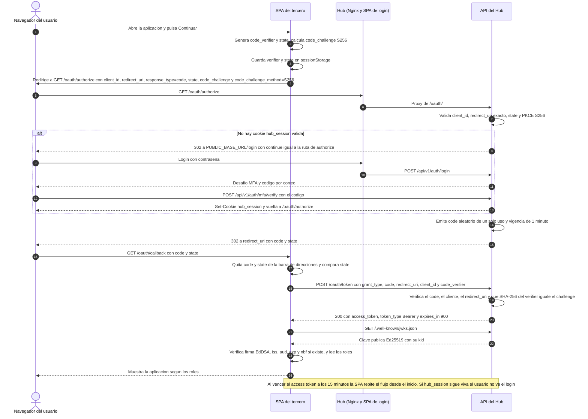

# Guía de integración de plataformas de terceros

Esta guía explica cómo una aplicación externa delega su inicio de sesión en Identity Hub y qué debe cambiar en su frontend. Describe únicamente lo que el repositorio implementa hoy: OAuth 2.0 Authorization Code con PKCE, en versión mínima ([ADR 0009](../../specs/adr/0009-sso-entre-dominios-con-authorization-code-y-pkce.md)). La aplicación de referencia es Contabilidad ([`contabilidad/`](../../contabilidad/)); no se construye una segunda aplicación cliente (D5 de [`odd/tasks/idp-semana-4.md`](../../odd/tasks/idp-semana-4.md)).

Tono y convenciones: el contrato es [`specs/03-api/openapi.yaml`](../../specs/03-api/openapi.yaml); donde el código hace más que el contrato, la guía lo indica. Para el contexto general vea el [manual de arquitectura](arquitectura.md) y el [manual de seguridad](seguridad.md).

## 1. Qué ofrece Identity Hub a una plataforma externa

| Capacidad | Cómo se materializa hoy |
|---|---|
| Autenticación centralizada | El usuario inicia sesión en el Hub (contraseña y MFA por correo, [ADR 0010](../../specs/adr/0010-mfa-por-codigo-enviado-por-correo.md)); la aplicación nunca recibe su contraseña. |
| SSO entre sitios | Tras el primer inicio de sesión el Hub guarda una cookie propia (`hub_session`); un segundo `GET /oauth/authorize` no vuelve a pedir credenciales mientras esa sesión viva. |
| Credencial verificable sin llamar al Hub | Un access token JWT firmado con Ed25519, verificable con la clave pública del JWKS (`/.well-known/jwks.json`). |
| Autorización por roles de la aplicación | El token lleva solo los roles cuyo prefijo coincide con el `client_id` (por ejemplo `contabilidad.senior`), no los roles del directorio ([`roles.go`](../../backend/internal/auth/roles/roles.go), `ForApplication`). |
| Auditoría | La emisión, el canje y el reuso de un código de autorización generan eventos de auditoría (`authorization_code_issued`, `authorization_code_exchanged`, `authorization_code_reused`). |

Lo que **no** ofrece: no es OpenID Connect (sin `id_token`, discovery ni `userinfo`), no tiene registro dinámico de clientes, no entrega refresh tokens a las aplicaciones y no implementa cierre de sesión único. Los detalles están en la sección 9.

## 2. Requisitos previos y registro del cliente

### 2.1 Cómo se registra un cliente hoy

Hay **un único cliente**, `contabilidad`, y su registro **no es configurable por variables de entorno**. Se define en tres lugares que deben coincidir:

| Dato | Valor actual | Dónde vive |
|---|---|---|
| `client_id` | `contabilidad` | Constante `OAuthClientID` en [`backend/internal/config/config.go`](../../backend/internal/config/config.go) y fila de la tabla `applications` sembrada por la migración [`000007_oauth_authorization_code.up.sql`](../../db/migrations/000007_oauth_authorization_code.up.sql). |
| `redirect_uri` | `http://contabilidad.localhost:8080/oauth/callback` | Constante `OAuthRedirectURI` y columna `redirect_uri`. Se compara por **coincidencia exacta** en `/oauth/authorize` y en `/oauth/token`. |
| Origen permitido (CORS) | `http://contabilidad.localhost:8080` | Constante `OAuthClientOrigin` y columna `allowed_origin`. Es el único origen al que el Hub responde con `Access-Control-Allow-Origin` en `/oauth/token` y en el JWKS. |

Al arrancar, la API compara la configuración con la fila registrada (`ValidateOAuthClient` en [`backend/cmd/api/main.go`](../../backend/cmd/api/main.go) y `ValidateRegisteredClient` en [`oauth.go`](../../backend/internal/auth/oauth/oauth.go)); si no coinciden, no inicia. No hay secreto de cliente: es un **cliente público** y PKCE sustituye al secreto.

Variables de entorno que sí afectan a la integración (ver [`config.go`](../../backend/internal/config/config.go) y [`docker-compose.yml`](../../deploy/docker-compose.yml)):

| Variable | Efecto | Valor por defecto o de compose |
|---|---|---|
| `JWT_ISSUER` | Valor de la claim `iss` que el cliente debe exigir. | `http://identityhub.localhost:8080` (compose lo fija igual). |
| `JWT_SIGNING_KEY` | Semilla Ed25519 (base64, 32 bytes) con la que se firma; su parte pública es la que publica el JWKS. Obligatoria. | Sin valor por defecto. |
| `PUBLIC_BASE_URL` | Base de la URL de login del Hub (`<base>/login`) a la que se redirige cuando no hay sesión. | `http://identityhub.localhost:8080`. |
| `HUB_SESSION_TTL` | Duración de la cookie `hub_session` (SSO). | `720h`. |

### 2.2 Requisitos previos de la aplicación del tercero

- Ser un SPA (o cliente) capaz de generar números aleatorios criptográficos y SHA-256 (en el navegador, `crypto.getRandomValues` y `crypto.subtle`) y de verificar Ed25519 (`crypto.subtle` con `Ed25519`, como hace [`jwt.ts`](../../contabilidad/src/auth/jwt.ts)).
- Servirse desde un origen fijo y conocido, con una ruta de callback fija (en Contabilidad, `/oauth/callback`).
- Poder llamar por `fetch` al Hub: la CSP del tercero debe permitir el origen del Hub en `connect-src`, como hace el bloque `contabilidad.localhost` de [`frontend/nginx/default.conf`](../../frontend/nginx/default.conf).
- Las cuentas deben existir en el Hub y tener asignado un rol de la aplicación; el tercero no crea usuarios.
- En local el flujo corre sobre `http://*.localhost:8080`. Las cookies del Hub llevan `Secure`; un despliegue real debe servir el Hub y el tercero por HTTPS.

### 2.3 Qué cambiaría para agregar un segundo cliente

Hoy **no se puede agregar un segundo cliente solo con configuración**. El código fija un cliente en varias capas, así que un segundo cliente exige trabajo de desarrollo (futuro, no disponible):

| Capa | Estado actual | Cambio necesario |
|---|---|---|
| Registro | Constantes en `config.go`; `oauth.Service` recibe un único `oauth.Client`. | Cargar la lista de clientes desde la tabla `applications` (ya admite varias filas) y buscar por `client_id` en cada petición. |
| Base de datos | Una fila sembrada por la migración 000007. | Nueva migración (o un mecanismo de alta) con `client_id`, `redirect_uri`, `allowed_origin`, `name`. |
| Token | `IssueForAudience` recibe el `client_id` configurado; `aud` = ese cliente. | Emitir `aud` con el cliente que canjeó el código. |
| Roles | En código solo viven los roles de sistema `admin` y `user` ([`roles.go`](../../backend/internal/auth/roles/roles.go)); los roles de aplicación son datos que se crean en la grilla ([ADR 0013](../../specs/adr/0013-roles-y-permisos-configurables-por-aplicacion.md)). | Una migración que siembre la aplicación y su catálogo de permisos (como la 000009 de Contabilidad); los roles se arman después en la grilla, sin tocar `roles.go` (ver sección 7). |
| CORS | `oauthCORS` compara `Origin` con un solo valor. | Comparar contra el `allowed_origin` del cliente que corresponda. |
| Nginx | Un `server` para el Hub y otro para Contabilidad; la CSP de Contabilidad permite el origen del Hub. | Un `server` (o dominio) para la nueva aplicación con su propia CSP, o alojarla fuera de este Nginx. |
| Compose | El servicio `web` sirve ambas SPA; las imágenes se construyen desde la raíz. | Incluir el artefacto del tercero o apuntar su dominio al Nginx. |

### 2.4 Limitaciones del registro

- Sin registro dinámico ni pantalla de consentimiento (la aplicación se asume de la propia empresa).
- Sin secreto de cliente ni autenticación del cliente en el canje; solo PKCE.
- Un cambio de `redirect_uri` u origen exige modificar el código y la migración, y volver a desplegar.
- El origen del Hub está escrito a mano en la configuración del cliente (`contabilidad/src/config.ts`) y en la CSP de Nginx.

## 3. Flujo paso a paso



### 3.1 Parámetros de `GET /oauth/authorize`

Todos son obligatorios y deben aparecer **una sola vez** (un parámetro repetido produce `400`).

| Parámetro | Regla (código y contrato) |
|---|---|
| `client_id` | Debe ser el cliente registrado (`contabilidad`). |
| `redirect_uri` | Coincidencia exacta con la registrada. |
| `response_type` | Solo `code`. |
| `state` | No vacío. Es opaco para el Hub y se devuelve sin cambios. |
| `code_challenge` | `BASE64URL(SHA256(code_verifier))`, de 43 a 128 caracteres del alfabeto `A-Z a-z 0-9 - _`. |
| `code_challenge_method` | Solo `S256`; `plain` se rechaza. |

### 3.2 Inicio de sesión y MFA en el Hub

Si la petición no trae una cookie `hub_session` válida (ausente, mal formada, expirada, revocada o de una cuenta inactiva), la API responde `302` a `<PUBLIC_BASE_URL>/login?continue=<ruta de authorize>`. La SPA del Hub solo acepta un `continue` relativo que empiece por `/oauth/authorize` (evita redirecciones abiertas; ver [`continueTarget.ts`](../../frontend/src/features/account/continueTarget.ts)). Tras la contraseña y el código MFA, `POST /api/v1/auth/mfa/verify` crea la cookie `hub_session` y la SPA vuelve a `/oauth/authorize`. El tercero no participa en este paso ni ve credenciales.

### 3.3 Callback

El Hub redirige a la `redirect_uri` registrada con `code` y `state`. Cuando el error es atribuible a la petición pero el cliente y la `redirect_uri` son los registrados, el Hub redirige igualmente con `error=invalid_request` (y `state` si llegó). El tercero debe tratar `error` como fallo. Si el `client_id` o la `redirect_uri` no son los registrados, el Hub **no redirige** y responde `400`.

### 3.4 Canje del código

`POST /oauth/token` con `Content-Type: application/x-www-form-urlencoded` y los campos `grant_type=authorization_code`, `code`, `redirect_uri`, `client_id` y `code_verifier` (43 a 128 caracteres de `A-Z a-z 0-9 - . _ ~`). El código se consume en una transacción: presentarlo dos veces falla y queda auditado. La respuesta lleva `Cache-Control: no-store`.

### 3.5 Expiración

No hay refresh token para las aplicaciones. Contabilidad programa un temporizador al valor de `exp` y entonces vuelve a llamar a `/oauth/authorize` ([`App.tsx`](../../contabilidad/src/App.tsx)). Mientras `hub_session` siga viva (por defecto `720h`) el Hub responde con un nuevo `code` sin pedir credenciales; si venció o se cerró, el usuario vuelve a ver el login del Hub. Contabilidad además rechaza un token que le deje menos de 60 segundos de vida (error de reloj).

## 4. Referencia de endpoints

Los tres endpoints no requieren autenticación previa (`security: []` en el contrato). Los nombres en `snake_case` son nombres de protocolo de RFC 6749.

| Método y ruta | Parámetros | Respuestas y errores |
|---|---|---|
| `GET /oauth/authorize` | Query: `client_id`, `redirect_uri`, `response_type`, `state`, `code_challenge`, `code_challenge_method` (ver 3.1). Cookie `hub_session` (la gestiona el navegador). | `302` con `Location`: al cliente con `code` y `state`; al cliente con `error=invalid_request` y `state`; o al login del Hub si no hay sesión. `400` `application/problem+json` (RFC 7807) cuando la petición no puede redirigirse de forma segura (cliente o `redirect_uri` no registrados, parámetros repetidos). Sin CORS. |
| `POST /oauth/token` | Cuerpo `application/x-www-form-urlencoded`: `grant_type` (`authorization_code`), `code`, `redirect_uri`, `client_id`, `code_verifier`. | `200` JSON `{access_token, token_type: "Bearer", expires_in}` (`expires_in` = 900). `400` problem: `oauth-invalid-request` (cuerpo mal formado, `grant_type` distinto o `code_verifier` con formato inválido) u `oauth-invalid-grant` (código inexistente, vencido, ya usado, o `client_id`, `redirect_uri` o verifier que no coinciden). CORS sin credenciales solo para el origen del cliente; el preflight `OPTIONS` responde `204` con `Access-Control-Allow-Methods: POST` y `Access-Control-Allow-Headers: Content-Type`. |
| `GET /.well-known/jwks.json` | Ninguno. | `200` JSON `{keys: [{kty: OKP, crv: Ed25519, x, kid, use: sig, alg: EdDSA}]}`; el Hub publica una sola clave. CORS sin credenciales solo para el origen del cliente. `503` si el servicio de tokens no está listo. |

Códigos que el código emite y el contrato no declara (conviene que el cliente los trate como fallo genérico): `500` en `/oauth/authorize` (`oauth-session-failed`, `oauth-authorization-failed`) y en `/oauth/token` (`oauth-token-failed`), y `503` (`oauth-unavailable`) en ambos cuando OAuth no está disponible. Fuente: [`backend/internal/api/oauth.go`](../../backend/internal/api/oauth.go).

Los endpoints `POST /api/v1/auth/login` y `POST /api/v1/auth/mfa/verify` pertenecen a la interfaz de login del propio Hub; la aplicación del tercero no los llama.

## 5. Contenido del token

El access token es un JWT firmado con `EdDSA` (Ed25519) emitido por [`token.go`](../../backend/internal/auth/token/token.go) (`IssueForAudience`).

**Cabecera:** `alg: EdDSA` y `kid` (identificador de la clave del JWKS).

| Claim | Contenido | Cómo debe validarlo el cliente |
|---|---|---|
| `iss` | Valor de `JWT_ISSUER` (`http://identityhub.localhost:8080` por defecto). | Igualdad exacta con el emisor esperado. |
| `sub` | UUID del usuario. | Debe ser una cadena no vacía; es el identificador estable de la cuenta. |
| `aud` | Lista con un elemento: el `client_id` (`contabilidad`). | Debe contener el `client_id` propio. Un token con otra audiencia no es para esta aplicación. |
| `exp` | Emisión más 15 minutos (`expires_in` = 900). | Obligatorio; rechazar si venció. |
| `iat` | Instante de emisión. | Informativo. |
| `jti` | Identificador aleatorio (hexadecimal). | Informativo; el Hub no ofrece endpoint de revocación ni introspección. |
| `roles` | Roles de esa aplicación (por ejemplo `contabilidad.senior`). Si el usuario no tiene ninguno, el Hub lo serializa como `null`. | Tratar `null` como lista vacía y exigir que todo elemento sea una cadena. |
| `permissions` | Unión de los permisos de esos roles para la audiencia (por ejemplo `["movimientos.ver_todos", "reportes.ver"]`); lista vacía si no tiene ninguno (sección 7). | Exigir una lista de cadenas; tratar su ausencia o `null` como lista vacía (no concede nada). Decidir las capacidades por esta lista, no por el nombre del rol. |

Los tokens de aplicación no llevan `sid` (solo el token de la consola del Hub) ni `nbf`, y no incluyen correo ni nombre.

**Cómo valida Contabilidad** ([`jwt.ts`](../../contabilidad/src/auth/jwt.ts), invocado desde [`flow.ts`](../../contabilidad/src/auth/flow.ts)):

1. El token debe tener tres segmentos y `alg` debe ser exactamente `EdDSA`; el algoritmo se fija en el cliente y no se toma del JWKS, así `none` y los intentos de degradar a HMAC fallan.
2. Se busca en el JWKS la clave con el mismo `kid`, `kty: OKP` y `crv: Ed25519`; sin coincidencia se rechaza.
3. Se verifica la firma Ed25519 sobre `cabecera.payload`.
4. Se comprueban `iss`, `aud` y `exp` con una tolerancia de reloj de 60 segundos (`CLOCK_LEEWAY_SECONDS`); si existiera `nbf` se valida también.
5. `sub` debe ser una cadena no vacía, y `roles` y `permissions` listas de cadenas (ausente o `null` cuenta como lista vacía).

Esta verificación en el navegador sirve para mostrar la interfaz; no autoriza datos. Una API propia del tercero debe repetir la validación en el servidor (la API del Hub rechaza los tokens de aplicación: exige otra audiencia, `identity-hub`, en [`token.go`](../../backend/internal/auth/token/token.go)).

## 6. Cambios en el frontend del tercero

Contabilidad es la implementación de referencia; cada punto enlaza el archivo correspondiente.

| Cambio | Qué hacer | Referencia |
|---|---|---|
| Configuración | Fijar origen del Hub, `client_id`, emisor, audiencia y ruta de callback; derivar `redirect_uri` del origen propio. | [`config.ts`](../../contabilidad/src/config.ts) |
| PKCE | Generar un `code_verifier` de 32 bytes aleatorios en base64url (43 caracteres) y el `code_challenge` S256. | [`pkce.ts`](../../contabilidad/src/auth/pkce.ts), [`base64url.ts`](../../contabilidad/src/auth/base64url.ts) |
| `state` | Generar 16 bytes aleatorios y guardarlos junto con el verifier en `sessionStorage` solo durante la ida y vuelta; consumirlos (una sola vez) al volver, haya éxito o error. | [`flow.ts`](../../contabilidad/src/auth/flow.ts) (`beginLogin`, `takeStoredFlow`) |
| Ruta de callback | La ruta registrada (`/oauth/callback`) debe caer en la SPA (en Nginx, el `try_files ... /index.html`). Al llegar, quitar `code` y `state` de la URL antes de cualquier operación asíncrona, comparar `state`, tratar `error`, canjear el código con `credentials: 'omit'` y verificar el token con el JWKS. | [`flow.ts`](../../contabilidad/src/auth/flow.ts) (`completeCallback`), [`App.tsx`](../../contabilidad/src/App.tsx) |
| Almacenamiento del token | Contabilidad lo guarda **solo en memoria** (estado de React), nunca en `localStorage` ni `sessionStorage`. Riesgo: cualquier XSS en la aplicación puede leerlo mientras viva la página; recargar la página cierra la sesión local (el SSO del Hub permite recuperarla sin credenciales). Guardarlo en `localStorage` ampliaría la exposición y su persistencia; no se recomienda. | [`App.tsx`](../../contabilidad/src/App.tsx), [ADR 0009](../../specs/adr/0009-sso-entre-dominios-con-authorization-code-y-pkce.md) |
| Guardas por permiso | Tener al menos un rol de la aplicación da acceso (sin ninguno, pantalla de acceso denegado); cada capacidad se decide por una clave de `permissions` (sección 7), nunca por el nombre del rol, para que un rol nuevo armado en la grilla funcione sin desplegar la aplicación. Es solo presentación: el servidor del tercero debe volver a aplicar los permisos. | [`access.ts`](../../contabilidad/src/access.ts), [`Shell.tsx`](../../contabilidad/src/Shell.tsx), [`Login.tsx`](../../contabilidad/src/Login.tsx) |
| Cierre de sesión | `Cerrar sesión` en Contabilidad solo borra el token de memoria. La sesión `hub_session` sigue viva, así que volver a pulsar Continuar entra sin credenciales. Cerrar sesión en el Hub (`POST /api/v1/auth/logout`) revoca el refresh token y todas las sesiones del Hub del usuario en el servidor ([`logout/logout.go`](../../backend/internal/auth/logout/logout.go)), audita el evento y limpia la cookie `hub_session`, pero no invalida un access token ya emitido: la aplicación lo sigue aceptando hasta que vence (15 minutos). | [`App.tsx`](../../contabilidad/src/App.tsx), [`logout.go`](../../backend/internal/api/logout.go) |
| Reautenticación | Programar el inicio de un nuevo flujo cuando `exp` se cumpla (no hay refresh token). | [`App.tsx`](../../contabilidad/src/App.tsx) |
| CSP | `connect-src` debe incluir el origen del Hub; el resto en `'self'`, sin scripts inline. | [`default.conf`](../../frontend/nginx/default.conf) |

Las pruebas que respaldan el flujo están en [`flow.test.ts`](../../contabilidad/src/auth/flow.test.ts), [`jwt.test.ts`](../../contabilidad/src/auth/jwt.test.ts) y [`pkce.test.ts`](../../contabilidad/src/auth/pkce.test.ts).

## 7. Declaración de permisos de la aplicación

Los roles de aplicación son datos del Hub, no código ([ADR 0013](../../specs/adr/0013-roles-y-permisos-configurables-por-aplicacion.md), RF-021). Cada aplicación declara un catálogo de **permisos**; un administrador arma **roles** marcando permisos en la grilla de la consola (**Roles**) y los asigna a las cuentas. La aplicación solo lee el claim `permissions` del token.

### 7.1 Modelo

| Concepto | Dónde vive | Reglas |
|---|---|---|
| Permiso | Tabla `permissions`, ligada a `applications`. | Clave estable con forma `<recurso>.<acción>` (por ejemplo `cierre.ejecutar`). Pertenece a una sola aplicación. |
| Rol de aplicación | Tabla `roles` con `application_id` no nulo. | Nombre `<client_id>.<nombre>` (por ejemplo `contabilidad.auditor`); se crea, edita y borra desde la grilla. |
| Relación rol-permiso | Tabla `role_permissions`. | Un rol solo referencia permisos de su propia aplicación. |
| Rol de directorio | `admin` y `user` (`application_id` nulo, marca de sistema). | Del propio Hub; la grilla no los crea, edita ni borra, y el token de una aplicación nunca los lleva. |

### 7.2 Cómo declara sus permisos una aplicación

Hoy el catálogo se declara con una **migración** que siembra la aplicación y sus claves; no hay endpoint para declararlas. La de Contabilidad es [`000009_application_permissions.up.sql`](../../db/migrations/000009_application_permissions.up.sql), que también convierte los dos roles históricos en filas con sus permisos:

| Clave de Contabilidad | Capacidad en la interfaz | `senior` | `analista` |
|---|---|:-:|:-:|
| `movimientos.registrar` | Botón «Registrar movimiento» y su formulario. | ✓ | ✓ |
| `movimientos.ver_todos` | Ver los movimientos de todos (sin él, solo los propios). | ✓ | |
| `movimientos.aprobar` | Aprobar y rechazar movimientos pendientes. | ✓ | |
| `cierre.ejecutar` | Sección y botón de cierre contable. | ✓ | |
| `reportes.ver` | Resumen con totales del período. | ✓ | ✓ |

Para una aplicación nueva: elegir claves que describan capacidades (no puestos de trabajo), escribir la migración que inserte la aplicación y sus `permissions`, y hacer que el frontend decida cada capacidad por una clave. Los roles los arma después el administrador; la aplicación no debe conocer sus nombres.

### 7.3 Cómo llegan al token

Al emitir el token de una aplicación, el Hub incluye en `roles` solo los roles de esa aplicación y en `permissions` la unión de sus permisos ([`token.go`](../../backend/internal/auth/token/token.go)). Un cambio en la grilla se ve en el **siguiente** token: uno ya emitido conserva el estado anterior hasta que vence (15 minutos como máximo).

Ejemplo: un empleado con el rol `contabilidad.auditor` (`reportes.ver` y `movimientos.ver_todos`) recibe:

```json
{ "aud": ["contabilidad"], "roles": ["contabilidad.auditor"], "permissions": ["movimientos.ver_todos", "reportes.ver"] }
```

Contabilidad le muestra todos los movimientos y el Resumen, pero no le ofrece registrar, aprobar ni cerrar el mes. Esta escena es la prueba E2E de [`roles-y-permisos.spec.ts`](../../e2e/tests/roles-y-permisos.spec.ts), que además verifica el claim exacto.

### 7.4 Administración y controles

Los endpoints de la grilla exigen `admin` (contrato en [`openapi.yaml`](../../specs/03-api/openapi.yaml)):

| Operación | Endpoint |
|---|---|
| Listar aplicaciones, permisos y roles | `GET /api/v1/admin/applications` |
| Listar roles de una aplicación | `GET /api/v1/admin/applications/{applicationId}/roles` |
| Crear rol | `POST /api/v1/admin/applications/{applicationId}/roles` |
| Actualizar permisos | `PATCH /api/v1/admin/applications/{applicationId}/roles/{roleId}` |
| Eliminar rol | `DELETE /api/v1/admin/applications/{applicationId}/roles/{roleId}` |

Controles que aplica el Hub, cada uno cubierto por un escenario de [`roles-y-permisos.feature`](../../specs/06-acceptance/roles-y-permisos.feature):

1. Solo se crean roles de aplicación; `admin` y `user` no se crean, editan ni borran (`400` o `403`).
2. Un administrador no modifica los permisos de un rol que posee (`403`).
3. Un permiso desconocido o de otra aplicación se rechaza (`400`).
4. Un rol asignado no se elimina (`409`).
5. Crear, actualizar y borrar un rol queda en el audit log (`role_created`, `role_updated`, `role_deleted`); las asignaciones siguen registrando `role_changed`.

## 8. Checklist de seguridad para el integrador

- [ ] Usar PKCE `S256` con un `code_verifier` aleatorio criptográfico de al menos 43 caracteres; nunca `plain`.
- [ ] Generar un `state` impredecible por intento, guardarlo y compararlo antes de canjear el código; descartarlo después de usarlo.
- [ ] Registrar una `redirect_uri` exacta y fija; no construirla con datos del usuario.
- [ ] Quitar `code` y `state` de la URL antes de cualquier llamada asíncrona; no registrarlos en logs ni en analítica.
- [ ] Canjear el código con `credentials: 'omit'`; el Hub no usa cookies en `/oauth/token`.
- [ ] Verificar el token: firma `EdDSA` con la clave del JWKS por `kid`, `iss` exacto, `aud` propio y `exp`. Fijar el algoritmo en el cliente.
- [ ] No tratar la verificación en el navegador como autorización: repetirla y aplicar los permisos en el servidor del tercero.
- [ ] Decidir cada capacidad por una clave de `permissions`, nunca por el nombre del rol, y tratar un claim ausente como lista vacía.
- [ ] Mantener el access token solo en memoria; no persistirlo en `localStorage`.
- [ ] Aplicar una CSP estricta (sin scripts inline) con `connect-src` limitado a su origen y al del Hub.
- [ ] Tratar `error` en el callback y los fallos `400`, `500` y `503` de los endpoints sin revelar detalles al usuario.
- [ ] Planificar la reautenticación al vencer el token (15 minutos) y no depender de un cierre de sesión único.
- [ ] Servir el Hub y la aplicación por HTTPS en cualquier entorno distinto del local; las cookies del Hub son `Secure`.
- [ ] Mantener las dependencias de la aplicación bajo los mismos escaneos del [manual de seguridad](seguridad.md).

## 9. Limitaciones actuales y trabajo futuro

| Limitación actual | Qué haría falta (trabajo futuro, no disponible hoy) |
|---|---|
| Un solo cliente fijo en el código (`contabilidad`). | Cargar clientes desde `applications`, con alta administrable y CORS y audiencia por cliente (sección 2.3). |
| Sin registro dinámico de clientes ni consentimiento. | Un endpoint o consola de registro y una pantalla de consentimiento para terceros ajenos a la empresa. |
| Sin secreto de cliente; solo clientes públicos con PKCE. | Autenticación de cliente confidencial para aplicaciones con backend. |
| Sin refresh tokens para aplicaciones; la renovación pasa por un nuevo `/oauth/authorize`. | Un refresh token acotado por cliente, con rotación y revocación (el del Hub, [ADR 0005](../../specs/adr/0005-refresh-tokens-rotativos-con-familia.md), es solo de la consola). |
| No es OpenID Connect: sin `id_token`, discovery (`/.well-known/openid-configuration`) ni `userinfo`. | Implementar OIDC para que clientes estándar se integren sin código a medida. |
| Los permisos de una aplicación se declaran con una migración (sección 7.2). | Un endpoint o manifiesto con el que la aplicación registre su catálogo de permisos sin desplegar el Hub. |
| Sin cierre de sesión único: salir del Hub no cierra la sesión de la aplicación hasta que vence su token (15 minutos). | Cierre de sesión por canal frontal o trasero y revocación de tokens. |
| Sin revocación ni introspección de access tokens. | Endpoint de introspección o lista de revocación. |
| El JWKS publica una sola clave. | Publicar varias claves y un procedimiento de rotación con `kid` (el cliente de referencia ya selecciona la clave por `kid`). |
| Roles de aplicación fijos en código; el mecanismo de declaración de permisos no existe. | Se completa tras T15 (sección 7). |
| El Hub, el emisor y el `client_id` están fijos a mano en la configuración del cliente y en la CSP de Nginx. | Configuración por entorno en el cliente. |
| El contrato OpenAPI no declara los `500` y `503` que el código emite en los endpoints OAuth. | Alinear el contrato con el comportamiento real. |
