# Manual de usuario

Esta guía explica cómo usar Identity Hub y la aplicación conectada Contabilidad, paso a paso y con capturas. Describe únicamente lo que las pantallas ofrecen hoy; no promete funciones que no existen. Está organizada por tipo de usuario:

| Si usted es... | Lea | Qué hace |
|---|---|---|
| Empleado | [sección 2](#2-empleado) | Activa su cuenta, inicia sesión con código por correo, recupera su contraseña y gestiona su perfil y sesiones. |
| Administrador | [sección 3](#3-administrador-consola-del-hub) | Invita y administra usuarios, configura roles y permisos, consulta la auditoría. |
| Usuario de Contabilidad | [sección 4](#4-contabilidad-sso-con-identity-hub) | Entra a Contabilidad con su cuenta del Hub y ve lo que su rol permite. |

La [sección 5](#5-historia-de-usuario-para-la-sustentación) cuenta de punta a punta la historia del auditor, pensada para la sustentación.

## 1. Antes de empezar

### 1.1 Direcciones

| Pieza | Dirección local | Para qué sirve |
|---|---|---|
| Identity Hub (consola y cuenta) | `http://identityhub.localhost:8080` | Inicio de sesión, "Mi cuenta" y consola de administración. |
| Contabilidad | `http://contabilidad.localhost:8080` | Aplicación conectada al Hub (SSO). |
| Mailpit | `http://localhost:8025` | Buzón de pruebas: en este entorno los correos no salen a Internet, se leen aquí. |

Para levantar el stack, vea la [guía de desarrollo](../guia-desarrollo.md) o ejecute `make up` desde la raíz del repositorio.

### 1.2 Cómo funciona el inicio de sesión

- **Se usa contraseña y un código de seis dígitos que llega por correo electrónico** ([ADR 0010](../../specs/adr/0010-mfa-por-codigo-enviado-por-correo.md)). No hay código QR, ni aplicación autenticadora, ni claves que "enrolar": la verificación en dos pasos es el correo.
- **No existe el registro público.** Las cuentas las crea un administrador, que envía una invitación al correo de la persona.
- La contraseña debe tener entre 12 y 128 caracteres.
- Las capturas de este manual se generaron con cuentas de prueba (`...@example.test`) y datos de ejemplo. Ninguna muestra contraseñas, códigos ni enlaces de invitación o de restablecimiento.

### 1.3 Cómo regenerar las capturas

Las imágenes de [`img/usuario/`](img/usuario/) las produce un script que maneja el stack real, de modo que siguen el comportamiento actual:

```bash
make up          # si el stack no está levantado
make capturas    # escribe docs/manuales/img/usuario/*.png (48 imágenes, ~30 s)
```

El script ([`e2e/manual/capturas.ts`](../../e2e/manual/capturas.ts)) no forma parte de `make e2e` ni de la matriz de trazabilidad. Crea sus propias cuentas de prueba (que quedan deshabilitadas al terminar) y los roles `contabilidad.auditor` y `contabilidad.temporal`, que elimina al final. Si alguno de esos roles ya existe, se detiene sin tocarlo.

---

## 2. Empleado

### 2.1 Aceptar la invitación y definir la contraseña

1. Un administrador crea su cuenta y el Hub envía un correo de invitación a su dirección. En este entorno de pruebas el correo se lee en Mailpit; el asunto es **"[Identity Hub] You have been invited to Identity Hub"**.

   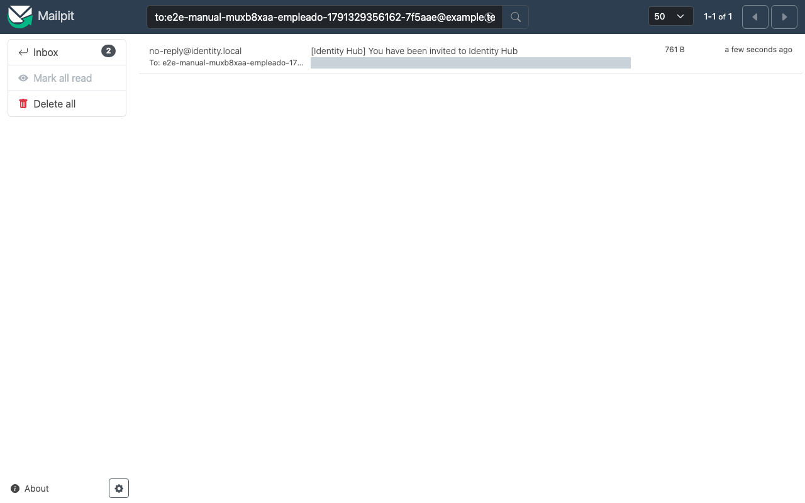

2. Abra el enlace del correo. Verá la pantalla **Define tu contraseña**. Escriba la contraseña nueva y repítala en **Confirma la contraseña**.

   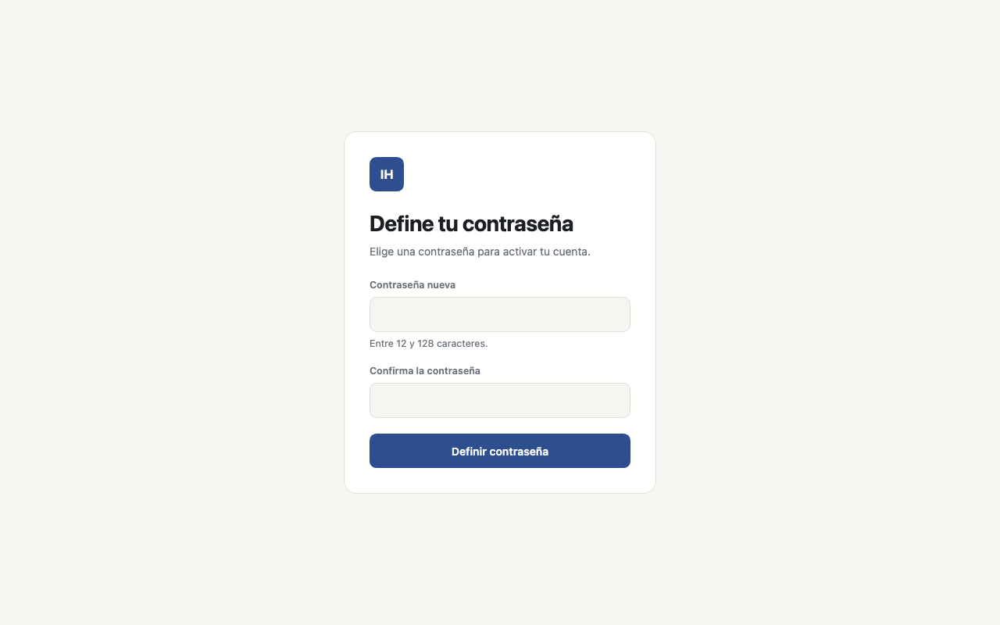

3. Si la contraseña no cumple el largo (entre 12 y 128 caracteres) o las dos no coinciden, la pantalla lo indica y no envía nada.

   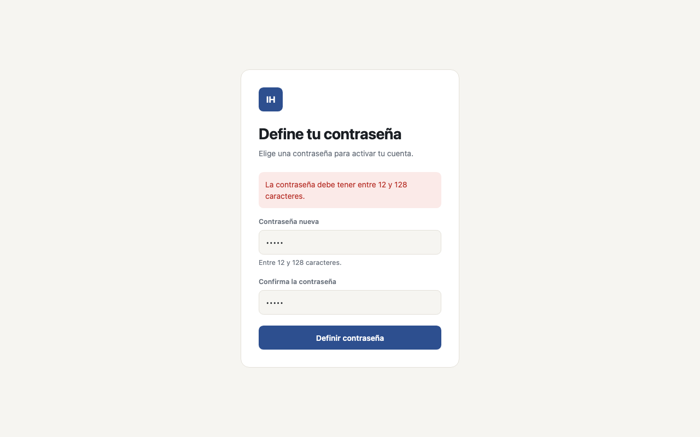

4. Pulse **Definir contraseña**. Aparece el aviso **Tu cuenta quedó activada**. Use **Ir a iniciar sesión** para continuar.

   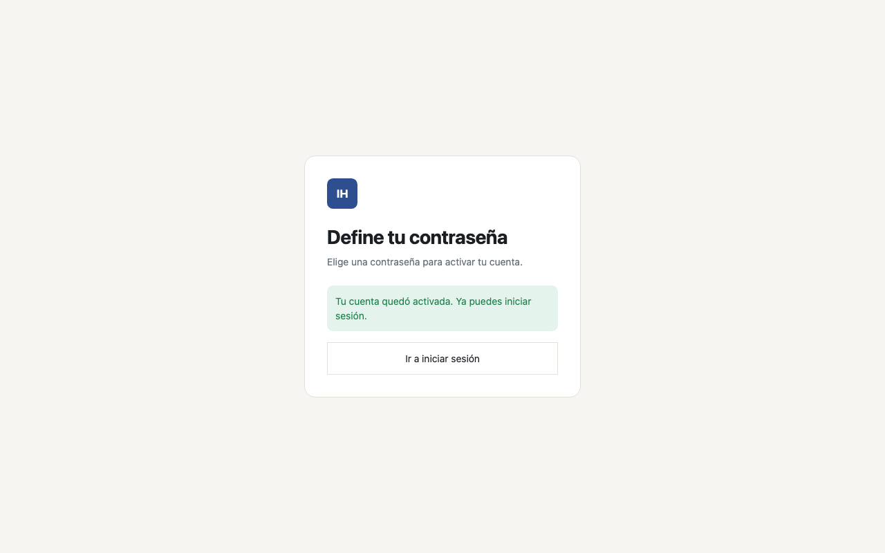

Si el enlace está incompleto, venció o ya se usó, la pantalla lo dice (**La invitación venció o ya se usó**) y debe pedir a un administrador que le reenvíe la invitación.

### 2.2 Iniciar sesión con contraseña y código por correo

1. Abra `http://identityhub.localhost:8080/login`, escriba su correo y su contraseña y pulse **Iniciar sesión**.

   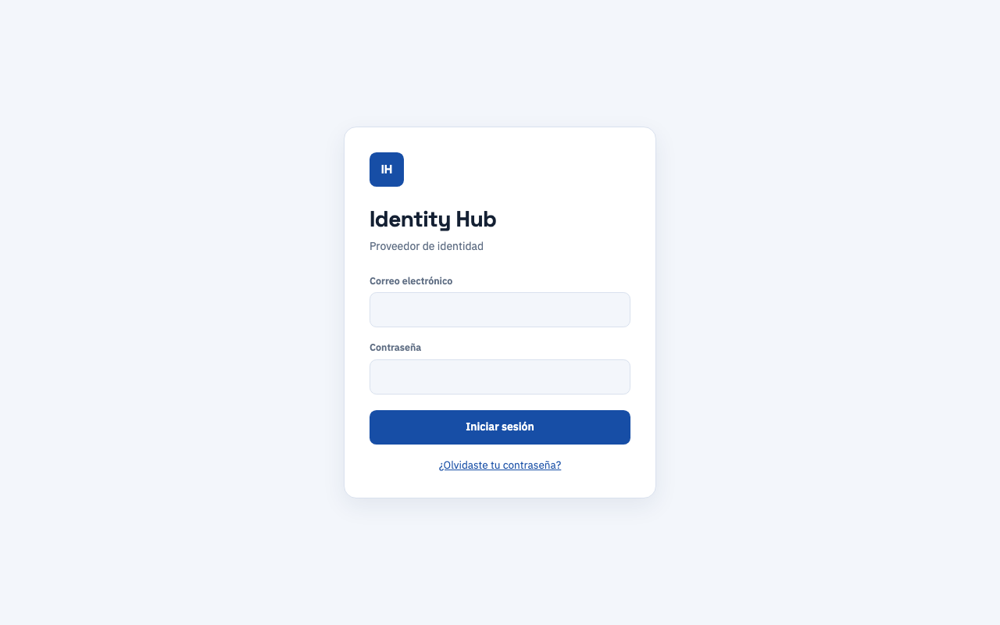

2. El Hub le envía un código de seis dígitos y muestra la pantalla **Código de verificación**.

   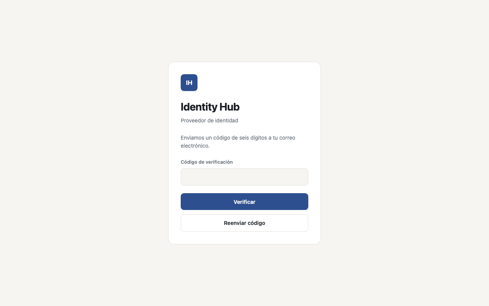

3. Abra el correo **"[Identity Hub] Your Identity Hub sign-in code"**, copie el código y escríbalo. Pulse **Verificar**. (La captura oculta la línea de vista previa del correo porque contiene el código.)

   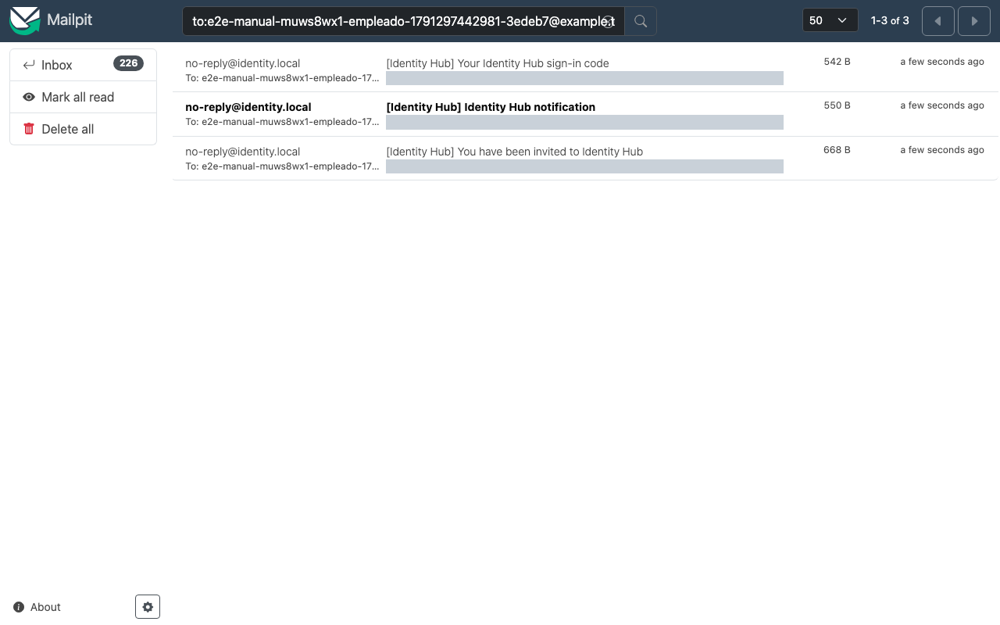

4. Si no le llegó el código, pulse **Reenviar código**. Solo se puede pedir otro cada 60 segundos; si lo intenta antes, la pantalla avisa **Se solicitaron demasiados códigos. Espera antes de reenviar otro.** y el código anterior sigue siendo válido.

   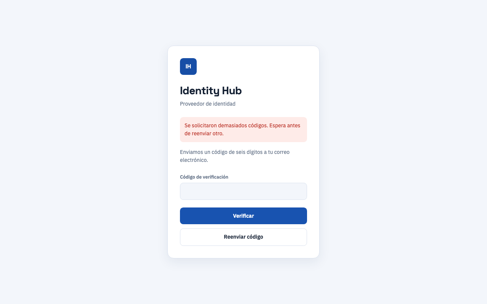

5. Un código incorrecto o vencido muestra **El código no es válido o el desafío expiró.** con el botón **Volver a iniciar sesión**.

6. Al verificar, entra a **Mi cuenta** (los administradores entran a **Usuarios**).

### 2.3 Mi cuenta: perfil y sesiones

**Mi cuenta** muestra dos paneles:

- **Perfil**: el nombre para mostrar (editable), el correo (solo lectura) y sus roles.
- **Sesiones activas**: cada dispositivo con una sesión abierta, con su dirección IP y fechas. La sesión actual lleva la etiqueta **Esta sesión**. **Revocar** cierra una sesión; si revoca la actual, se cierra aquí mismo.

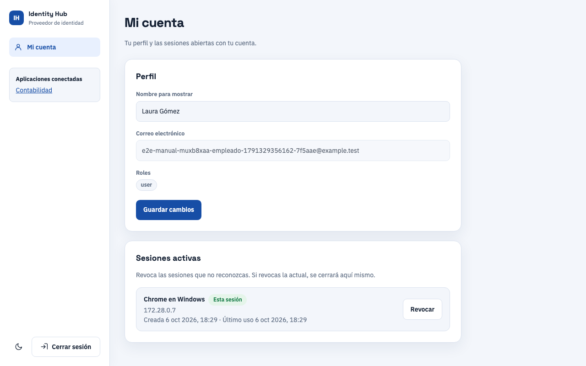

Para cambiar el nombre, edítelo y pulse **Guardar cambios**: aparece **Perfil actualizado.**

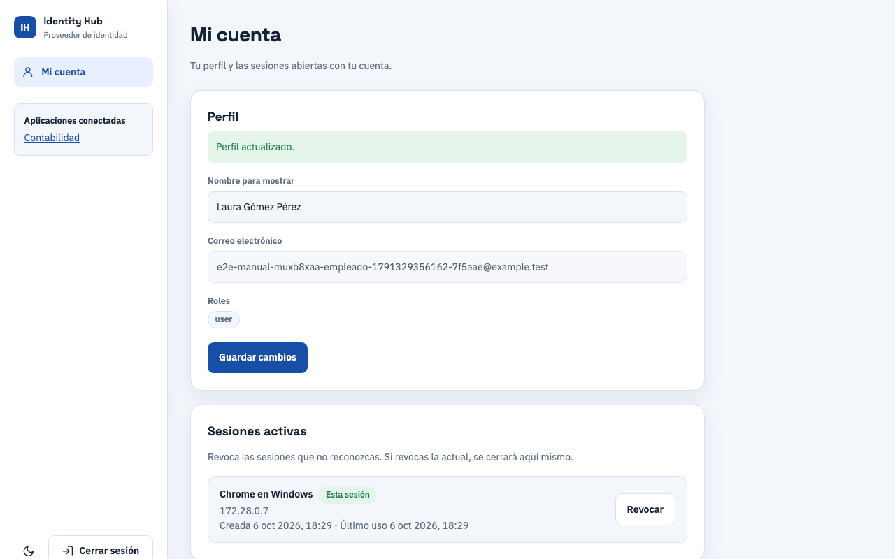

### 2.4 Olvidé mi contraseña

1. En la pantalla de inicio de sesión, pulse **¿Olvidaste tu contraseña?**, escriba su correo y pulse **Enviar enlace**.

   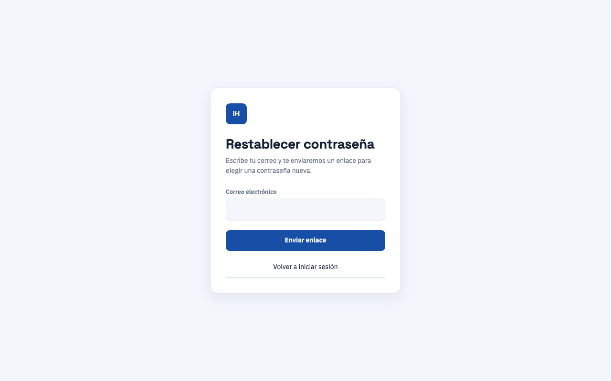

2. La pantalla responde siempre lo mismo, exista o no la cuenta (**Si la cuenta existe, enviamos un enlace...**), para no revelar qué correos están registrados.

   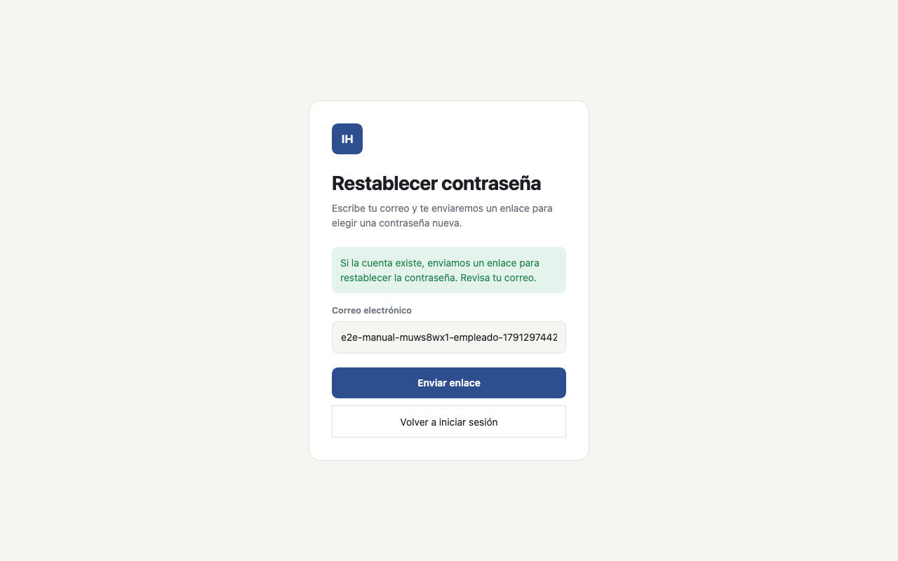

3. Abra el enlace del correo (el asunto menciona "password"). En **Elige una contraseña nueva** escriba la contraseña y su confirmación, y pulse **Restablecer contraseña**.

   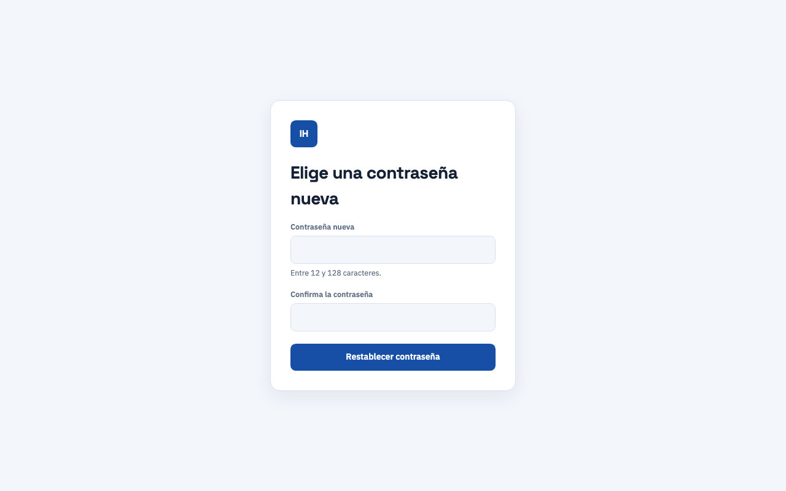

4. Aparece **Tu contraseña se actualizó y cerramos tus sesiones activas. Inicia sesión con la nueva.** Todas las sesiones anteriores se cierran por seguridad. Un enlace vencido o ya usado muestra **El enlace venció o ya se usó** y permite pedir otro.

   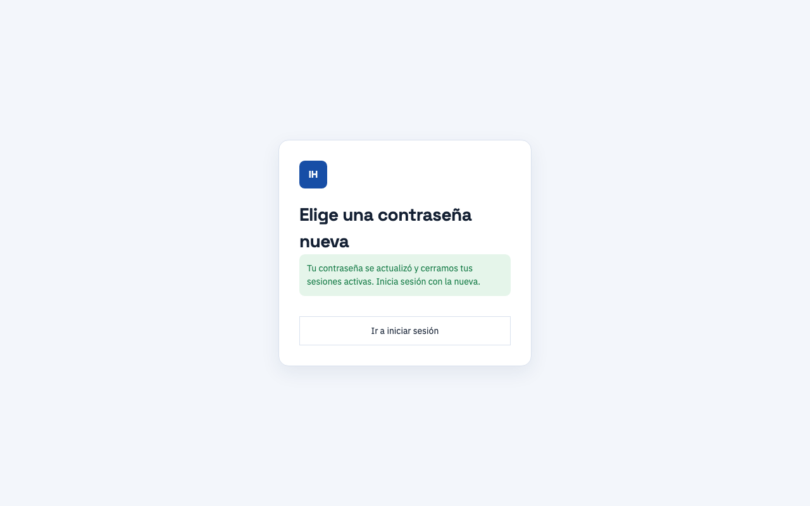

### 2.5 Mensajes de error y bloqueo de la cuenta

- Credenciales incorrectas: **Correo o contraseña incorrectos.**

  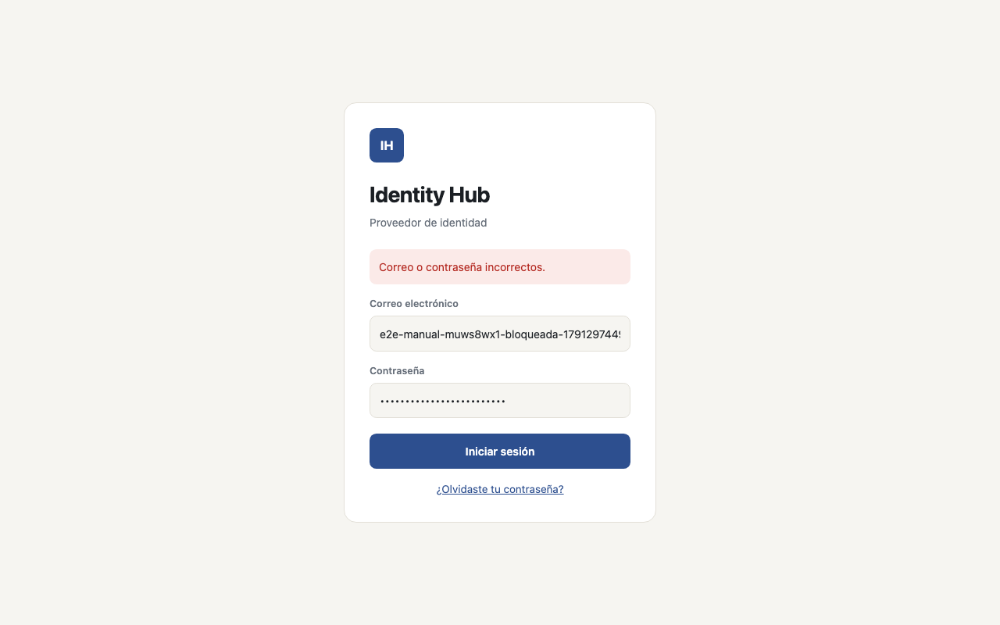

- **Tras 5 intentos fallidos la cuenta se bloquea** (15 minutos por defecto) y el Hub envía un correo "account temporarily locked". Mientras dure el bloqueo, aun la contraseña correcta recibe **La cuenta está bloqueada. Inténtalo más tarde.**

  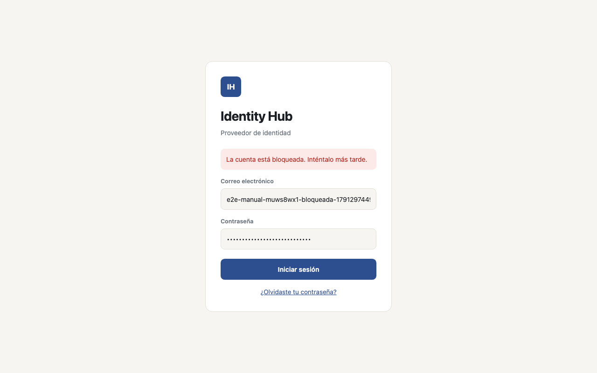

  Para volver a entrar puede esperar a que termine el bloqueo, restablecer la contraseña (sección 2.4) o pedir a un administrador que cambie el estado de la cuenta a **Activo** (sección 3.3).

- **Demasiados intentos. Espera antes de volver a intentarlo.** aparece cuando se supera el límite de solicitudes o de intentos permitido; espere unos minutos.

### 2.6 Cerrar sesión

En el menú lateral, pulse **Cerrar sesión**: vuelve al formulario de inicio de sesión (captura de la sección 2.2, paso 1). Cerrar la sesión del Hub no cierra por sí sola la de Contabilidad; esa se cierra con su propio botón (sección 4.6).

---

## 3. Administrador (consola del Hub)

Los administradores ven en el menú lateral cuatro entradas: **Usuarios**, **Roles**, **Auditoría** y **Mi cuenta**. Las tres primeras solo existen para el rol `admin`; un empleado que escriba esas direcciones es devuelto a **Mi cuenta**. Inicie sesión como se explica en la sección 2.2: entrará directamente a **Usuarios**.

### 3.1 Directorio de usuarios y búsqueda

**Usuarios** muestra tres indicadores (**Usuarios activos**, **Cuentas bloqueadas**, **Invitaciones pendientes**) y el **Directorio**: nombre, correo, estado (**Activo**, **Pendiente**, **Bloqueado**, **Deshabilitado**), roles y último acceso. Los indicadores cuentan solo los usuarios cargados; si hay más, aparece **Cargar más**.

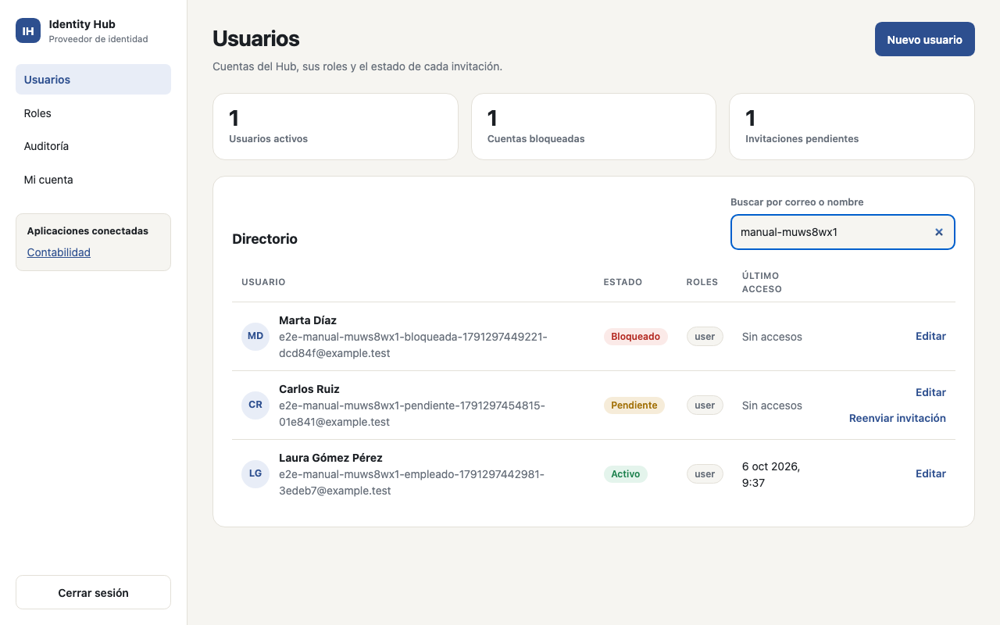

> En la captura se aplicó una búsqueda para mostrar solo las cuentas de la corrida del script; sin filtro verá el directorio completo.

Para buscar, escriba en **Buscar por correo o nombre**; la lista se filtra mientras escribe.

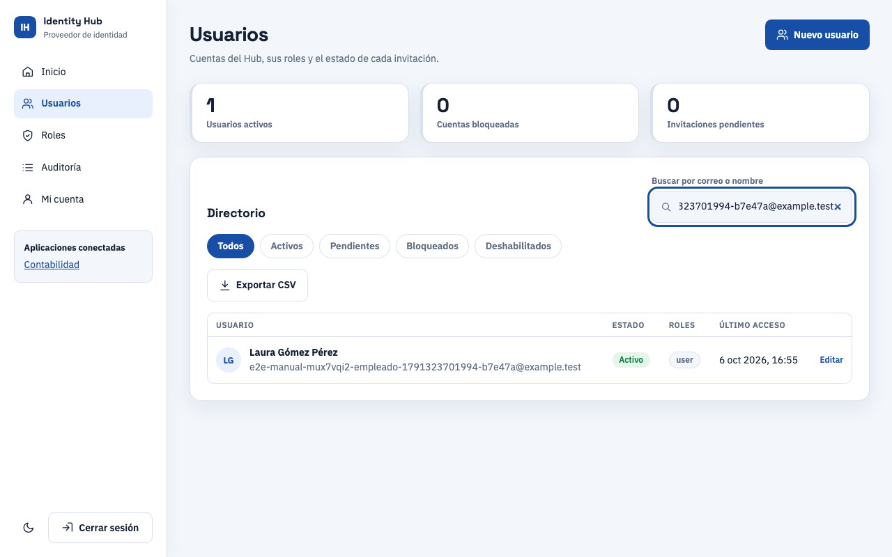

### 3.2 Invitar a un usuario

1. Pulse **Nuevo usuario**. Se abre el panel lateral con el nombre, el correo y los roles. El rol `user` va siempre marcado; puede añadir roles de aplicaciones (por ejemplo `contabilidad.senior`), cada uno con su descripción y sus permisos.

   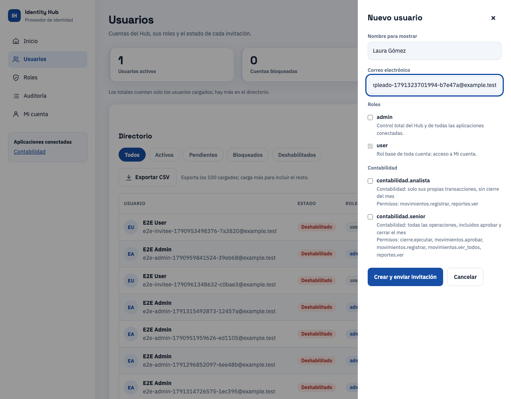

2. Pulse **Crear y enviar invitación**. El Hub crea la cuenta en estado **Pendiente** y envía el correo; aparece **Invitación enviada a ...**.

   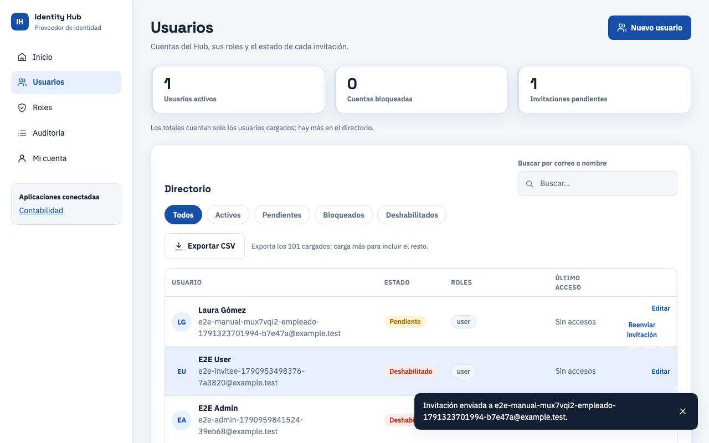

3. Si la persona no recibió el correo, en su fila use **Reenviar invitación** (solo disponible mientras la cuenta está **Pendiente**).

   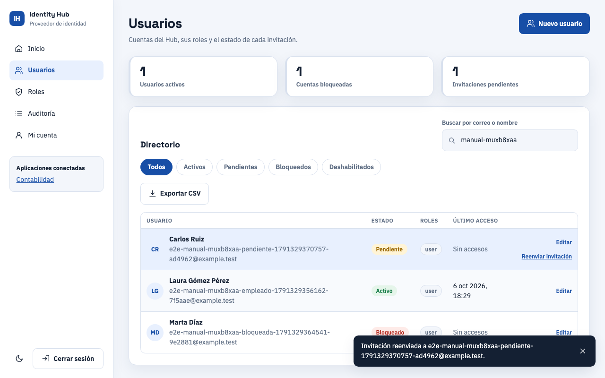

### 3.3 Editar un usuario

Pulse **Editar** en la fila. El nombre y el correo son de solo lectura. Puede cambiar:

- **Estado**: **Activo**, **Bloqueado** o **Deshabilitado** (**Pendiente** solo aparece mientras la cuenta no aceptó su invitación). Poner **Activo** a una cuenta bloqueada la desbloquea; **Deshabilitado** le impide iniciar sesión.
- **Roles**: `admin` y los roles de cada aplicación. `user` no se puede quitar.

Pulse **Guardar cambios** (aparece **Cambios guardados.**) o **Cancelar**. Un rol nuevo rige desde el siguiente inicio de sesión de la persona.

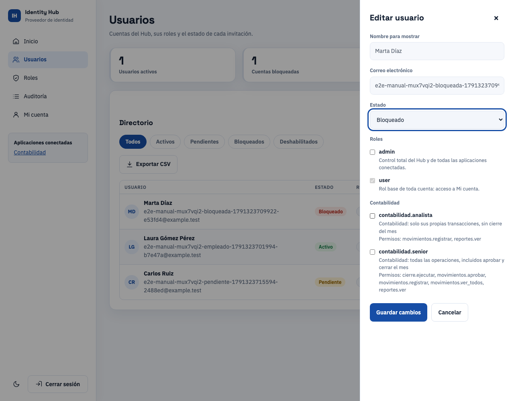

Reglas que el panel hace cumplir: un administrador **no puede deshabilitarse ni asignarse roles a sí mismo** (otro administrador debe hacerlo), y siempre debe quedar un administrador activo.

### 3.4 Roles y permisos

**Roles** ofrece una grilla por aplicación conectada. Cada aplicación declara sus permisos (columnas) y usted decide qué permisos lleva cada rol (filas). Los roles `admin` y `user` son del sistema y no se editan aquí. Un cambio de permisos rige desde el siguiente token de acceso de la persona (hasta 15 minutos).

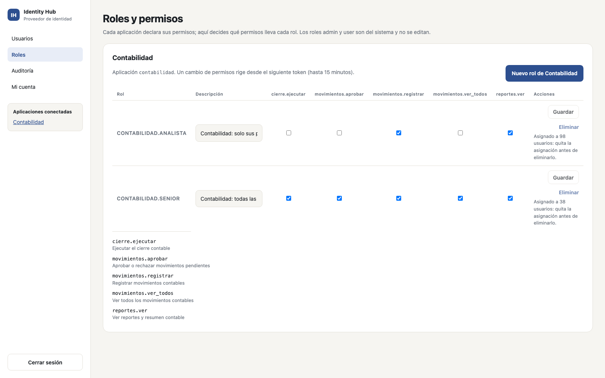

> En pantallas de 1280 px la grilla se desplaza horizontalmente dentro de su panel. Las capturas de esta sección se tomaron en una ventana más ancha para mostrarla completa.

**Crear un rol.** Pulse **Nuevo rol de Contabilidad**, escriba el nombre (con el prefijo `contabilidad.`), marque los permisos y pulse **Crear rol**. Cada permiso se explica en la leyenda al pie de la grilla.

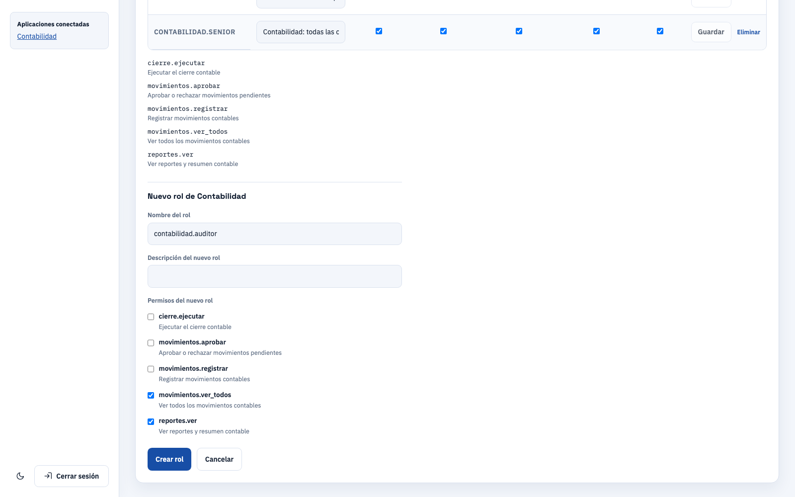

Al crearlo aparece **Rol contabilidad.auditor creado.** y el rol aparece en la grilla.

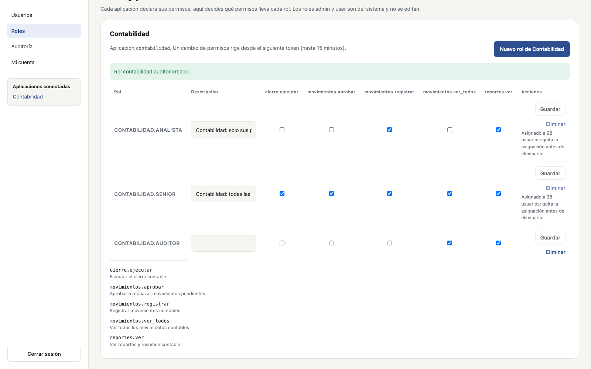

**Cambiar los permisos de un rol.** Marque o desmarque casillas en su fila; el botón **Guardar** de esa fila se habilita (también puede editar la descripción). Pulse **Guardar**.

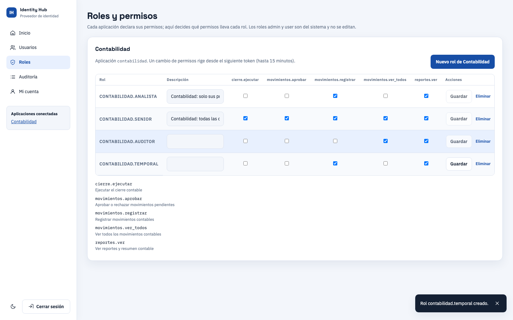

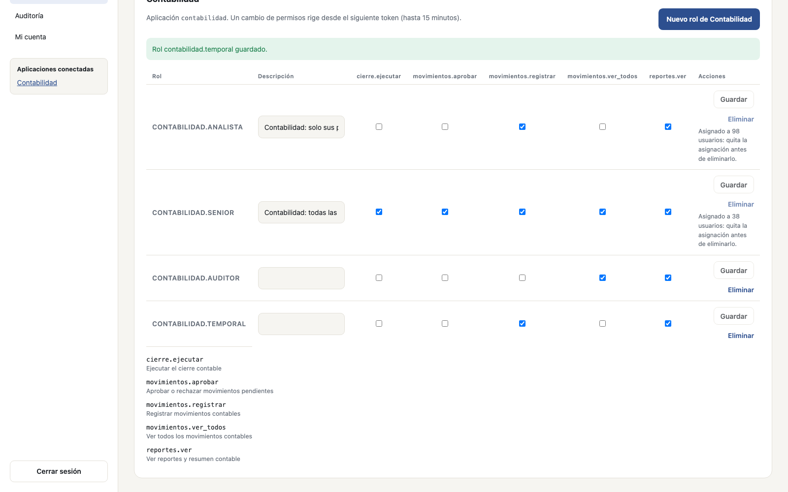

**Eliminar un rol que nadie usa.** Pulse **Eliminar** y luego **Confirmar eliminación** (o **Cancelar**).

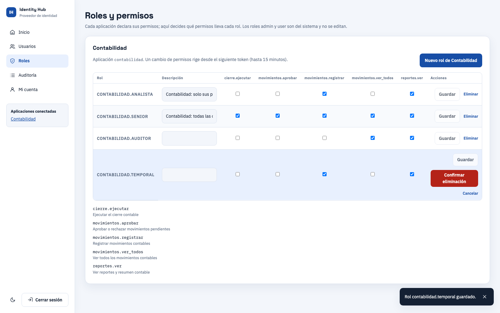

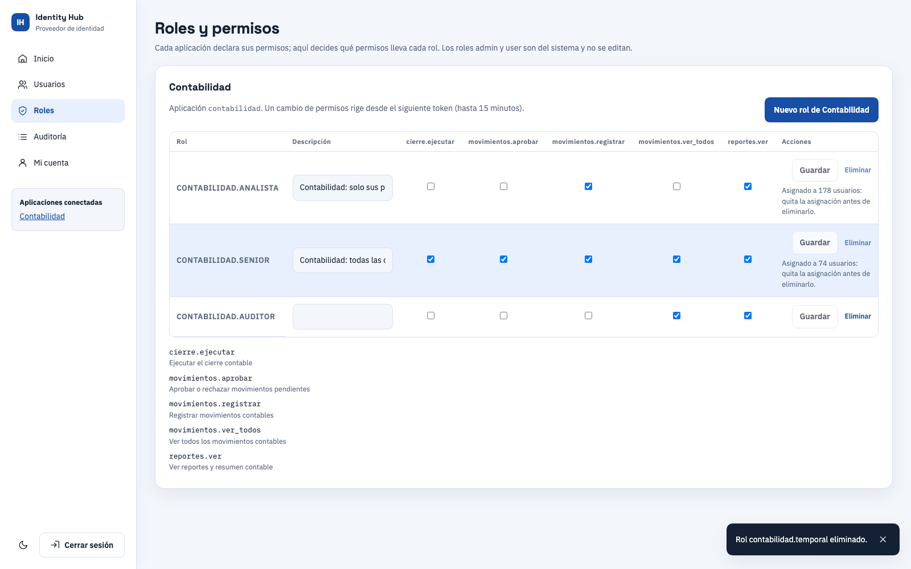

**Un rol asignado no se puede eliminar.** Si al menos una persona lo tiene, **Eliminar** queda deshabilitado y la fila indica **Asignado a N usuarios: quita la asignación antes de eliminarlo.** Tampoco puede un administrador editar ni eliminar un rol que él mismo posee: solo otro administrador puede hacerlo.

Cada creación, cambio y eliminación de un rol queda registrado en la auditoría (sección 3.6).

### 3.5 Asignar un rol de aplicación a un usuario

1. En **Usuarios**, busque a la persona y pulse **Editar**.
2. Marque el rol en la sección de la aplicación (por ejemplo `contabilidad.auditor`; el panel muestra sus permisos).

   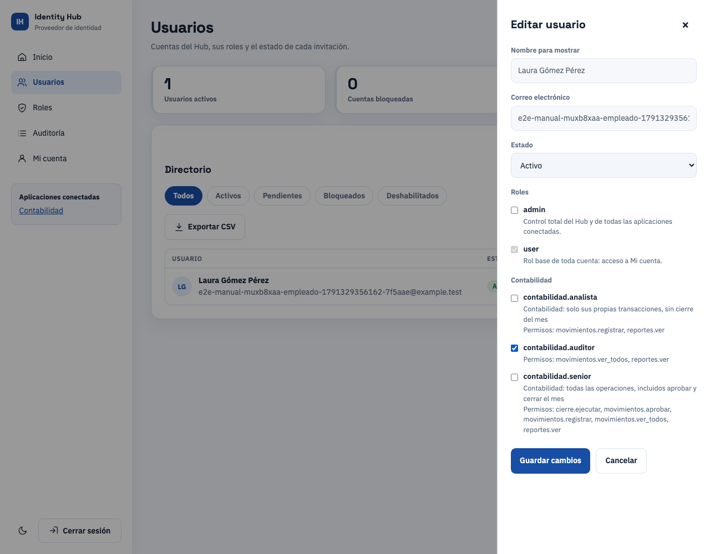

3. Pulse **Guardar cambios**. Aparece **Cambios guardados.**

   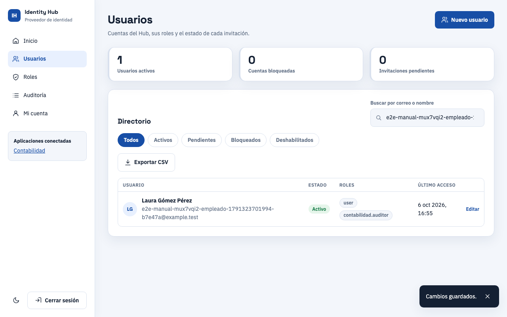

4. De vuelta en **Roles**, la fila del rol muestra ahora **Asignado a 1 usuario** y **Eliminar** deshabilitado.

   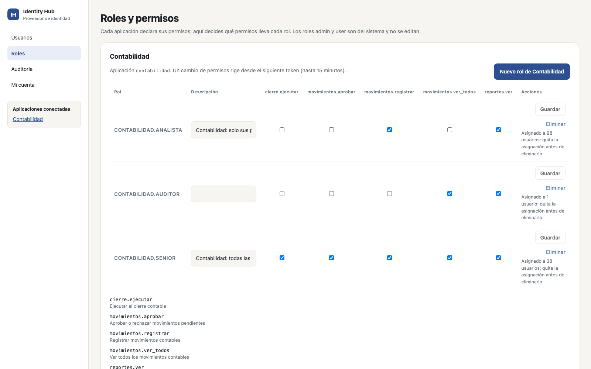

### 3.6 Registro de auditoría

**Auditoría** lista los eventos de seguridad del Hub, del más reciente al más antiguo. Es de solo lectura. Cada fila muestra fecha, actor, acción (por ejemplo `login_failed`, `account_locked`, `employee_created`, `invitation_resent`, `role_created`, `role_updated`, `role_deleted`, `role_changed`), recurso, IP y metadatos (**Ver** despliega el detalle).

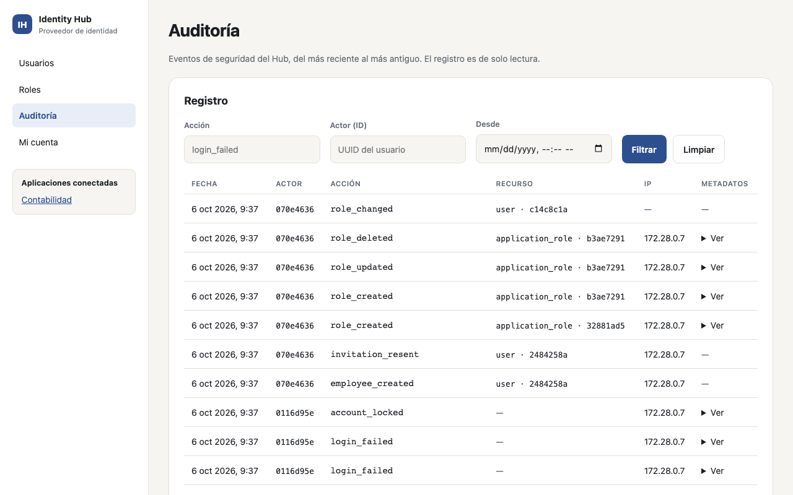

Para acotar, use los filtros **Acción** (nombre exacto de la acción), **Actor (ID)** (un UUID) y **Desde** (fecha y hora), y pulse **Filtrar**; **Limpiar** los quita. **Cargar más** trae eventos anteriores.

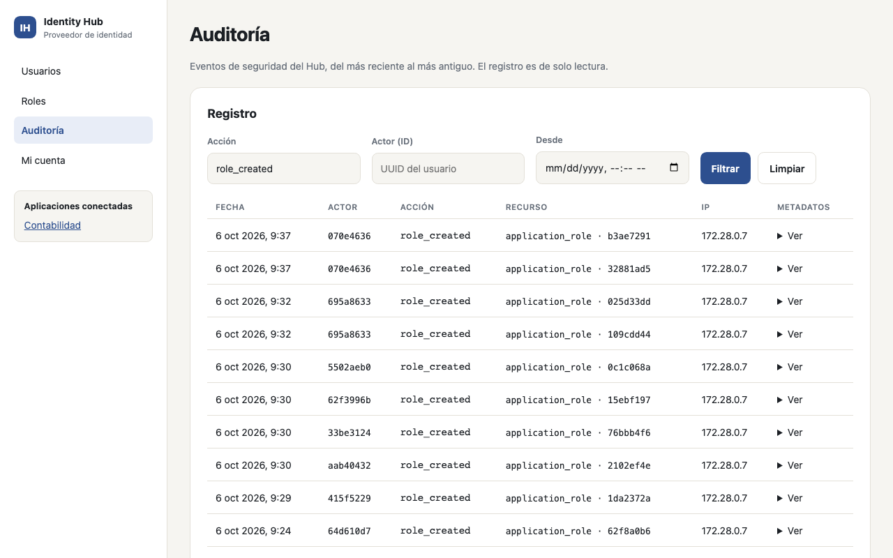

---

## 4. Contabilidad (SSO con Identity Hub)

Contabilidad no tiene usuarios ni contraseñas propias: delega el inicio de sesión en el Hub ([guía de integración](integracion-terceros.md)). Los movimientos que muestra son **datos de ejemplo** que viven en el navegador: se reinician al recargar la página.

### 4.1 Entrar

1. Abra `http://contabilidad.localhost:8080` y pulse **Continuar con Identity Hub**.

   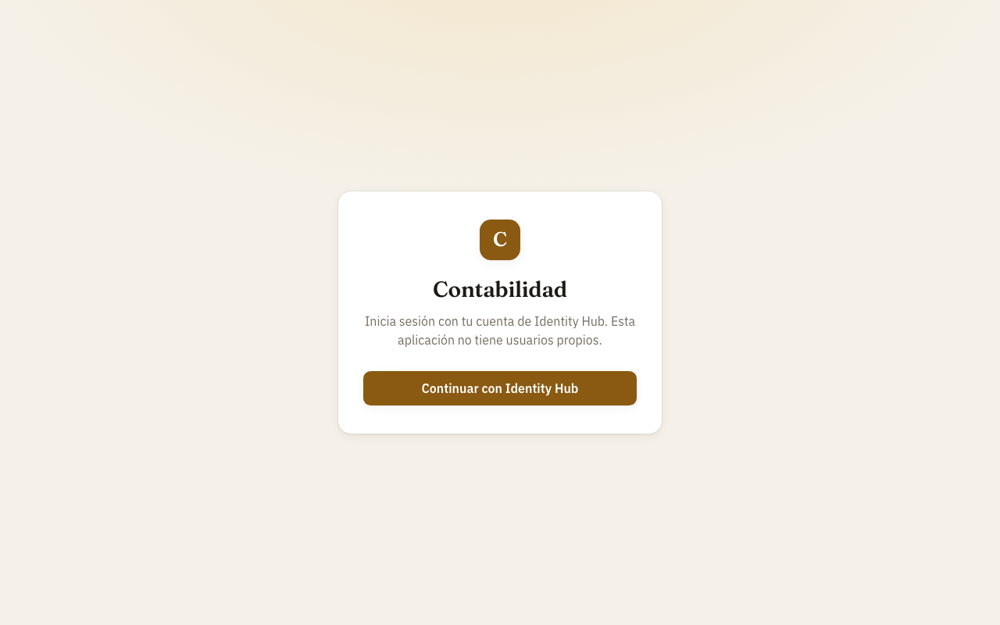

2. Si todavía no tiene sesión en el Hub, lo lleva a su pantalla de inicio de sesión: escriba correo, contraseña y el código por correo (sección 2.2).

   

3. Si ya tiene sesión en el Hub, el paso anterior se omite: vuelve a Contabilidad sin pedirle credenciales.

La barra superior muestra su rol y un identificador corto de su cuenta; la nota del menú lateral resume lo que su rol permite. Contabilidad no guarda un token de renovación: cuando su credencial vence, vuelve a pedirla al Hub, que responde sin molestarle mientras su sesión del Hub siga abierta.

### 4.2 Qué ve y qué puede hacer cada rol

| | `contabilidad.senior` | `contabilidad.analista` | Auditor (`reportes.ver` + `movimientos.ver_todos`) | Sin rol de Contabilidad |
|---|---|---|---|---|
| Etiqueta en la barra | Contador senior | Analista contable | Nombre del rol | Pantalla "Sin acceso" |
| Resumen | Sí, de toda la organización | Sí, solo sus movimientos | Sí, de toda la organización | No |
| Transacciones | Todas | Solo las suyas | Todas | No |
| Registrar movimiento | Sí | Sí | No | No |
| Aprobar o rechazar | Sí | No | No | No |
| Cierre contable | Sí | Bloqueado | Bloqueado | No |

Lo que cada persona puede hacer depende de los **permisos** de su rol (`movimientos.registrar`, `movimientos.ver_todos`, `movimientos.aprobar`, `cierre.ejecutar`, `reportes.ver`), no del nombre del rol: por eso un rol nuevo creado en la grilla funciona sin cambiar código. Las secciones bloqueadas llevan un candado y no se pueden abrir.

### 4.3 Analista

Ve solo sus propios movimientos y el **Resumen** con **Mis aprobados**, **Mis pendientes** y **Mis registros del mes**. **Cierre contable** aparece con candado.

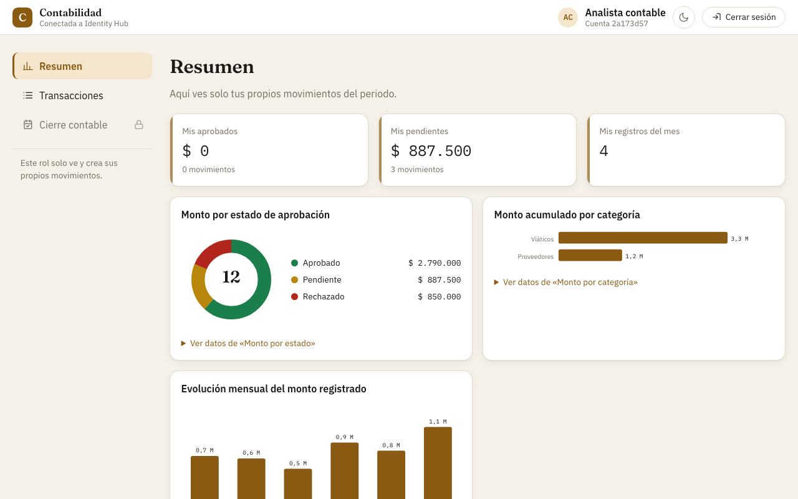

En **Transacciones** solo aparecen sus movimientos; los pendientes dicen **esperando aprobación**.

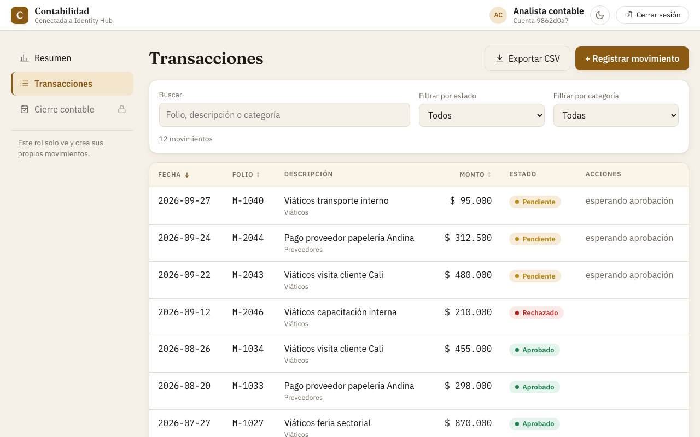

**Registrar un movimiento:** pulse **+ Registrar movimiento**, escriba la descripción y el monto y pulse **Registrar**.

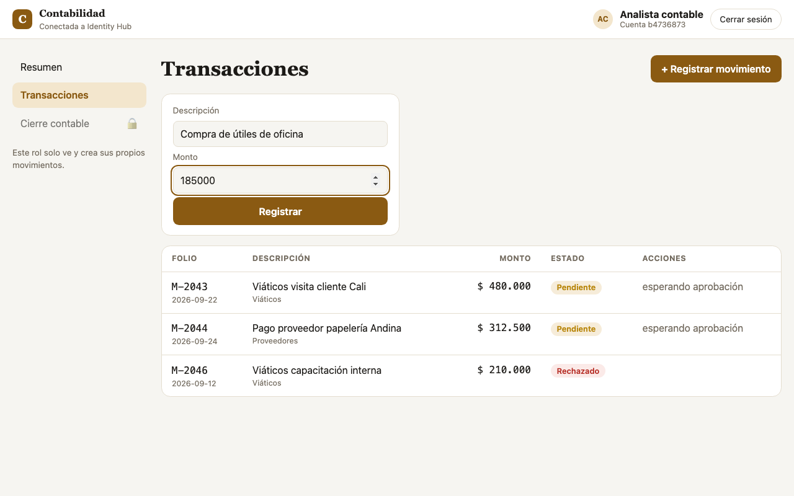

Aparece **Movimiento registrado, queda pendiente de aprobación.** y el movimiento entra a la lista con estado **Pendiente**.

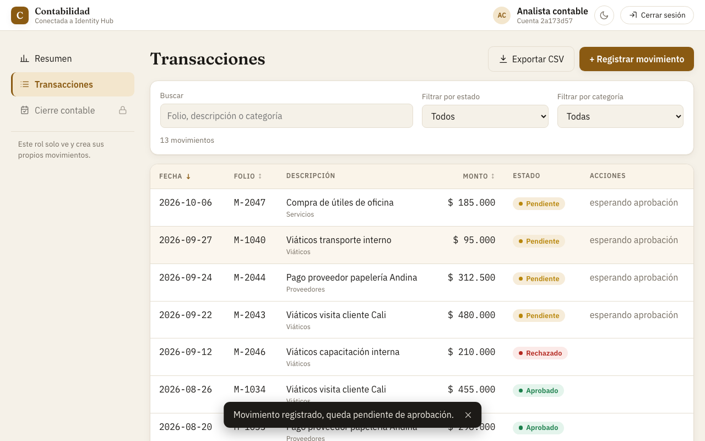

### 4.4 Contador senior

Ve el **Resumen** de toda la organización (**Aprobado del mes**, **Pendiente de aprobación**, **Cerrado hasta**, **Usuarios con acceso**) y todas las transacciones.

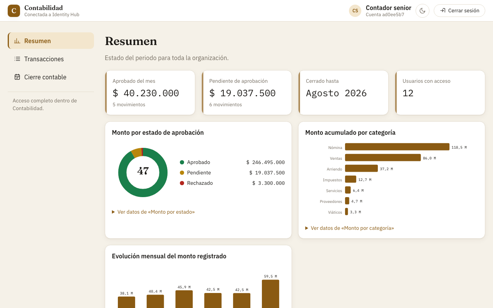

En **Transacciones**, los movimientos pendientes muestran **Aprobar** y **Rechazar**.

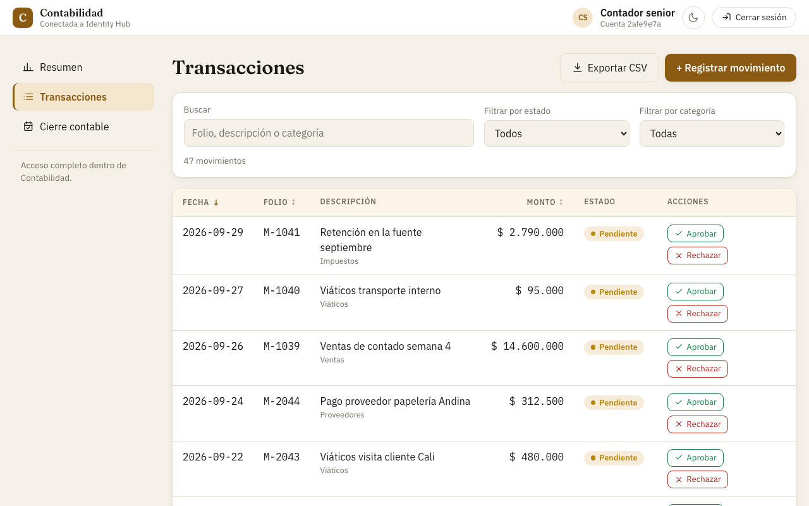

Al decidir aparece, por ejemplo, **Movimiento M-2043 aprobado.** y el estado cambia.

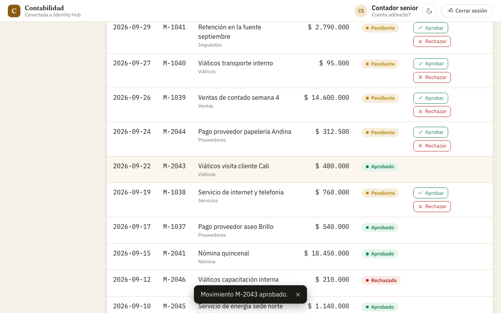

**Cierre contable** muestra el periodo, los movimientos aprobados y pendientes y el último cierre. **Cerrar mes de Septiembre 2026** registra el cierre.

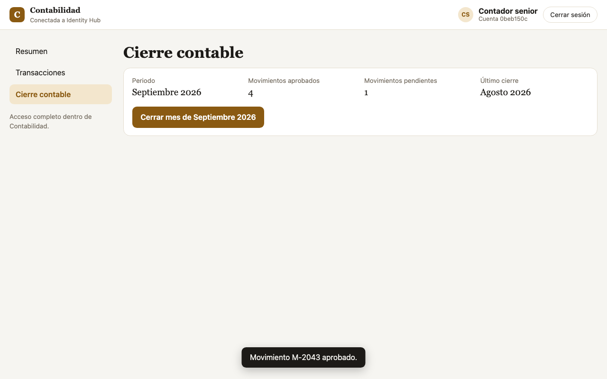

Tras cerrar, el botón pasa a **Mes cerrado** y el aviso indica que son datos de ejemplo.

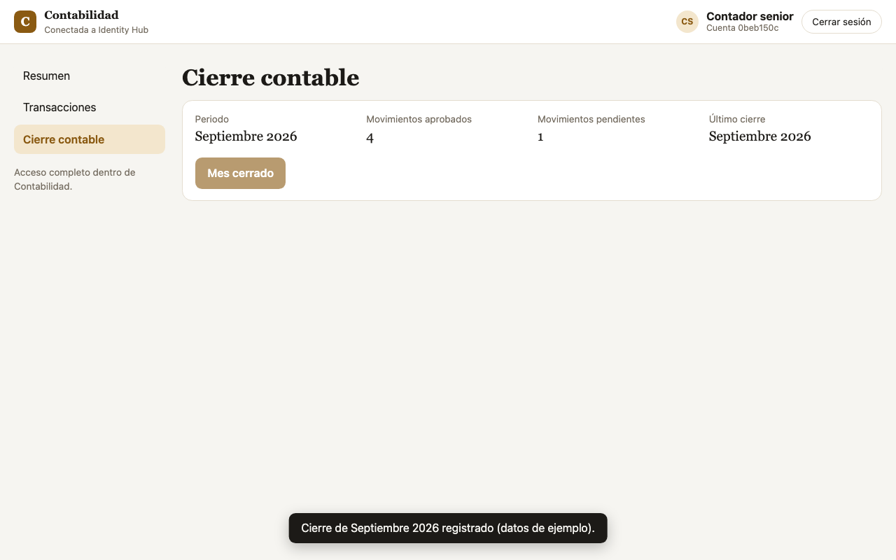

### 4.5 Auditor

Un rol con solo `reportes.ver` y `movimientos.ver_todos` ve el **Resumen** de toda la organización y todas las transacciones, pero no tiene botones de registrar, aprobar ni rechazar, y **Cierre contable** está bloqueado. La historia completa está en la [sección 5](#5-historia-de-usuario-para-la-sustentación).

### 4.6 Cuenta sin rol de Contabilidad

Si su cuenta se autenticó pero no tiene ningún rol `contabilidad.*`, Contabilidad muestra **Sin acceso a Contabilidad**. Use **Ir a Identity Hub** o pida a un administrador que le asigne un rol (sección 3.5).

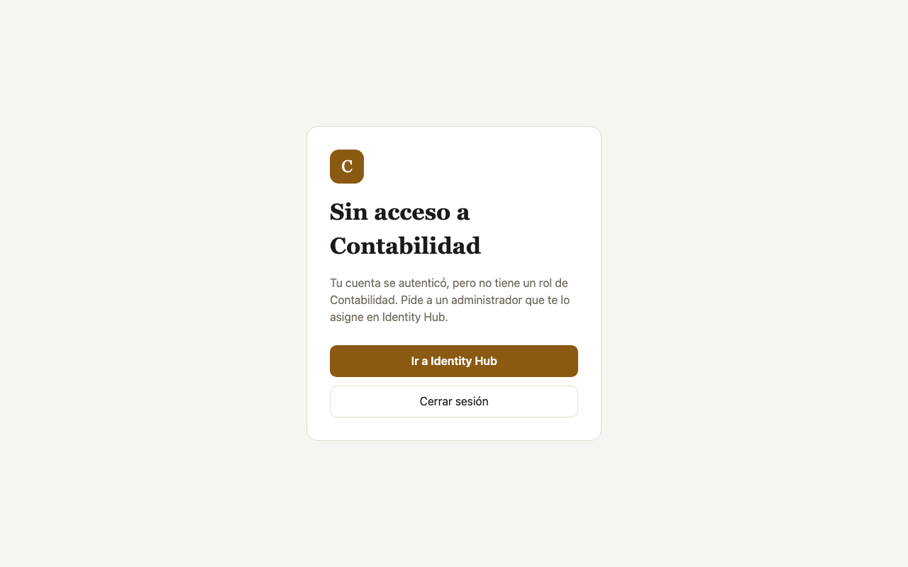

### 4.7 Cerrar sesión

Pulse **Cerrar sesión** en la barra superior (o en la pantalla "Sin acceso"): Contabilidad olvida su credencial y vuelve a la pantalla de inicio (captura de la sección 4.1). Esto no cierra su sesión del Hub; para eso use **Cerrar sesión** en el Hub.

---

## 5. Historia de usuario para la sustentación

**Historia:** *como administrador del Hub quiero crear un rol de solo lectura para auditoría y asignárselo a un empleado, para que consulte Contabilidad sin poder modificar nada y sin que nadie cambie código ni redespliegue.*

Esta historia es distinta de la autenticación: muestra la administración de permisos y su efecto en otra aplicación. Cada paso remite a la captura que lo respalda.

| # | Quién | Acción | Resultado | Captura |
|---|---|---|---|---|
| 1 | Administrador | Entra a la consola con contraseña y código por correo. | Llega a **Usuarios**. | [directorio](img/usuario/administrador-01-directorio.png) |
| 2 | Administrador | En **Roles**, pulsa **Nuevo rol de Contabilidad**, escribe `contabilidad.auditor` y marca solo `reportes.ver` y `movimientos.ver_todos`. | El formulario refleja exactamente dos permisos. | [nuevo rol](img/usuario/administrador-08-nuevo-rol.png) |
| 3 | Administrador | Pulsa **Crear rol**. | La grilla muestra la fila del auditor con esas dos casillas marcadas y `cierre.ejecutar`, `movimientos.aprobar` y `movimientos.registrar` sin marcar. | [rol creado](img/usuario/administrador-09-rol-creado.png) |
| 4 | Administrador | En **Usuarios**, edita al empleado y marca `contabilidad.auditor`. | **Cambios guardados.** | [asignar](img/usuario/administrador-14-asignar-rol.png), [guardado](img/usuario/administrador-15-rol-asignado.png) |
| 5 | Administrador | Vuelve a **Roles**. | El rol queda con **Eliminar** deshabilitado y **Asignado a 1 usuario**. | [rol asignado](img/usuario/administrador-16-rol-asignado-sin-eliminar.png) |
| 6 | Empleado | Abre Contabilidad y pulsa **Continuar con Identity Hub**; inicia sesión con código por correo. | Vuelve a Contabilidad con el rol `contabilidad.auditor`. | [inicio](img/usuario/contabilidad-01-inicio.png), [login](img/usuario/contabilidad-02-login-hub.png) |
| 7 | Empleado | Mira el **Resumen**. | Ve los totales de toda la organización; el menú indica **Tu rol permite: ver todos los movimientos, ver el resumen.** | [resumen](img/usuario/contabilidad-03-auditor-resumen.png) |
| 8 | Empleado | Abre **Transacciones**. | Ve los seis movimientos, no solo los suyos; no hay **Registrar**, **Aprobar** ni **Rechazar**; los pendientes dicen **esperando aprobación**. **Cierre contable** tiene candado. | [transacciones](img/usuario/contabilidad-04-auditor-transacciones.png) |
| 9 | Administrador | Consulta **Auditoría** filtrando por `role_created`. | Queda el rastro de quién creó el rol y cuándo. | [auditoría](img/usuario/administrador-18-auditoria-filtrada.png) |

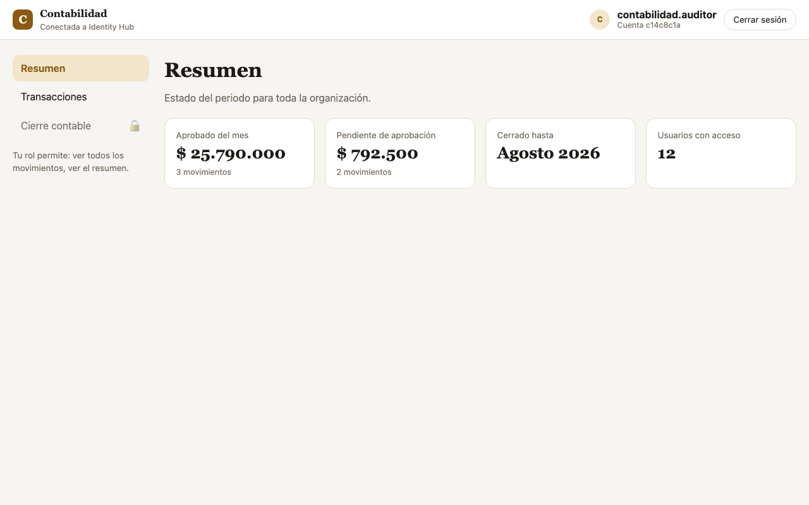

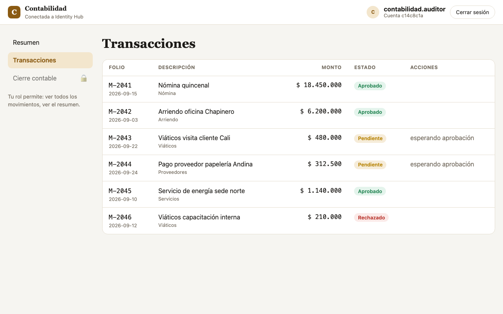

Qué demuestra esta historia ([criterio de aceptación 2 de la semana 4](../../odd/tasks/idp-semana-4.md)): el Hub emite en el token solo los permisos marcados en la grilla, y Contabilidad decide lo que muestra a partir de ellos. Las pruebas E2E del requisito RF-021 ([`e2e/tests/roles-y-permisos.spec.ts`](../../e2e/tests/roles-y-permisos.spec.ts)) comprueban el mismo recorrido, incluida la lectura de los permisos del token.

## 6. Problemas frecuentes

| Síntoma | Qué hacer |
|---|---|
| No llega ningún correo | En este entorno revise Mailpit (`http://localhost:8025`). Si la invitación se perdió, un administrador puede reenviarla (sección 3.2). |
| **La cuenta está bloqueada** | Espere el fin del bloqueo, restablezca la contraseña (2.4) o pida a un administrador que ponga la cuenta en **Activo** (3.3). |
| **Demasiados intentos** | Se superó el límite de intentos o de solicitudes; espere unos minutos. |
| El rol nuevo no aparece en Contabilidad | El cambio rige desde el siguiente token (hasta 15 minutos): cierre sesión en Contabilidad y vuelva a entrar. |
| **Sin acceso a Contabilidad** | La cuenta no tiene un rol `contabilidad.*`; pídalo a un administrador (3.5). |
| No puedo eliminar un rol | Tiene usuarios asignados (3.4): quite la asignación primero. |
