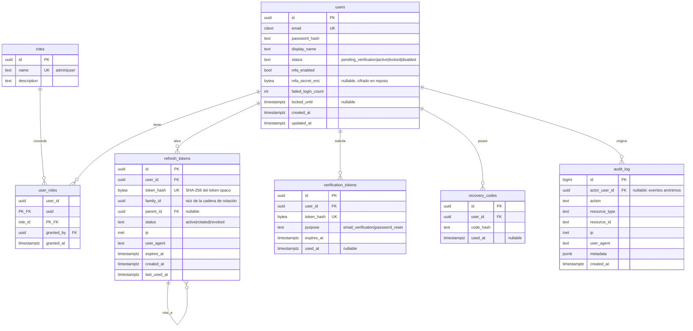

# 02 — Modelo de dominio

## Diagrama entidad-relación



## Invariantes

Reglas que el sistema garantiza siempre. Cada una tiene una prueba con su nombre.

1. **Una contraseña nunca se almacena de forma recuperable.** `users.password_hash` empieza
   siempre por `$argon2id$`. No existe ninguna ruta de código que devuelva ese campo.
2. **Un token nunca se almacena en claro.** Refresh y verificación se guardan como hash; el
   valor original solo existe en la respuesta HTTP o en el correo, y una sola vez.
3. **Rotación monótona.** En una familia de refresh tokens hay como máximo un token en estado
   `active`. Cualquier intento de usar uno en estado `rotated` revoca la familia entera (RF-006).
4. **Una cuenta no activa no obtiene tokens de sesión.** Solo `status = 'active'` produce un par
   de tokens en el login.
5. **El audit log es append-only.** El rol de base de datos de la aplicación tiene `INSERT` y
   `SELECT` sobre `audit_log`, y carece de `UPDATE` y `DELETE`. Se aplica en la migración, no
   por convención.
6. **Siempre existe al menos un administrador habilitado.** Un `UPDATE` que dejaría el sistema
   sin ningún admin activo se rechaza.
7. **Los códigos de recuperación son de un solo uso.** Consumir uno fija `used_at` en la misma
   transacción que emite los tokens de sesión.

## Máquina de estados de la cuenta

```
                registro
                   │
                   ▼
        ┌──────────────────────┐
        │ pending_verification │──── token de verificación ────┐
        └──────────┬───────────┘                              │
                   │ 24 h sin verificar                        ▼
                   ▼                                    ┌──────────┐
              (purga por lote)                          │  active  │
                                                        └────┬─────┘
                        5 fallos en 15 min  ◄────────────────┤
                                │                            │ admin deshabilita
                                ▼                            ▼
                        ┌──────────────┐              ┌────────────┐
                        │    locked    │              │  disabled  │
                        └──────┬───────┘              └────────────┘
                               │ expira locked_until
                               └────────────► active
```

## Notas de diseño

- **`citext` para el correo.** La comparación insensible a mayúsculas se resuelve en la base de
  datos y no en código de aplicación, donde es fácil olvidarla y abrir un registro duplicado.
- **`family_id` en los refresh tokens** es lo que hace posible RF-006: la detección de reuso
  necesita alcanzar a todos los descendientes de una sesión comprometida con un solo `UPDATE`.
- **`mfa_secret_enc` cifrado en reposo**, no solo hasheado: el servidor necesita el secreto en
  claro para verificar cada código TOTP, así que se cifra con una clave del entorno (AES-GCM).
  Esto lo distingue de las contraseñas, que sí son irreversibles.
- **UUID v7 como claves primarias** salvo en `audit_log`, donde un `bigint` secuencial deja
  explícito el orden de inserción y hace más barata la consulta por rango temporal.
