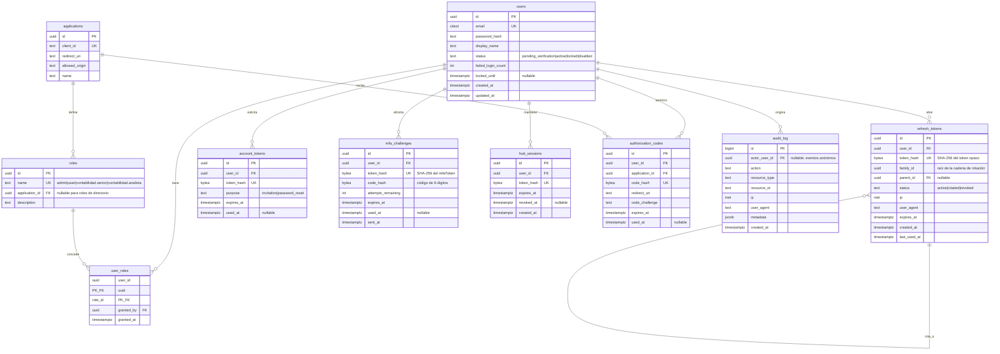

# 02 — Modelo de dominio

## Diagrama entidad-relación


```mermaid
erDiagram
    users ||--o{ user_roles         : tiene
    roles ||--o{ user_roles         : concede
    users ||--o{ refresh_tokens     : abre
    users ||--o{ account_tokens     : solicita
    users ||--o{ mfa_challenges     : afronta
    users ||--o{ hub_sessions       : mantiene
    users ||--o{ authorization_codes: autoriza
    applications ||--o{ roles       : define
    applications ||--o{ authorization_codes: recibe
    users ||--o{ audit_log          : origina
    refresh_tokens ||--o{ refresh_tokens : rota_a

    users {
        uuid   id PK
        citext email UK
        text   password_hash
        text   display_name
        text   status        "pending_verification|active|locked|disabled"
        int    failed_login_count
        timestamptz locked_until "nullable"
        timestamptz created_at
        timestamptz updated_at
    }
    roles {
        uuid id PK
        text name UK "admin|user|contabilidad.senior|contabilidad.analista"
        uuid application_id FK "nullable para roles de directorio"
        text description
    }
    user_roles {
        uuid user_id PK_FK
        uuid role_id PK_FK
        uuid granted_by FK
        timestamptz granted_at
    }
    refresh_tokens {
        uuid   id PK
        uuid   user_id FK
        bytea  token_hash UK "SHA-256 del token opaco"
        uuid   family_id     "raíz de la cadena de rotación"
        uuid   parent_id FK  "nullable"
        text   status        "active|rotated|revoked"
        inet   ip
        text   user_agent
        timestamptz expires_at
        timestamptz created_at
        timestamptz last_used_at
    }
    account_tokens {
        uuid   id PK
        uuid   user_id FK
        bytea  token_hash UK
        text   purpose "invitation|password_reset"
        timestamptz expires_at
        timestamptz used_at "nullable"
    }
    mfa_challenges {
        uuid   id PK
        uuid   user_id FK
        bytea  token_hash UK "SHA-256 del mfaToken"
        bytea  code_hash "código de 6 dígitos"
        int    attempts_remaining
        timestamptz expires_at
        timestamptz used_at "nullable"
        timestamptz sent_at
    }
    applications {
        uuid   id PK
        text   client_id UK
        text   redirect_uri
        text   allowed_origin
        text   name
    }
    hub_sessions {
        uuid   id PK
        uuid   user_id FK
        bytea  token_hash UK
        timestamptz expires_at
        timestamptz revoked_at "nullable"
        timestamptz created_at
    }
    authorization_codes {
        uuid   id PK
        uuid   user_id FK
        uuid   application_id FK
        bytea  code_hash UK
        text   redirect_uri
        text   code_challenge
        timestamptz expires_at
        timestamptz used_at "nullable"
    }
    audit_log {
        bigint id PK
        uuid   actor_user_id FK "nullable: eventos anónimos"
        text   action
        text   resource_type
        text   resource_id
        inet   ip
        text   user_agent
        jsonb  metadata
        timestamptz created_at
    }
```

## Invariantes

Reglas que el sistema garantiza siempre. Cada una tiene una prueba con su nombre.

1. **Una contraseña nunca se almacena de forma recuperable.** `users.password_hash` empieza
   siempre por `$argon2id$`. No existe ninguna ruta de código que devuelva ese campo.
2. **Un token nunca se almacena en claro.** Refresh y verificación se guardan como hash; el
   valor original solo existe en la respuesta HTTP o en el correo, y una sola vez.
3. **Rotación monótona.** En una familia de refresh tokens hay como máximo un token en estado
   `active`. Cualquier intento de usar uno en estado `rotated` revoca la familia entera (RF-006).
4. **Una cuenta no activa no obtiene tokens de sesión.** Solo `status = 'active'` produce un par
   de tokens en el login.
5. **El audit log es append-only.** El rol de base de datos de la aplicación tiene `INSERT` y
   `SELECT` sobre `audit_log`, y carece de `UPDATE` y `DELETE`. Se aplica en la migración, no
   por convención.
6. **Siempre existe al menos un administrador habilitado.** Un `UPDATE` que dejaría el sistema
   sin ningún admin activo se rechaza.
7. **Los tokens de cuenta son de un solo uso y propósito único.** Invitación y restablecimiento
   comparten almacenamiento, pero una operación nunca acepta el propósito de la otra.
8. **Un desafío MFA solo se consume una vez.** El acierto, el vencimiento, el agotamiento de
   intentos o el reenvío invalidan el código anterior de forma atómica.
9. **Los ámbitos de roles no se mezclan.** Toda cuenta tiene `user`; los JWT de Contabilidad
   contienen solo `contabilidad.senior` y/o `contabilidad.analista`.
10. **Un código de autorización solo se canjea una vez.** Está ligado a cliente, URI de retorno y
    desafío PKCE; el canje fija `used_at` en la misma transacción que emite el access token.
11. **Un administrador no se autoasigna roles.** El actor y el destinatario deben ser distintos.

## Máquina de estados de la cuenta

```
             alta administrativa
                   │
                   ▼
        ┌──────────────────────┐
        │ pending_verification │──── acepta invitación ────────┐
        └─────┬──────────▲─────┘                              │
              │          │ admin reenvía (token nuevo;         ▼
              │          │ el anterior deja de valer)    ┌──────────┐
              └──────────┘                               │  active  │
        la invitación vence a las 24 h                   └────┬─────┘
        y la cuenta sigue pendiente                           │
                                                              │
        5 fallos en 15 min  ◄─────────────────────────────────┤
                │                                             │ admin deshabilita
                ▼                                             ▼
        ┌──────────────┐                               ┌────────────┐
        │    locked    │                               │  disabled  │
        └──────┬───────┘                               └────────────┘
               │ expira locked_until (solo el bloqueo automático)
               │ o restablecimiento de contraseña
               │ o un admin lo pasa a active
               └────────────► active
```

## Notas de diseño

- **Una invitación vencida no purga la cuenta.** A las 24 h el token de invitación deja de ser
  válido, pero la cuenta permanece en `pending_verification`: ningún proceso la elimina. Un `admin`
  puede reenviar la invitación (RF-001), lo que emite un token nuevo e invalida el anterior. No
  hay purga por lote porque borrar cuentas huérfanas destruiría rastro de auditoría
  (`audit_log` referencia a la cuenta) y quitaría al administrador el control sobre quién sigue
  en el directorio; una cuenta pendiente no inicia sesión (invariante 4), así que mantenerla no
  amplía la superficie de ataque.
- **El bloqueo manual de un administrador no vence.** El bloqueo automático por fallos fija
  `locked_until` (+15 min) y el siguiente intento de login lo levanta al vencer. Cuando un `admin`
  deja una cuenta en `locked` mediante `PATCH /admin/users/{id}`, `locked_until` queda vacío y el
  login lo trata como bloqueo sin fin (`locked_until` nulo). Es intencional: una decisión humana
  no debe caducar sola. Solo lo levantan un `admin` que pasa la cuenta a `active` o la
  confirmación de un restablecimiento de contraseña (que pone `active` y borra `locked_until`).
- **`citext` para el correo.** La comparación insensible a mayúsculas se resuelve en la base de
  datos y no en código de aplicación, donde es fácil olvidarla y abrir un registro duplicado.
- **`family_id` en los refresh tokens** es lo que hace posible RF-006: la detección de reuso
  necesita alcanzar a todos los descendientes de una sesión comprometida con un solo `UPDATE`.
- **`account_tokens` unifica invitaciones y restablecimientos** sin hacerlos intercambiables: el
  campo `purpose` forma parte de la validación y cada flujo conserva su propia vigencia.
- **MFA por correo no guarda secretos recuperables.** Tanto el `mfaToken` como el código se
  almacenan como hash; no hay TOTP, enrolamiento ni códigos de recuperación (ADR 0010).
- **`hub_sessions` es independiente del refresh de consola.** La cookie SSO usa `SameSite=Lax` y
  el refresh conserva `SameSite=Strict`; ambos valores opacos se guardan solo como hash.
- **`applications` representa el único cliente configurado.** En esta fase solo existe
  Contabilidad; `authorization_codes` liga cada código al cliente, URI y PKCE S256 (ADR 0009).
- **UUID v7 como claves primarias** salvo en `audit_log`, donde un `bigint` secuencial deja
  explícito el orden de inserción y hace más barata la consulta por rango temporal.
